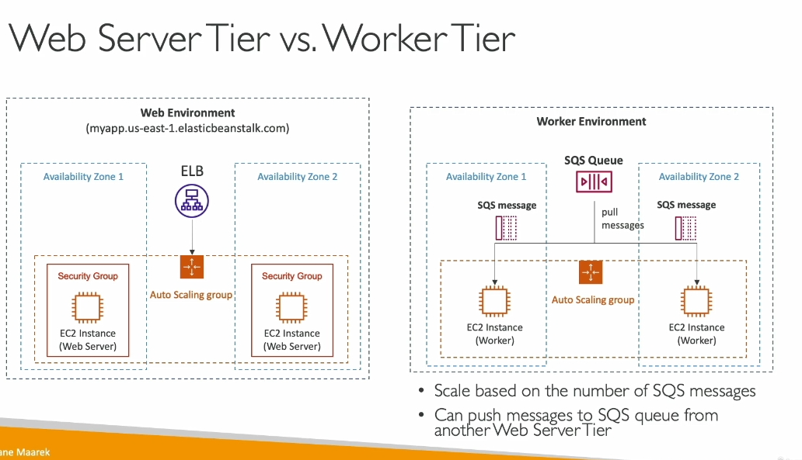
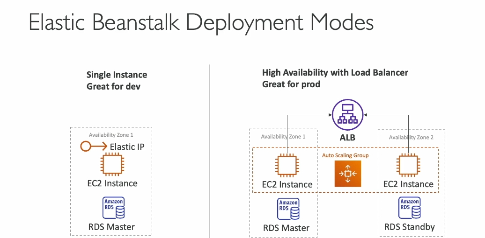

**Tóm tắt bài giảng về AWS Elastic Beanstalk:**

1. **Kiến trúc ứng dụng truyền thống:**
   - **Load Balancer (ELB):** Tiếp nhận yêu cầu từ người dùng.
   - **Auto Scaling Group (ASG):** Quản lý các EC2 instance trong nhiều vùng khả dụng (AZ).
   - **Backend:** Bao gồm RDS (cơ sở dữ liệu), ElastiCache (cache), và các thành phần khác.

2. **Vấn đề của nhà phát triển:**
   - Cấu hình thủ công cơ sở hạ tầng như database, load balancer tốn thời gian và phức tạp.
   - Cần một cách dễ dàng triển khai ứng dụng mà không cần lo lắng quá nhiều về cơ sở hạ tầng.

3. **Elastic Beanstalk giải quyết vấn đề:**
   - Cung cấp giao diện tập trung để triển khai ứng dụng trên AWS.
   - Sử dụng các dịch vụ AWS như EC2, ASG, ELB, RDS dưới dạng **dịch vụ quản lý**.
   - Tự động xử lý provisioning, scaling, monitoring, và cấu hình.
   - Nhà phát triển chỉ cần quan tâm đến **mã nguồn**.

4. **Thành phần Elastic Beanstalk:**
   - **Application:** Tập hợp các thành phần Beanstalk như môi trường, phiên bản, và cấu hình.
   - **Version:** Các phiên bản mã ứng dụng (v1, v2, v3...).
   - **Environment:** Tập hợp tài nguyên chạy một phiên bản ứng dụng. có thể multi env :  dev test prod 
   - **Tiers:** 
   
     - **Web Server Tier:** Kiến trúc truyền thống với load balancer và EC2 instances xử lý yêu cầu.
     - **Worker Tier:** Xử lý các tác vụ từ hàng đợi tin nhắn (SQS queue).

5. **Quy trình triển khai ứng dụng:**
   - Tạo ứng dụng.
   - Tải lên phiên bản mã nguồn.
   - Khởi chạy môi trường.
   - Quản lý và cập nhật vòng đời môi trường (upload & deploy version mới).

6. **Chế độ triển khai:**

   - **Single Instance Mode:** 
     - Chạy trên một EC2 instance duy nhất (phù hợp môi trường phát triển).
   - **High Availability Mode:**
     - Có load balancer và ASG, phân tán qua nhiều AZ (phù hợp môi trường production).

7. **Hỗ trợ nhiều ngôn ngữ lập trình:**
   - Ví dụ: Go, Java, .NET, Node.js, Python, Ruby, Docker...

8. **Mô hình Web và Worker:**

   - Web Environment: Xử lý trực tiếp yêu cầu từ người dùng.
   - Worker Environment: Xử lý tác vụ từ SQS queue, tự động scale dựa trên số lượng tin nhắn.

Elastic Beanstalk giúp các nhà phát triển tập trung vào code, trong khi các tác vụ liên quan đến cơ sở hạ tầng được tự động hóa và quản lý hiệu quả.