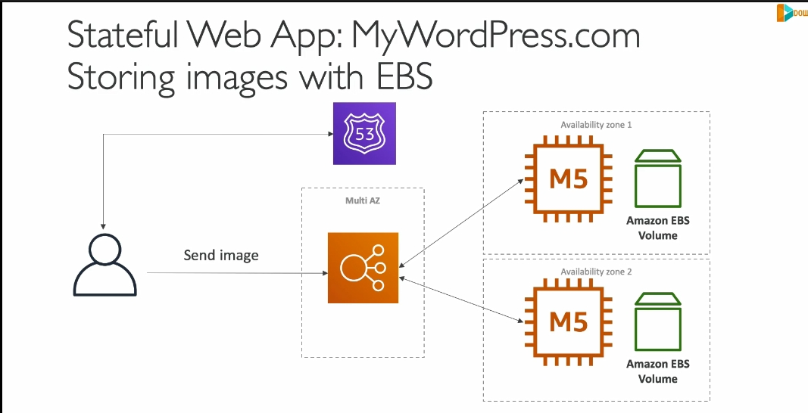
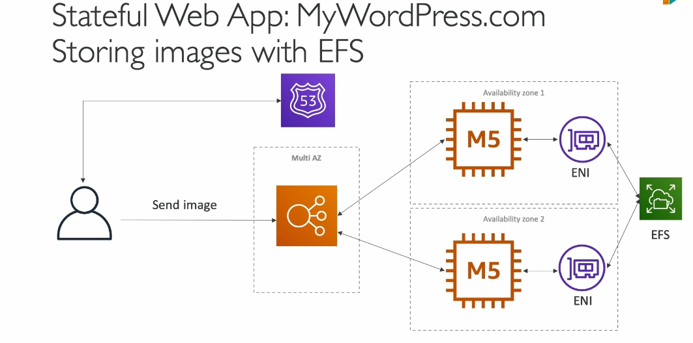

---

### **1. Tổng quan bài toán: Xây dựng website WordPress có khả năng mở rộng trên AWS**
- **Mục tiêu**:
  - Triển khai WordPress trên AWS.
  - Xây dựng giải pháp có thể mở rộng (scalable) để xử lý tải người dùng toàn cầu.
  - Lưu trữ hình ảnh và nội dung blog trong cơ sở dữ liệu và bộ nhớ dùng chung.

- **Công nghệ sử dụng**:
  - **RDS (Relational Database Service)**: Lưu trữ dữ liệu nội dung blog.
  - **Aurora MySQL**: Thay thế RDS trong các trường hợp yêu cầu hiệu suất và mở rộng cao.
  - **EBS (Elastic Block Store)** và **EFS (Elastic File System)**: Lưu trữ hình ảnh và các tệp dùng chung giữa các instance.

---

### **2. So sánh lưu trữ dữ liệu: EBS vs. EFS**
#### **EBS (Elastic Block Store)**:
- **Ưu điểm**:
  - Hiệu quả khi sử dụng trên **một instance duy nhất**.
  - Chi phí thấp hơn so với EFS.
- **Hạn chế**:
  - Dữ liệu được lưu trữ gắn chặt với một instance, không thể chia sẻ trực tiếp giữa các instance.
  - Khi mở rộng số lượng EC2 instance hoặc qua nhiều AZ (Availability Zone), cần giải pháp khác để đồng bộ dữ liệu.

#### **EFS (Elastic File System)**:
- **Ưu điểm**:
  - Dữ liệu được chia sẻ giữa **nhiều instance**, **nhiều AZ**.
  - Tự động mở rộng theo nhu cầu sử dụng.
- **Hạn chế**:
  - Chi phí cao hơn so với EBS.
- **Cách hoạt động**:
  - Sử dụng giao thức NFS (Network File System).
  - Tạo các ENI (Elastic Network Interface) trong mỗi AZ để kết nối đến EFS.

---

### **3. Xử lý vấn đề lưu trữ hình ảnh**
- **Bài toán khi dùng EBS với nhiều EC2 instance**:

  - Hình ảnh lưu trên EBS Volume của một instance sẽ không khả dụng với instance khác.
  - Dẫn đến lỗi khi yêu cầu truy xuất dữ liệu từ instance khác.

- **Giải pháp với EFS**:

  - Tất cả các instance trong nhiều AZ có thể truy cập cùng một hệ thống tệp.
  - Hình ảnh hoặc dữ liệu tải lên từ một instance sẽ khả dụng cho tất cả các instance khác.

---

### **4. Cơ sở dữ liệu: RDS và Aurora**
- **RDS (MySQL)**:
  - Quản lý cơ sở dữ liệu truyền thống với hỗ trợ Multi-AZ.
- **Aurora MySQL**:
  - Hiệu suất cao hơn với khả năng tự động mở rộng, hỗ trợ nhiều read replica và cơ sở dữ liệu toàn cầu (global database).
  - Tối ưu hóa chi phí vận hành.

---

### **5. Vai trò của giải pháp kiến trúc**
- **Vai trò của Solutions Architect**:
  - Lựa chọn công nghệ dựa trên **yêu cầu cụ thể**:
    - Hiệu suất (Performance).
    - Chi phí (Cost).
    - Mở rộng (Scalability).
  - Hiểu rõ ưu, nhược điểm của từng giải pháp để đưa ra quyết định phù hợp.

---

### **6. Tổng kết**
- **Lưu trữ dữ liệu**:
  - Sử dụng **EBS** cho ứng dụng nhỏ hoặc không cần mở rộng.
  - Sử dụng **EFS** cho ứng dụng yêu cầu lưu trữ dùng chung giữa các instance.
- **Cơ sở dữ liệu**:
  - RDS phù hợp với ứng dụng trung bình.
  - Aurora phù hợp với ứng dụng lớn, yêu cầu hiệu suất cao.

