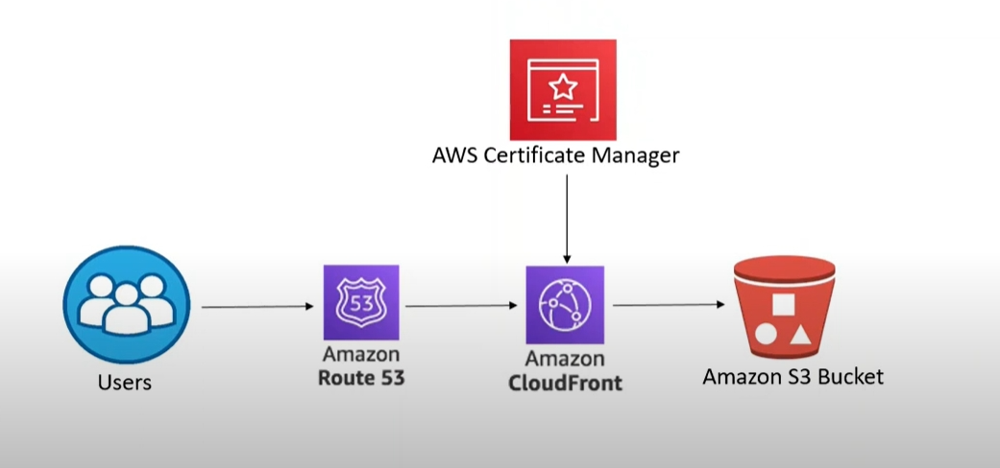

LƯU Ý PHÍA DƯỚI LÀ CHATGPT NÊN LÊN YOUTUBE GÕ CICD HOST STATIC WEBSITE AWS LÀ NÓ LÊN CẢ MỚI ANH ẤN ĐỘ XEM BỪA RỒI LÀM LAB THÔI 
---

### **Cập nhật tối ưu hệ thống S3 và CloudFront với SSL + Route 53**

---

### **1. Tạo S3 Bucket và tối ưu cấu hình**
1. **Tạo Bucket**:
   - Tên bucket nên phù hợp với domain, ví dụ: `frontend.mywebsite.com`.
   - Bật tính năng **Static Website Hosting**.
   - Tắt toàn bộ quyền public trực tiếp từ S3 (CloudFront sẽ quản lý quyền công khai).

2. **Thêm Bucket Policy giới hạn truy cập qua CloudFront**:
   - Sử dụng **Origin Access Control (OAC)** để đảm bảo chỉ CloudFront mới có quyền truy cập S3.
   - Tạo OAC qua AWS Console:
     - Trong CloudFront, chọn "Create OAC" và gán quyền cho bucket.
   - **Bucket Policy** (sử dụng OAC):
     ```json
     {
         "Version": "2012-10-17",
         "Statement": [
             {
                 "Effect": "Allow",
                 "Principal": {
                     "Service": "cloudfront.amazonaws.com"
                 },
                 "Action": "s3:GetObject",
                 "Resource": "arn:aws:s3:::frontend.mywebsite.com/*",
                 "Condition": {
                     "StringEquals": {
                         "AWS:SourceArn": "arn:aws:cloudfront::YOUR_ACCOUNT_ID:distribution/YOUR_DISTRIBUTION_ID"
                     }
                 }
             }
         ]
     }
     ```

---

### **2. Tạo CloudFront Distribution**
1. **Origin**:
   - Trỏ đến bucket S3.
   - Sử dụng OAC vừa tạo để thiết lập quyền truy cập.

2. **Cài đặt quan trọng**:
   - **Viewer Protocol Policy**: Redirect HTTP to HTTPS.
   - **Default TTL**: Tùy chỉnh cache, ví dụ `3600 giây`.
   - **Compress Objects Automatically**: Bật gzip hoặc Brotli để tăng hiệu suất tải file.
   - **Custom Error Pages**: Thêm trang 404 hoặc 403 từ S3.

3. **Thêm SSL từ ACM**:
   - Trong **CloudFront > Distribution Settings**:
     - Chọn `Custom SSL Certificate`.
     - Sử dụng chứng chỉ từ ACM (bước 3).

4. **Enable Cache Invalidation**:
   - Đảm bảo CloudFront hỗ trợ xóa cache sau mỗi lần deploy (dùng API).

---

### **3. Cấu hình ACM cho SSL**
1. **Tạo chứng chỉ SSL**:
   - Truy cập **AWS Certificate Manager (ACM)**.
   - Chọn **Request a public certificate**.
   - Nhập domain chính (e.g., `mywebsite.com`) và subdomain (e.g., `*.mywebsite.com`).

2. **Xác minh chứng chỉ**:
   - Nếu sử dụng Route 53, ACM sẽ tự động thêm bản ghi DNS để xác minh.
   - Sau khi xác minh, chứng chỉ sẽ ở trạng thái "Issued".

---

### **4. Gắn Route 53 với CloudFront**
1. **Tạo hoặc quản lý Hosted Zone**:
   - Trong **Route 53**, tạo Hosted Zone cho domain `mywebsite.com`.

2. **Thêm bản ghi CNAME hoặc A (Alias)**:
   - Trỏ từ tên miền `frontend.mywebsite.com` đến CloudFront:
     - **Type**: A (Alias).
     - **Alias Target**: Chọn CloudFront Distribution.
   - Tất cả truy cập qua domain sẽ được chuyển tới CloudFront.

---

### **5. Cập nhật Pipeline Jenkins**
#### **Thay đổi Pipeline để hỗ trợ cache invalidation và sử dụng Route 53**
Trong file `Jenkinsfile`, thêm bước **Invalidate CloudFront Cache** và cập nhật domain sử dụng Route 53.

```groovy
pipeline {
    agent any
    environment {
        S3_BUCKET = 'frontend.mywebsite.com'
        CLOUDFRONT_DISTRIBUTION_ID = 'YOUR_DISTRIBUTION_ID'
    }
    stages {
        stage('Checkout') {
            steps {
                git branch: 'main', url: 'https://github.com/your-repo/frontend.git'
            }
        }
        stage('Build') {
            steps {
                sh 'npm install'
                sh 'npm run build'
            }
        }
        stage('Upload to S3') {
            steps {
                sh '''
                aws s3 sync ./build s3://$S3_BUCKET --delete
                '''
            }
        }
        stage('Invalidate CloudFront Cache') {
            steps {
                sh '''
                aws cloudfront create-invalidation --distribution-id $CLOUDFRONT_DISTRIBUTION_ID --paths "/*"
                '''
            }
        }
    }
}
```

---

### **6. Bảo mật nâng cao**
1. **Bật Logging cho CloudFront**:
   - Sử dụng S3 bucket khác để lưu trữ log từ CloudFront (giám sát lỗi và phân tích lưu lượng).
   
2. **Tích hợp WAF (Web Application Firewall)**:
   - Dùng AWS WAF để bảo vệ CloudFront khỏi các tấn công DDoS hoặc tấn công injection.

3. **Giám sát CloudWatch**:
   - Tạo dashboard CloudWatch để theo dõi lượng request, tỷ lệ cache hit/miss và lỗi.

---

### **7. Kiểm tra cuối cùng**
1. **Truy cập qua domain**:
   - Đảm bảo `https://frontend.mywebsite.com` hoạt động bình thường.
   - Kiểm tra HTTPS, tốc độ tải, và các tính năng cache.

2. **Giả lập các tình huống lỗi**:
   - Tạo lỗi 404 hoặc 403 và kiểm tra xử lý từ CloudFront.

---

### **Tóm tắt tối ưu**
1. **Route 53 gắn CloudFront**: Tăng hiệu suất và sử dụng SSL qua ACM.
2. **OAC trong S3**: Đảm bảo chỉ CloudFront có quyền đọc file.
3. **Pipeline Jenkins**: Triển khai tự động với cache invalidation.
4. **WAF và Logging**: Tăng bảo mật và giám sát.

