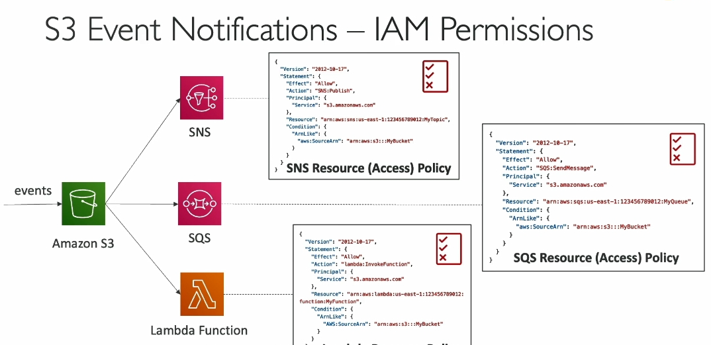
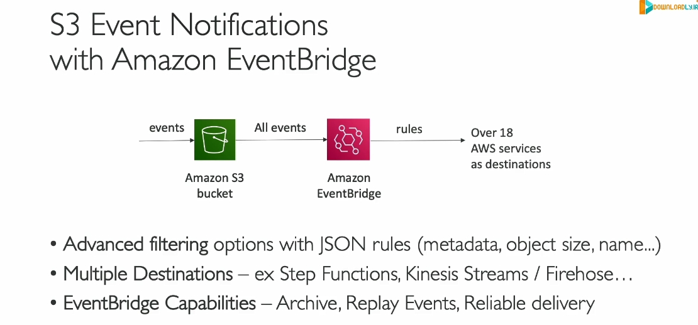

### Kiến thức về **Amazon S3 Event Notifications**

#### 1. **Event Notifications là gì?**

- **Event Notifications** trong S3 cho phép bạn phản ứng với các sự kiện xảy ra trên một bucket S3.
- Các sự kiện phổ biến:
  - **Object Created:** Một đối tượng mới được tải lên.
  - **Object Removed:** Một đối tượng bị xóa.
  - **Object Restored:** Một đối tượng được khôi phục từ lưu trữ.
  - **Replication:** Sao chép đối tượng giữa các bucket.

#### 2. **Lọc sự kiện**

- Bạn có thể lọc sự kiện bằng cách xác định điều kiện, ví dụ:
  - Chỉ xử lý các đối tượng có phần mở rộng `.jpeg`.

#### 3. **Mục tiêu của Event Notifications**

- Tự động phản ứng với sự kiện, ví dụ:
  - **Tạo thumbnail:** Khi một hình ảnh được tải lên S3, tự động tạo phiên bản nhỏ của hình ảnh đó.

#### 4. **Các đích nhận thông báo**

- Sự kiện có thể được gửi tới các dịch vụ sau:
  - **SNS Topic** (dịch vụ gửi thông báo).
  - **SQS Queue** (hàng đợi tin nhắn).
  - **Lambda Function** (hàm serverless để xử lý dữ liệu).
  - **Amazon EventBridge** (dịch vụ quản lý sự kiện nâng cao).

#### 5. **Thời gian xử lý sự kiện**

- Thông thường, các sự kiện được gửi trong vòng **vài giây** nhưng có thể mất **một phút hoặc lâu hơn**.

#### 6. **Quyền (IAM Permissions)**

- Để thông báo hoạt động, S3 cần có quyền truy cập:
  - **SNS Resource Access Policy:** Cho phép S3 gửi thông báo đến SNS Topic.
  - **SQS Resource Access Policy:** Cho phép S3 gửi tin nhắn đến SQS Queue.
  - **Lambda Resource Policy:** Cho phép S3 kích hoạt Lambda Function.
- **Chú ý:** Không dùng **IAM Roles** mà cần thiết lập **resource access policies** trực tiếp trên tài nguyên đích.

#### 7. **Amazon EventBridge**

- **EventBridge** tự động nhận tất cả sự kiện từ S3.
- Cung cấp các tính năng nâng cao:
  - Lọc chi tiết theo metadata, kích thước đối tượng, tên đối tượng.
  - Gửi sự kiện đến hơn **18 dịch vụ AWS khác**, như:
    - **Step Functions, Kinesis Data Streams, Firehose,** v.v.
  - Các tính năng nổi bật:
    - Lưu trữ (archive) và phát lại (replay) sự kiện.
    - Đảm bảo giao hàng đáng tin cậy hơn.

#### 8. **Lợi ích chính**

- **Tự động hóa quy trình:** Phản ứng nhanh với các thay đổi trong bucket.
- **Khả năng mở rộng:** Tích hợp với nhiều dịch vụ AWS để xử lý và quản lý sự kiện.

#### 9. **Điểm cần nhớ**

- Các đích nhận sự kiện:
  - **SNS, SQS, Lambda**, và **EventBridge.**
- EventBridge mang đến khả năng lọc và xử lý mạnh mẽ hơn.
