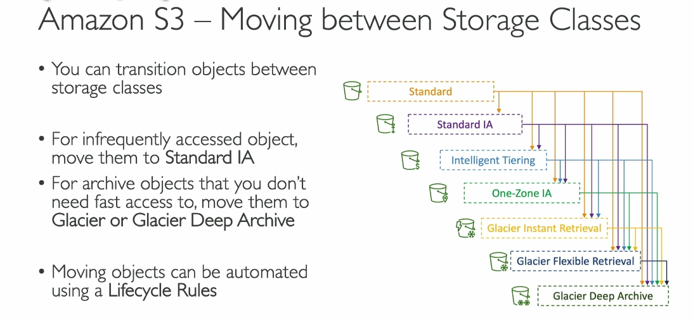

---

### **1. Tổng quan về chuyển đổi giữa các lớp lưu trữ**
- **Chuyển đổi lớp lưu trữ:**  
  - Bạn có thể di chuyển dữ liệu từ **Standard** sang:
    - **Standard-IA (Infrequent Access):** Dữ liệu truy cập không thường xuyên.  
    - **Intelligent Tiering:** Tự động chuyển đổi dựa trên kiểu truy cập.  
    - **One-Zone-IA:** Chi phí thấp hơn nhưng không chịu được mất dữ liệu khi xảy ra sự cố khu vực.  
    - **Glacier Flexible Retrieval** hoặc **Deep Archive:** Dùng cho dữ liệu lưu trữ lâu dài.
  - **Ví dụ:** Nếu biết dữ liệu ít được truy cập, chuyển sang Standard-IA; nếu cần lưu trữ lâu dài, chọn Glacier hoặc Deep Archive.

---

### **2. Quy tắc Lifecycle Rules (Tự động hóa)**
- **Lifecycle Rules:** Dùng để tự động hóa việc chuyển đổi hoặc xóa dữ liệu.
  - **Transition Action:** Chuyển dữ liệu sau một khoảng thời gian:
    - Ví dụ: Chuyển sang Standard-IA sau 60 ngày hoặc Glacier sau 6 tháng.
  - **Expiration Action:** Xóa dữ liệu sau một khoảng thời gian:
    - Ví dụ: Xóa log file sau 365 ngày.
    - Xóa các phiên bản cũ nếu bật **Versioning**.
    - Xóa các file tải lên không hoàn chỉnh sau 2 tuần.

---

### **3. Quy tắc áp dụng cụ thể**
- **Dựa trên tiền tố (Prefix):** Áp dụng cho một nhóm dữ liệu cụ thể (ví dụ: "images/").
- **Dựa trên thẻ (Tags):** Áp dụng cho dữ liệu có thẻ cụ thể (ví dụ: "finance").

---

### **4. Ví dụ thiết kế bài thi**
1. **Ứng dụng tạo ảnh thumbnail:**
   - **Source Images:**  
     - Lưu trữ ở Standard trong 60 ngày, sau đó chuyển sang Glacier.  
   - **Thumbnails:**  
     - Lưu ở One-Zone-IA, xóa sau 60 ngày.

2. **Khôi phục dữ liệu trong công ty:**
   - **Yêu cầu:**  
     - Phục hồi dữ liệu đã xóa ngay lập tức trong 30 ngày.  
     - Sau 30 ngày, cần phục hồi trong vòng 48 giờ trong thời gian tối đa 365 ngày.  
   - **Cách thiết kế:**  
     - Bật **Versioning** để giữ các phiên bản cũ.  
     - Sau 30 ngày, chuyển phiên bản cũ sang Standard-IA.  
     - Sau đó, chuyển sang Glacier Deep Archive để lưu trữ.

---

### **5. Xác định thời gian tối ưu chuyển đổi lớp lưu trữ**
- **S3 Analytics:** Công cụ phân tích để tối ưu hóa:
  - Cung cấp khuyến nghị giữa Standard và Standard-IA.
  - Xuất dữ liệu dưới dạng **CSV report**, cập nhật hàng ngày.
  - Giúp tạo hoặc cải thiện các quy tắc Lifecycle.

---

### **6. Kết luận**
- **Lợi ích:** Sử dụng Lifecycle Rules giúp tiết kiệm chi phí và quản lý dữ liệu hiệu quả.
- **Hành động:** Tận dụng S3 Analytics để phân tích và tối ưu hóa thời gian chuyển đổi dữ liệu giữa các lớp lưu trữ.

Chuyển phiên bản hiện tại giữa các lớp lưu trữ (storage classes):

Ví dụ:
Sau 30 ngày, chuyển sang Standard-IA (tiết kiệm chi phí).
Sau 60 ngày, chuyển sang Intelligent Tiering.
Sau 90 ngày, chuyển sang Glacier Instant Retrieval.
Sau 180 ngày, chuyển sang Glacier Flexible Retrieval.
Sau 365 ngày, chuyển sang Deep Archive.
Quy tắc này giúp tự động tối ưu chi phí lưu trữ khi dữ liệu không còn được sử dụng thường xuyên.
Chuyển phiên bản không phải hiện tại (non-current versions):

Non-current version là phiên bản cũ hơn sau khi đối tượng bị cập nhật.
Ví dụ: Sau 90 ngày, chuyển các phiên bản này sang Glacier Flexible Retrieval vì không cần truy xuất nhanh.
Hết hạn phiên bản hiện tại (expire current versions):

Có thể đặt ngày hết hạn sau 700 ngày chẳng hạn, để tự động xóa phiên bản hiện tại.
Xóa vĩnh viễn các phiên bản không phải hiện tại:

Sau 700 ngày, các phiên bản không phải hiện tại sẽ bị xóa hoàn toàn.
Xóa các đối tượng đã hết hạn, delete markers hoặc incomplete multi-part uploads:

Tự động dọn dẹp các dữ liệu thừa thãi trong bucket.
