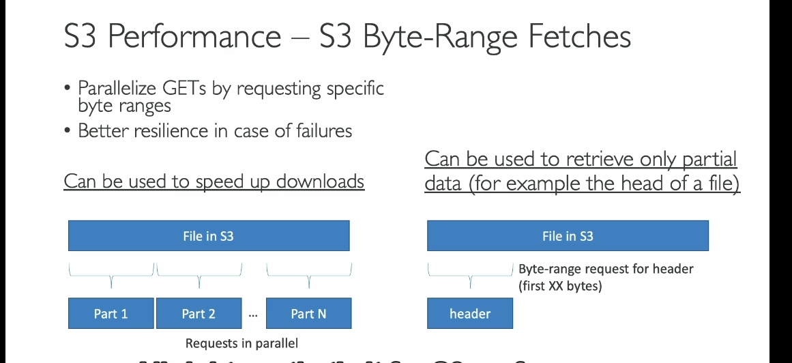
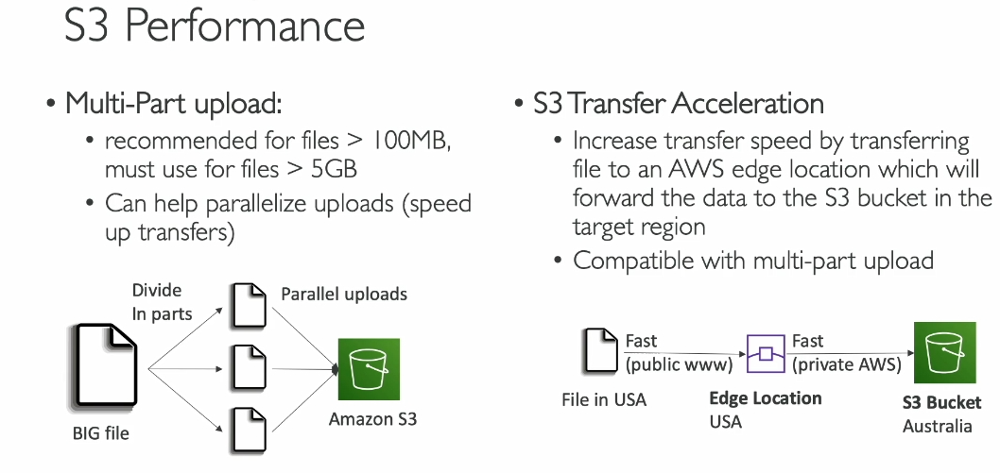

Đoạn transcript trên cung cấp thông tin chi tiết về hiệu suất của **Amazon S3**, bao gồm các khái niệm quan trọng và cách tối ưu hóa hoạt động. Dưới đây là bản phân tích từ vựng và các khái niệm chính:

---

### **Từ vựng và giải thích**:

1. **Baseline performance**:

   - Hiệu suất cơ bản của một hệ thống khi không có bất kỳ tối ưu hóa nào.
   - Trong trường hợp này, S3 có thể xử lý lượng lớn yêu cầu với độ trễ thấp.

2. **Automatically scales**:

   - Tự động mở rộng.
   - Amazon S3 tự động mở rộng để đáp ứng khối lượng công việc lớn.

3. **Requests per second**:

   - Số lượng yêu cầu mà hệ thống có thể xử lý trong một giây.

4. **PUT/COPY/POST/DELETE**:

   - Các thao tác API để lưu trữ, sao chép, tải lên hoặc xóa dữ liệu trong S3.

5. **GET/HEAD requests**:

   - GET: Truy xuất nội dung của file.
   - HEAD: Truy xuất thông tin metadata của file.

6. **Prefix**:

   - Phần đường dẫn giữa tên bucket và tên file, dùng để phân chia dữ liệu trong S3 để tối ưu hóa hiệu suất.

7. **Multi-part upload**:

   - Tải lên nhiều phần.
   - Tính năng cho phép chia file lớn thành nhiều phần nhỏ để tải lên song song.

8. **Transfer acceleration**:

   - Tăng tốc truyền tải.
   - Sử dụng mạng lưới **AWS edge locations** để tăng tốc độ tải lên/tải xuống.

9. **Edge locations**:

   - Điểm biên, là các trung tâm dữ liệu của AWS gần người dùng cuối nhất.

10. **S3 Byte Range Fetches**:

    - Truy xuất phạm vi byte.
    - Yêu cầu chỉ một phần cụ thể của file, thay vì tải toàn bộ file.

11. **Parallelize**:

    - Chạy song song nhiều tác vụ để cải thiện hiệu suất.

12. **KMS limits**:
    - Giới hạn của **Key Management Service** (dịch vụ quản lý khóa mã hóa).

---

### **Giải thích**:

1. **Hiệu suất cơ bản của S3**:

   - S3 có độ trễ thấp (100-200ms) để gửi byte đầu tiên.
   - Có khả năng xử lý 3,500 yêu cầu PUT/POST/DELETE và 5,500 yêu cầu GET/HEAD mỗi giây cho mỗi **prefix**.

2. **Cách tính Prefix**:

   - Dựa trên đường dẫn giữa bucket và file. Mỗi prefix là một "đơn vị độc lập" để tối ưu hóa hiệu suất.

3. **Tối ưu hóa upload/download**:

   - **Multi-part upload**: Chia file lớn thành nhiều phần nhỏ để tải lên nhanh hơn.
   - **Transfer acceleration**: Sử dụng **edge locations** để rút ngắn thời gian truyền tải qua internet công cộng.
   - **Byte Range Fetches**: Tải xuống song song các phần nhỏ của file hoặc chỉ lấy các byte cần thiết.

4. **Ứng dụng thực tế**:
   - Tối ưu hóa cho các trường hợp cần xử lý file lớn hoặc có lượng truy cập cao.

---
