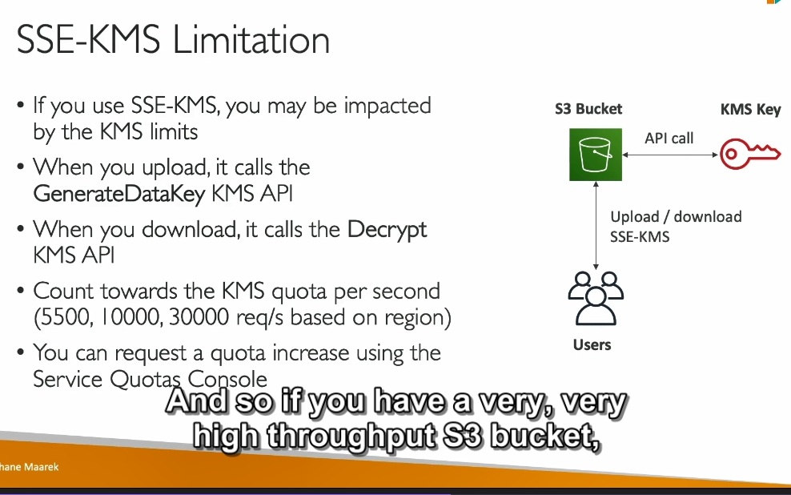
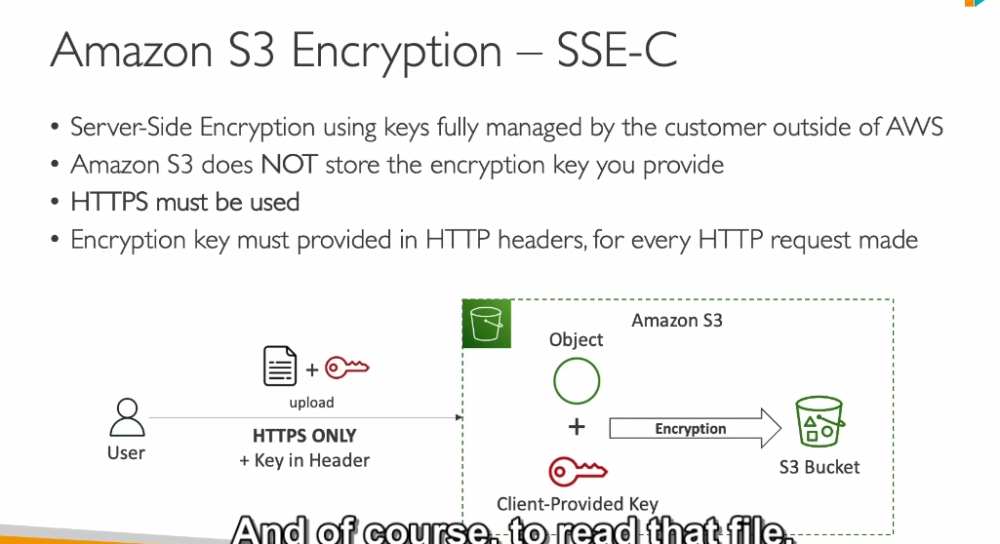
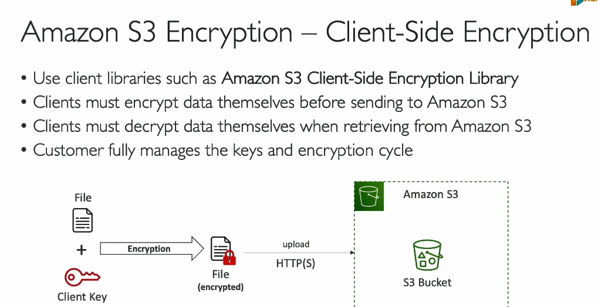

- từ chối tất cả api put nếu như object không được mã hóa bởi ...

# note là nó xem policy trước mới xem đến default encryp

### **Object Encryption trong Amazon S3**

#### 1. **Các phương pháp mã hóa trên Amazon S3**

Amazon S3 hỗ trợ 4 phương pháp mã hóa dữ liệu:

- **Server-Side Encryption (SSE)**:
  - SSE-S3: Mã hóa với khóa do Amazon S3 quản lý.
  - SSE-KMS: Mã hóa với khóa do AWS Key Management Service (KMS) quản lý.
  - SSE-C: Mã hóa với khóa do khách hàng cung cấp.
- **Client-Side Encryption**: Mã hóa dữ liệu phía khách hàng trước khi upload.

---

#### 2. **Server-Side Encryption (SSE)**

**a. SSE-S3**

- **Khóa mã hóa**: AWS quản lý hoàn toàn, không cho người dùng truy cập.
- **Loại mã hóa**: AES-256.
- **Cách sử dụng**:
  - Gửi header `x-amz-server-side-encryption: AES256` trong yêu cầu.
  - SSE-S3 được bật mặc định cho các bucket và object mới.
- **Quy trình hoạt động**:
  - Người dùng upload dữ liệu lên S3.
  - Dữ liệu được mã hóa server-side bằng khóa do S3 sở hữu.
  - Dữ liệu mã hóa được lưu trữ trong bucket.

**b. SSE-KMS**

- **Khóa mã hóa**: Do AWS KMS quản lý, người dùng có quyền kiểm soát.
- **Ưu điểm**:
  - Theo dõi và ghi lại việc sử dụng khóa qua CloudTrail.
  - Có thể tạo và chỉnh sửa quyền sử dụng khóa.
- **Cách sử dụng**:
  - Gửi header `x-amz-server-side-encryption: aws:kms`.
  - Có thể chỉ định một KMS key cụ thể trong yêu cầu.
- **Hạn chế**:
  - Gọi API KMS để mã hóa/giải mã dữ liệu có thể bị giới hạn theo quota API của KMS.
  - Quota API (5,000–30,000 yêu cầu/giây) tùy theo khu vực, có thể tăng qua **Service Quotas Console**.

**c. SSE-C**

- **Khóa mã hóa**: Do người dùng quản lý và cung cấp cho AWS thông qua HTTPS.
- **Cách hoạt động**:
  - Người dùng cung cấp khóa mã hóa khi tải dữ liệu lên.
  - AWS chỉ sử dụng khóa này để mã hóa/giải mã dữ liệu và không lưu trữ nó.
- **Yêu cầu**:
  - Mọi yêu cầu đều phải dùng giao thức HTTPS.
  - Phải gửi khóa mã hóa qua HTTP header.

---

#### 3. **Client-Side Encryption**

- **Quy trình**:
  - Dữ liệu được mã hóa phía khách hàng trước khi tải lên S3.
  - Khóa mã hóa do khách hàng quản lý.
- **Ưu điểm**:
  - AWS không tham gia vào việc mã hóa hoặc giải mã.
  - Đảm bảo dữ liệu được bảo mật trước khi truyền lên S3.

---

#### 4. **Encryption In Transit**

- **SSL/TLS**: Mã hóa dữ liệu trong quá trình truyền tải giữa máy khách và S3.
- **Cách sử dụng**:
  - Bật HTTPS khi giao tiếp với Amazon S3.
  - Đảm bảo rằng dữ liệu không bị rò rỉ trong quá trình truyền.

---

#### **Tóm tắt**:

- **SSE-S3**: Đơn giản, AWS quản lý toàn bộ.
- **SSE-KMS**: Bảo mật cao hơn với quyền kiểm soát khóa.
- **SSE-C**: Người dùng chịu trách nhiệm quản lý khóa.
- **Client-Side Encryption**: Bảo mật tối đa, nhưng phức tạp hơn trong quản lý.

---

DSSE-KMS (Double Server-Side Encryption with KMS) là một phương pháp mã hóa trong AWS, kết hợp sử dụng **KMS (Key Management Service)** để tăng cường bảo mật khi mã hóa dữ liệu. Đây là phương pháp nâng cao, chủ yếu áp dụng trong các kịch bản yêu cầu bảo mật nghiêm ngặt.

### **Tổng quan về DSSE-KMS**

- **DSSE** viết tắt của **Double Server-Side Encryption**, nghĩa là dữ liệu được mã hóa hai lần ở cấp server.
- Cả hai lớp mã hóa đều sử dụng các khóa được quản lý bởi **KMS**.
- DSSE-KMS áp dụng cho dữ liệu lưu trữ trong **Amazon S3**.

---

### **Cách hoạt động của DSSE-KMS**

1. **Quy trình mã hóa:**

   - **Lớp mã hóa thứ nhất**:
     - Dữ liệu được mã hóa bằng **SSE-KMS**, trong đó sử dụng một khóa mã hóa từ KMS.
   - **Lớp mã hóa thứ hai**:
     - Sau khi mã hóa lần đầu, dữ liệu đã mã hóa được mã hóa lại bằng một khóa KMS khác.

2. **Quy trình giải mã:**

   - Để truy cập dữ liệu, bạn cần giải mã theo thứ tự ngược lại:
     - Dữ liệu được giải mã bằng khóa của lớp thứ hai.
     - Sau đó, giải mã lớp thứ nhất để lấy dữ liệu gốc.

3. **Yêu cầu:**
   - Bạn cần có quyền truy cập cả hai khóa mã hóa KMS để thực hiện quá trình mã hóa/giải mã.

---

### **Ưu điểm của DSSE-KMS**

1. **Tăng cường bảo mật:**

   - Dữ liệu được bảo vệ với hai lớp mã hóa độc lập.
   - Ngay cả khi một lớp mã hóa bị xâm phạm, lớp thứ hai vẫn bảo vệ dữ liệu.

2. **Kiểm soát chặt chẽ qua KMS:**

   - Bạn có thể quản lý, giám sát và kiểm tra việc sử dụng các khóa thông qua **AWS CloudTrail**.

3. **Tích hợp tốt trong môi trường AWS:**
   - DSSE-KMS hoạt động mượt mà với các dịch vụ AWS khác, đặc biệt khi cần bảo mật dữ liệu nhạy cảm.

---

### **Hạn chế của DSSE-KMS**

1. **Chi phí cao hơn:**

   - Sử dụng nhiều lớp mã hóa và các API của KMS có thể làm tăng chi phí.

2. **Độ phức tạp:**

   - Cần thiết lập và quản lý nhiều khóa KMS.
   - Quản lý quyền truy cập hai khóa độc lập yêu cầu kiểm soát chặt chẽ.

3. **Giới hạn hiệu suất:**
   - Các API của KMS, như **GenerateDataKey** và **Decrypt**, đều có giới hạn số lần gọi API mỗi giây.
   - Điều này có thể trở thành điểm nghẽn hiệu suất nếu bạn xử lý lượng dữ liệu lớn.

---

### **Khi nào nên dùng DSSE-KMS?**

- Khi bạn làm việc với **dữ liệu cực kỳ nhạy cảm**, như dữ liệu tài chính, y tế hoặc thông tin nhận dạng cá nhân (PII).
- Trong các hệ thống yêu cầu tuân thủ các quy định bảo mật nghiêm ngặt, như **HIPAA**, **GDPR**, hoặc **PCI DSS**.
- Khi bạn cần **bảo mật tối đa** để chống lại các mối đe dọa từ cả bên trong và bên ngoài.
