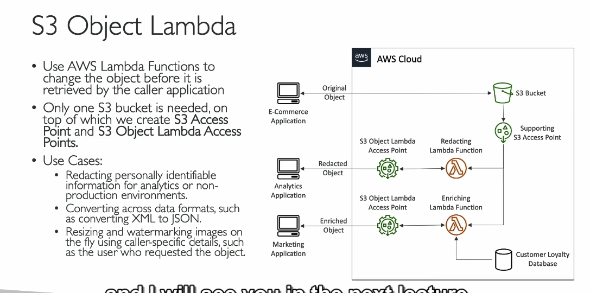

**S3 Object Lambda** và cách nó sử dụng **S3 Access Points** để xử lý dữ liệu trong **Amazon S3**:

### 1. **Giới thiệu về S3 Object Lambda**
   - **S3 Object Lambda** cho phép bạn chỉnh sửa dữ liệu trong **S3 bucket** ngay khi đối tượng (object) được truy xuất. Điều này giúp bạn thực hiện các thao tác như thay đổi định dạng, loại bỏ thông tin nhạy cảm (PII), hoặc thực hiện các phép biến đổi dữ liệu mà không cần phải tạo các bản sao mới của đối tượng trong các bucket khác.
   - Thay vì sao chép bucket để tạo các phiên bản khác nhau của mỗi đối tượng, bạn có thể sử dụng **Lambda** để sửa đổi đối tượng khi nó được yêu cầu.

### 2. **Cách hoạt động của S3 Object Lambda**
   - **S3 Access Points** kết hợp với **Lambda function** cho phép thực hiện các thao tác tùy chỉnh trên dữ liệu trong **S3 bucket**.
   - **Ví dụ ứng dụng**:
     - Một ứng dụng e-commerce có thể lưu trữ dữ liệu gốc trong **S3 bucket**. Khi các ứng dụng khác như **phân tích (analytics)** yêu cầu dữ liệu, họ có thể chỉ nhận được các đối tượng đã được **xóa thông tin nhạy cảm (redacted)**, mà không cần phải tạo một **S3 bucket mới**.
     - Quá trình này hoạt động như sau:
       1. **S3 Object Lambda Access Point** được tạo để kết nối với một **Lambda function**.
       2. Khi có yêu cầu từ ứng dụng phân tích (analytics), Lambda sẽ xử lý đối tượng trong bucket, thực hiện các biến đổi dữ liệu (như xóa thông tin nhạy cảm), và trả lại đối tượng đã được sửa đổi.

### 3. **Tích hợp Lambda và Access Point**
   - **Lambda function** là một đoạn mã chạy trong đám mây, có thể xử lý các đối tượng trong S3 khi được truy cập. Lambda có thể thực hiện nhiều tác vụ như:
     - **Redact dữ liệu** (xóa thông tin nhạy cảm).
     - **Enrich dữ liệu** (làm phong phú dữ liệu từ các nguồn khác, ví dụ: cơ sở dữ liệu khách hàng).
     - **Chuyển đổi định dạng** (như từ XML sang JSON).
   - **S3 Object Lambda Access Point** cho phép ứng dụng truy cập vào **Lambda function** và thực hiện các phép biến đổi đối với dữ liệu theo yêu cầu.

### 4. **Ví dụ về các ứng dụng sử dụng S3 Object Lambda**
   - **Ứng dụng phân tích** có thể cần dữ liệu đã bị **xóa thông tin nhạy cảm**. Thay vì tạo một bucket mới với dữ liệu đã được sửa đổi, bạn có thể sử dụng **Lambda function** để xử lý dữ liệu khi truy xuất.
   - **Ứng dụng marketing** có thể cần dữ liệu đã được **enrich** (làm phong phú) với thông tin từ cơ sở dữ liệu khách hàng, giúp dữ liệu trở nên phù hợp hơn với các chiến dịch tiếp thị.
   - **Chỉnh sửa ảnh**: **S3 Object Lambda** có thể được sử dụng để **resize** hoặc **watermark** hình ảnh khi yêu cầu, và watermark có thể được tùy chỉnh cho từng người dùng.

### 5. **Các trường hợp sử dụng phổ biến**
   - **Redaction**: Xóa **PII (Personally Identifiable Information)** cho các ứng dụng phân tích hoặc môi trường không sản xuất.
   - **Chuyển đổi định dạng**: Ví dụ chuyển đổi từ **XML** sang **JSON** hoặc thực hiện bất kỳ phép biến đổi nào trên dữ liệu.
   - **Tùy chỉnh ảnh**: Thực hiện các thao tác như **resize** và **watermark** ảnh động ngay khi người dùng yêu cầu, với watermark có thể thay đổi theo từng người dùng.

### 6. **Lợi ích của việc sử dụng S3 Object Lambda**
   - **Tiết kiệm chi phí**: Không cần phải tạo và duy trì nhiều **S3 buckets** chứa các phiên bản dữ liệu khác nhau.
   - **Tính linh hoạt cao**: Bạn có thể áp dụng các thay đổi tùy chỉnh đối với dữ liệu ngay khi nó được yêu cầu.
   - **Dễ dàng bảo mật**: Các thông tin nhạy cảm có thể được **xóa bỏ** hoặc **chỉnh sửa** trước khi được chia sẻ, giúp bảo vệ quyền riêng tư của người dùng.

### 7. **Tóm tắt**
   - **S3 Object Lambda** là một tính năng mạnh mẽ giúp bạn xử lý và biến đổi dữ liệu trong **S3 bucket** mà không cần phải tạo các bản sao mới của đối tượng. Việc tích hợp với **Lambda function** giúp bạn dễ dàng thực hiện các thay đổi như **redact** dữ liệu, **enrich** dữ liệu hoặc **chuyển đổi định dạng** mà không tốn thêm chi phí bảo trì nhiều bucket.
