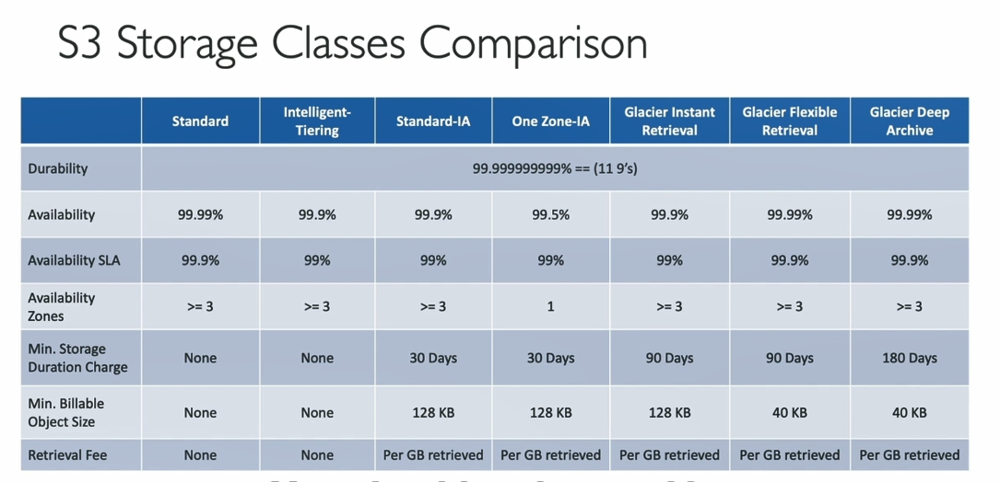
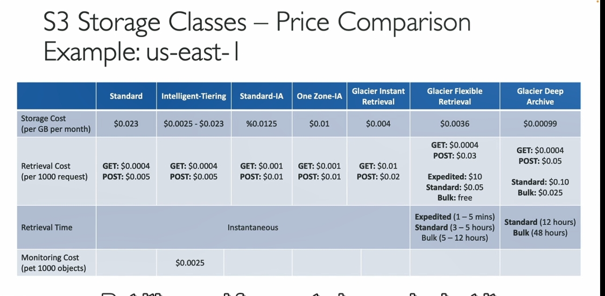

Dưới đây là chi tiết về các lớp lưu trữ (storage classes) của Amazon S3 và các khái niệm liên quan được đề cập trong đoạn video trên:

### Các lớp lưu trữ của Amazon S3:

1. **Amazon S3 Standard - General Purpose**:
   - **Sử dụng cho**: Dữ liệu thường xuyên được truy cập.
   - **Tính năng**: 
     - Độ bền cao (11 nines - 99.999999999%).
     - Tính khả dụng 99.99% (tức là chỉ có khoảng 53 phút không khả dụng trong một năm).
     - Được sử dụng cho các ứng dụng như phân tích dữ liệu lớn, ứng dụng di động, game, và phân phối nội dung.
     - Có thể chịu đựng hai sự cố đồng thời tại các cơ sở AWS khác nhau.

2. **Amazon S3 Infrequent Access (IA)**:
   - **Sử dụng cho**: Dữ liệu ít được truy cập nhưng cần truy cập nhanh khi cần thiết.
   - **Tính năng**: 
     - Chi phí thấp hơn so với S3 Standard.
     - Được tính phí khi truy xuất dữ liệu.
     - Tính khả dụng 99.9% (tức là khoảng 8 giờ không khả dụng trong một năm).
     - Thường được sử dụng cho các bản sao lưu và phục hồi thảm họa.

3. **Amazon S3 One Zone-Infrequent Access (One Zone-IA)**:
   - **Sử dụng cho**: Dữ liệu ít truy cập nhưng có thể chấp nhận mất mát nếu khu vực AZ (Availability Zone) bị hỏng.
   - **Tính năng**: 
     - Lưu trữ trong một khu vực AZ duy nhất, với độ bền cao, nhưng có thể mất dữ liệu nếu khu vực này bị sự cố.
     - Tính khả dụng 99.5%.
     - Thường dùng cho sao lưu phụ của dữ liệu hoặc dữ liệu có thể tái tạo được.

4. **Amazon S3 Glacier**:
   - **Sử dụng cho**: Lưu trữ lâu dài, sao lưu và lưu trữ lạnh.
   - **Tính năng**: 
     - **Amazon S3 Glacier Instant Retrieval**: Truy xuất dữ liệu trong mili giây, thường dùng cho dữ liệu cần truy xuất theo quý, với thời gian lưu trữ tối thiểu là 90 ngày.
     - **Amazon S3 Glacier Flexible Retrieval**: Truy xuất dữ liệu linh hoạt với 3 tùy chọn:
       - **Expedited**: Truy xuất dữ liệu trong 1-5 phút.
       - **Standard**: Truy xuất trong 3-5 giờ.
       - **Bulk**: Truy xuất trong 5-12 giờ (miễn phí).
     - **Amazon S3 Glacier Deep Archive**: Lưu trữ lâu dài với chi phí thấp, truy xuất dữ liệu trong 12-48 giờ, với thời gian lưu trữ tối thiểu 180 ngày.

5. **Amazon S3 Intelligent-Tiering**:
   - **Sử dụng cho**: Tự động di chuyển các đối tượng giữa các lớp lưu trữ dựa trên mẫu sử dụng.
   - **Tính năng**: 
     - Không có chi phí truy xuất.
     - Có một khoản phí giám sát hàng tháng và phí di chuyển tự động giữa các lớp.
     - Các lớp truy cập:
       - **Frequent Access**: Lớp mặc định, dùng cho đối tượng được truy cập thường xuyên.
       - **Infrequent Access**: Dùng cho đối tượng không được truy cập trong 30 ngày.
       - **Archive Instant Access**: Dành cho đối tượng không được truy cập trong 90 ngày.
       - **Archive Access**: Tùy chọn, có thể cấu hình từ 90 đến 700+ ngày.
       - **Deep Archive Access**: Tùy chọn, có thể cấu hình cho đối tượng không được truy cập từ 180 ngày đến 700+ ngày.

### Các khái niệm liên quan:
- **Độ bền (Durability)**: Đo lường khả năng mất mát dữ liệu. Amazon S3 có độ bền cao là **11 nines**, có nghĩa là bạn sẽ mất trung bình một đối tượng trong 10 triệu đối tượng mỗi 10.000 năm.
  
- **Khả năng sẵn sàng (Availability)**: Đo lường mức độ sẵn sàng của dịch vụ. Khả năng sẵn sàng càng thấp, số lượng vùng (Availability Zones) càng ít:
  - **S3 Standard**: Khả năng sẵn sàng 99.99% (khoảng 53 phút không khả dụng mỗi năm).
  - **S3 IA**: Khả năng sẵn sàng 99.9% (khoảng 8 giờ không khả dụng mỗi năm).

### Lưu ý về giá cả:
- Giá của các lớp lưu trữ Amazon S3 phụ thuộc vào khu vực (region). Ví dụ, tại khu vực US East (N. Virginia), mỗi lớp lưu trữ có giá khác nhau.
- Các lớp lưu trữ như Glacier và Glacier Deep Archive có chi phí lưu trữ thấp nhưng có phí truy xuất khi cần dữ liệu.

### Kết luận:
Các lớp lưu trữ của Amazon S3 cung cấp các lựa chọn linh hoạt cho việc lưu trữ dữ liệu dựa trên tần suất truy cập và yêu cầu về độ bền và khả năng sẵn sàng. Bạn có thể chọn lớp lưu trữ phù hợp với nhu cầu của mình và sử dụng các tính năng như **Lifecycle configurations** để tự động chuyển đối tượng giữa các lớp dựa trên thói quen sử dụng.