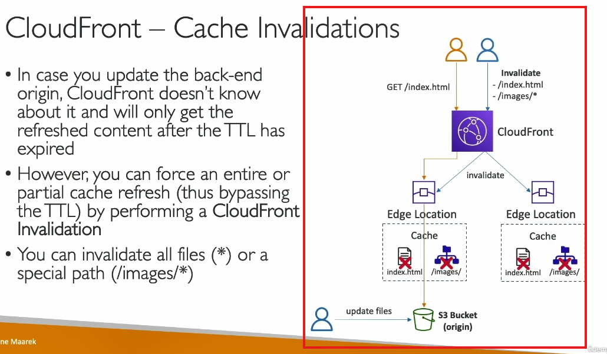

Đoạn transcript này giải thích cách làm mới (invalidate) cache trong Amazon CloudFront, giúp đảm bảo nội dung mới nhất từ backend origin được cập nhật ngay lập tức tới người dùng. Sau đây là tóm tắt nội dung và giải thích chi tiết:

---

#### **1. TTL và Cache tại Edge Locations**:

- TTL là thời gian file được lưu trong cache tại edge locations trước khi hết hạn.
- Nếu file chưa hết TTL, CloudFront sẽ không kiểm tra backend origin và tiếp tục phục vụ nội dung cũ từ cache.

#### **2. Cache Invalidation**:

- **Mục đích**: Làm mới nội dung ngay lập tức thay vì đợi TTL hết hạn.
- **Cách thức**:
  - Sử dụng wildcard (`*`) để làm mới toàn bộ file trong một thư mục (ví dụ: `/images/*`).
  - Chỉ định cụ thể một file để làm mới (ví dụ: `/index.html`).

#### **3. Quy trình hoạt động sau khi invalidation**:

- CloudFront thông báo tới các edge locations để xóa các file được chỉ định khỏi cache.
- Khi người dùng yêu cầu file đó:
  1. Edge location kiểm tra và không thấy file trong cache.
  2. Gửi truy vấn tới backend origin (S3 bucket) để lấy file mới.
  3. File mới được lưu lại vào cache tại edge location.

#### **4. Ứng dụng thực tế**:

- Khi cần cập nhật nội dung website như hình ảnh hoặc file HTML ngay lập tức, thao tác này rất hữu ích.
- Tránh tình trạng người dùng thấy nội dung lỗi thời khi nội dung backend đã thay đổi.

---
