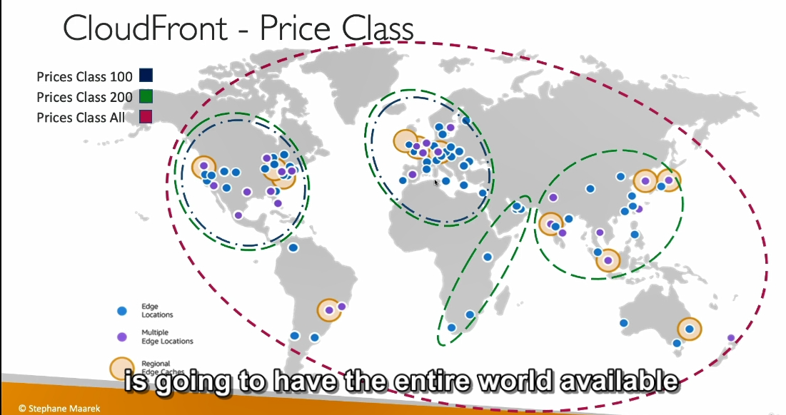

**CloudFront Pricing và Price Classes**

---

#### **1. Tổng quan về Pricing**

- **Các edge location của CloudFront**:

  - Phân bổ trên toàn thế giới.
  - **Chi phí**: Thay đổi tùy theo khu vực địa lý vì giá dữ liệu đầu ra khác nhau.

- **Ví dụ chi phí**:

  - **Mexico, Hoa Kỳ, Canada**:
    - **10TB đầu tiên**: $0.085/GB.
  - **Ấn Độ**:
    - **10TB đầu tiên**: $0.17/GB (cao gấp đôi so với khu vực Bắc Mỹ).

- **Giảm chi phí khi dữ liệu tăng**:
  - Nếu dữ liệu đầu ra vượt **5PB**, giá chỉ còn **$0.02/GB** ở Hoa Kỳ.

---

#### **2. Price Classes**

- **Ý nghĩa**:  
  Cho phép giới hạn số lượng **edge location** sử dụng trong phân phối CloudFront để **giảm chi phí**.

- **Ba loại Price Classes**:
  1. **Price Class All**:
     - Sử dụng tất cả edge location trên toàn cầu.
     - **Hiệu suất tốt nhất** nhưng **chi phí cao nhất**.
  2. **Price Class 200**:
     - Loại trừ các khu vực đắt đỏ nhất.
     - Phù hợp với hiệu suất **trung bình** và chi phí **hợp lý**.
  3. **Price Class 100**:
     - Chỉ sử dụng các khu vực có chi phí thấp nhất.
     - Tập trung vào **Bắc Mỹ** và **châu Âu**.
     - **Hiệu suất thấp hơn** so với hai lựa chọn trên.

---

#### **3. So sánh Price Classes**

| **Price Class** | **Khu vực**                        | **Chi phí** | **Hiệu suất** |
| --------------- | ---------------------------------- | ----------- | ------------- |
| **All**         | Toàn cầu                           | Cao nhất    | Tốt nhất      |
| **200**         | Phần lớn khu vực (trừ đắt đỏ nhất) | Trung bình  | Khá tốt       |
| **100**         | Bắc Mỹ, châu Âu                    | Thấp nhất   | Trung bình    |

---

#### **4. Ví dụ minh họa**

- **Price Class All**:

  - Kích hoạt tất cả edge location, bao gồm cả khu vực **Ấn Độ**, **Nam Mỹ**, v.v.
  - **Chi phí cao**, phù hợp nếu cần hiệu suất tối ưu trên toàn cầu.

- **Price Class 100**:
  - Chỉ sử dụng Bắc Mỹ và châu Âu.
  - **Chi phí thấp**, hiệu suất phù hợp với đối tượng người dùng tại các khu vực này.

---

#### **5. Đồ họa minh họa Price Classes**

- **Price Class 100**:
  - Khu vực **Bắc Mỹ** và **châu Âu**.
- **Price Class 200**:
  - Thêm khu vực **Châu Á** và một phần **Nam Mỹ**.
- **Price Class All**:
  - Toàn cầu, bao gồm các khu vực đắt đỏ như **Ấn Độ**.

---

#### **6. Lưu ý quan trọng**

- **Chọn Price Class dựa vào**:

  - Đối tượng người dùng (global hay chỉ một số khu vực).
  - Ngân sách cho chi phí CloudFront.
  - Hiệu suất mong muốn cho ứng dụng hoặc website.

- **Tối ưu hóa chi phí**:
  - Xem xét loại bỏ các edge location không cần thiết để giảm chi phí vận hành.

---

#### **Tóm tắt**

| Thành phần          | Vai trò                                          |
| ------------------- | ------------------------------------------------ |
| **Pricing**         | Chi phí dữ liệu đầu ra thay đổi theo khu vực.    |
| **Price Classes**   | Giới hạn số lượng edge location để giảm chi phí. |
| **Price Class All** | Tất cả edge location, hiệu suất tối ưu.          |
| **Price Class 200** | Loại trừ các khu vực đắt đỏ nhất.                |
| **Price Class 100** | Chỉ các khu vực có chi phí thấp nhất.            |

---
