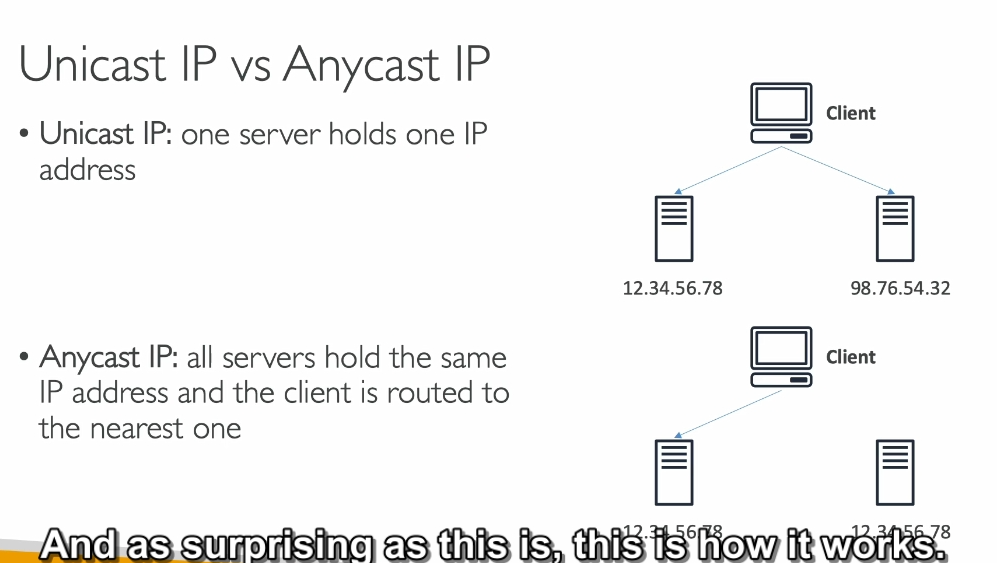

---

### **1. Vấn đề cần giải quyết**

Khi bạn triển khai một ứng dụng web hoặc dịch vụ API trong một khu vực AWS (ví dụ: ở Singapore), người dùng từ các khu vực xa như Mỹ, châu Âu hoặc Úc sẽ gặp phải các vấn đề:

- **Độ trễ cao**: Dữ liệu phải đi qua nhiều "bước trung gian" trên mạng internet công cộng, mất nhiều thời gian.
- **Mất mát dữ liệu hoặc ngắt kết nối**: Các sự cố như đứt cáp hoặc lỗi mạng có thể làm gián đoạn kết nối.
- **Hiệu suất không đồng nhất**: Người dùng gần với khu vực triển khai (Singapore) có trải nghiệm tốt hơn nhiều so với người dùng ở xa (Mỹ hoặc châu Âu).

**Mục tiêu**:

- Đảm bảo **độ trễ thấp**, **hiệu suất ổn định**, và **bảo mật cao** cho người dùng toàn cầu.

---

### **2. AWS Global Accelerator là gì?**

AWS Global Accelerator là một dịch vụ giúp tăng hiệu suất và tính khả dụng của ứng dụng bằng cách sử dụng **mạng toàn cầu AWS** và công nghệ **Anycast IP**.

- **Anycast IP**:

  - Đây là loại IP có thể được định tuyến tới nhiều vị trí khác nhau trên toàn cầu.
  - Khi người dùng gửi yêu cầu đến Anycast IP, hệ thống sẽ tự động định tuyến yêu cầu đó đến edge location gần nhất.
  - Ví dụ:
    - Người dùng từ Mỹ sẽ được định tuyến đến edge location ở Mỹ.
    - Người dùng từ châu Âu sẽ được định tuyến đến edge location ở châu Âu.

- **Edge Location**:
  - Đây là các điểm mạng AWS đặt gần người dùng trên toàn cầu (hơn 450 điểm trên toàn thế giới).
  - Nhiệm vụ của edge location:
    1. Nhận dữ liệu từ người dùng.
    2. Chuyển dữ liệu qua mạng nội bộ AWS đến ứng dụng của bạn (ví dụ: ALB hoặc EC2).

---

### **3. Cách hoạt động của AWS Global Accelerator**

#### a) **Cấu trúc mạng nội bộ AWS**

- AWS Global Accelerator sử dụng mạng riêng AWS (AWS Global Network) để truyền dữ liệu từ edge location tới các dịch vụ AWS (ALB, EC2, NLB, v.v.).
- Điều này giúp tránh các rủi ro khi sử dụng internet công cộng:
  - Giảm độ trễ vì không phải qua nhiều bước trung gian.
  - Tăng độ ổn định nhờ ít bị ảnh hưởng bởi các sự cố mạng công cộng.

#### b) **Các thành phần chính**

- **Global Accelerator**:
  - Cung cấp **2 Anycast IP** cố định, dùng làm điểm truy cập toàn cầu cho người dùng.
  - 2 IP này được phân bổ ở các edge location khác nhau để đảm bảo tính khả dụng.
- **Listener**:
  - Định nghĩa cách Global Accelerator nhận lưu lượng truy cập từ người dùng.
  - Bạn có thể cấu hình port (ví dụ: HTTP 80, HTTPS 443).
- **Endpoint Group**:
  - Một nhóm điểm cuối (endpoint) trong cùng một khu vực AWS.
  - Ví dụ: Nếu ứng dụng của bạn triển khai ở Singapore và Mỹ, bạn sẽ có 2 nhóm endpoint (mỗi nhóm tương ứng với một khu vực).
- **Endpoint**:
  - Là các đích đến cuối cùng nhận lưu lượng truy cập từ Global Accelerator.
  - Endpoint có thể là:
    - Application Load Balancer (ALB).
    - Network Load Balancer (NLB).
    - EC2 Instance hoặc Elastic IP.

#### c) **Quy trình xử lý lưu lượng truy cập**

1. Người dùng gửi yêu cầu đến ứng dụng qua Anycast IP.
2. Yêu cầu được định tuyến đến edge location gần nhất.
3. Dữ liệu từ edge location được truyền qua mạng nội bộ AWS tới endpoint (ứng dụng) gần nhất với edge location đó.

#### d) **Chuyển vùng tự động (Failover)**

- Nếu một endpoint gặp sự cố, AWS Global Accelerator sẽ tự động chuyển hướng lưu lượng truy cập sang endpoint khác trong chưa đầy 1 phút.

---

### **4. So sánh AWS Global Accelerator và AWS CloudFront**

| **Đặc điểm**             | **AWS Global Accelerator**                                  | **AWS CloudFront**                                |
| ------------------------ | ----------------------------------------------------------- | ------------------------------------------------- |
| **Mục đích chính**       | Tăng hiệu suất ứng dụng toàn cầu thông qua mạng nội bộ AWS. | Tăng hiệu suất tải nội dung tĩnh (CDN).           |
| **Sử dụng mạng AWS**     | Có (định tuyến qua mạng AWS).                               | Có (phục vụ nội dung từ edge location).           |
| **Hỗ trợ cache**         | Không.                                                      | Có (lưu trữ và cache nội dung tĩnh như hình ảnh). |
| **Hỗ trợ nội dung động** | Có (chuyển tiếp toàn bộ lưu lượng qua AWS Global Network).  | Có (thông qua kết nối back-to-origin).            |

---

### **5. Lợi ích chi tiết của AWS Global Accelerator**

#### a) **Tăng hiệu suất và giảm độ trễ**

- Tự động định tuyến người dùng đến edge location gần nhất thông qua **Anycast IP**.
- Tận dụng mạng nội bộ AWS để truyền dữ liệu, giảm thời gian chờ và độ trễ.

#### b) **Cải thiện tính khả dụng**

- Hỗ trợ **Failover tự động**: Nếu một endpoint hoặc khu vực gặp sự cố, hệ thống sẽ chuyển lưu lượng sang endpoint khác.
- Sử dụng 2 Anycast IP giúp duy trì kết nối ngay cả khi một IP gặp lỗi.

#### c) **Quản lý dễ dàng**

- Không cần thay đổi IP nếu bạn di chuyển ứng dụng hoặc thêm endpoint mới.
- Chỉ sử dụng 2 IP cố định, dễ dàng cấu hình firewall.

#### d) **Bảo mật cao**

- Dữ liệu được truyền trên mạng AWS riêng, ít bị ảnh hưởng bởi các rủi ro từ internet công cộng.
- Tích hợp với AWS Shield để bảo vệ chống lại các cuộc tấn công DDoS.

---

### **6. Ứng dụng thực tế**

- **E-commerce**:
  - Đảm bảo người dùng ở mọi khu vực đều có trải nghiệm mua sắm nhanh và ổn định.
- **Game Online**:
  - Giảm độ trễ khi chơi game nhờ kết nối nhanh đến các máy chủ.
- **Dịch vụ API toàn cầu**:
  - Các API phục vụ người dùng quốc tế (ví dụ: ứng dụng di động) sẽ hoạt động mượt mà hơn.

# so sánh

### **1. Cải thiện hiệu suất cho nhiều loại ứng dụng sử dụng TCP hoặc UDP**

- **TCP và UDP** là hai loại giao thức (cách thức) mà máy tính sử dụng để gửi dữ liệu cho nhau. Cả hai giao thức này đều giúp đảm bảo dữ liệu được gửi đi một cách chính xác, nhưng UDP nhanh hơn và không kiểm tra lỗi, trong khi TCP chậm hơn nhưng đảm bảo dữ liệu được truyền đầy đủ.

- **Ví dụ**: Trong trường hợp trò chơi trực tuyến (UDP), tốc độ là quan trọng hơn sự chính xác hoàn toàn, nên UDP được dùng. Global Accelerator giúp làm cho trò chơi hoặc các ứng dụng kiểu này chạy nhanh hơn, mượt mà hơn bằng cách giảm độ trễ (thời gian chờ giữa người chơi và máy chủ).

### **2. Chuyển tiếp gói tin tại các vị trí edge tới các ứng dụng chạy ở một hoặc nhiều khu vực AWS**

- **Vị trí "edge"** là những máy chủ nằm gần người dùng cuối, giúp giảm thời gian phản hồi khi người dùng yêu cầu dữ liệu. 
- Khi bạn sử dụng Global Accelerator, **nó sẽ "chuyển tiếp"** (proxy) các yêu cầu của người dùng đến các máy chủ ứng dụng đang chạy ở các khu vực khác nhau trên AWS để đảm bảo rằng người dùng nhận được dữ liệu nhanh chóng từ nơi gần nhất.

- **Ví dụ**: Nếu bạn đang ở Việt Nam và chơi game với người ở Mỹ, Global Accelerator giúp trò chơi của bạn không bị lag (trễ) vì nó sẽ chuyển tiếp dữ liệu qua máy chủ gần bạn hơn, thay vì phải đi xa tới Mỹ.

### **3. Phù hợp với các ứng dụng không phải HTTP, như trò chơi (UDP), IoT (MQTT), hoặc Voice over IP**

- **Ứng dụng không phải HTTP** là các ứng dụng không sử dụng giao thức web thông thường (HTTP, như trình duyệt web). Những ứng dụng này có thể là:
  - **Trò chơi (UDP)**: Trò chơi trực tuyến yêu cầu tốc độ truyền tải dữ liệu nhanh, không cần đảm bảo chính xác 100% mỗi lần (UDP).
  - **IoT (MQTT)**: Các thiết bị kết nối Internet như cảm biến, thiết bị thông minh. Những thiết bị này sử dụng giao thức MQTT để giao tiếp.
  - **Voice over IP**: Các cuộc gọi thoại qua Internet như Skype hoặc Zoom cần có chất lượng âm thanh ổn định, không có độ trễ lớn.

Global Accelerator giúp các ứng dụng này hoạt động nhanh hơn và mượt mà hơn bằng cách giảm độ trễ và tối ưu hóa đường truyền.

### **4. Phù hợp với các ứng dụng HTTP cần địa chỉ IP tĩnh**

- **Địa chỉ IP tĩnh** là một địa chỉ mạng cố định, không thay đổi. Một số ứng dụng cần địa chỉ IP tĩnh vì lý do bảo mật hoặc để kết nối với các hệ thống khác mà yêu cầu địa chỉ này không thay đổi.
  
- **Ví dụ**: Một website doanh nghiệp có thể cần địa chỉ IP tĩnh để đảm bảo rằng các khách hàng hoặc đối tác kết nối với nó sẽ luôn đến đúng địa chỉ, không bị thay đổi.

### **5. Phù hợp với các ứng dụng HTTP cần chuyển vùng nhanh chóng khi có sự cố**

- **Chuyển vùng nhanh chóng** có nghĩa là khi một khu vực máy chủ gặp sự cố (hỏng hóc), Global Accelerator sẽ tự động chuyển lưu lượng (dữ liệu) đến khu vực khác mà không làm gián đoạn dịch vụ. Điều này giúp ứng dụng luôn hoạt động liên tục, kể cả khi một số máy chủ gặp vấn đề.

- **Ví dụ**: Một trang web thương mại điện tử có thể đặt máy chủ ở nhiều khu vực khác nhau (như Mỹ, Châu Á, Châu Âu). Nếu máy chủ ở Mỹ gặp sự cố, Global Accelerator sẽ tự động chuyển lưu lượng đến máy chủ ở Châu Á mà không làm gián đoạn mua sắm của khách hàng.

---

Tóm lại, **Global Accelerator** giúp cải thiện tốc độ và độ tin cậy của các ứng dụng, đặc biệt là khi người dùng ở nhiều nơi khác nhau, giúp giảm độ trễ và tăng tính ổn định cho các ứng dụng không phải HTTP, hoặc các ứng dụng HTTP yêu cầu độ ổn định và tính sẵn sàng cao.