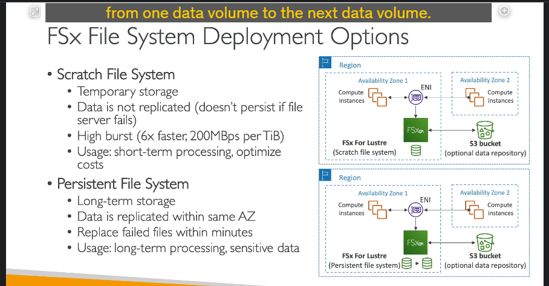

### Tổng quan về Amazon FSx

**Amazon FSx** là dịch vụ của AWS cho phép bạn khởi chạy các hệ thống tệp (file systems) hiệu suất cao từ bên thứ ba trên nền tảng AWS như một dịch vụ được quản lý hoàn toàn. Cách thức hoạt động của FSx giống như **Amazon RDS** nhưng dành cho hệ thống tệp, thay vì cơ sở dữ liệu. FSx hỗ trợ nhiều loại file system, bao gồm:

1. **FSx for Windows File Server**
2. **FSx for Lustre**
3. **FSx for NetApp ONTAP**
4. **FSx for OpenZFS**

---

### Chi tiết từng loại:

#### **1. Amazon FSx for Windows File Server**

- **Mục đích:** Hệ thống tệp chia sẻ được quản lý hoàn toàn, hỗ trợ các ứng dụng và hạ tầng dựa trên Windows.
- **Đặc điểm chính:**
  - Hỗ trợ [**SMB protocol** (Server Message Block) và **NTFS** (Windows NT File System).](image/./lý-thuyết-bên-lề/SMB-NTFS.md)
  - Tích hợp với [**Microsoft Active Directory (AD)**](image/./lý-thuyết-bên-lề/AD.md) để bảo mật người dùng.
  - Sử dụng [**ACLs (Access Control Lists)**](image/./lý-thuyết-bên-lề/ACLs.md) và quản lý hạn mức người dùng ([user quotas](image/./lý-thuyết-bên-lề/user-quota.md)).
  - Có thể gắn (mount) vào Linux EC2 Instances.
  - **DFS (Distributed File System):** Kết nối FSx với hệ thống Windows File Server tại chỗ (on-premises).
- **Hiệu suất:**
  - Đạt hàng chục GB/giây.
  - Hàng triệu IOPS.
  - Hỗ trợ lưu trữ lên đến hàng trăm petabyte.
- **Lựa chọn lưu trữ:**
  - **SSD:** Hiệu suất cao, độ trễ thấp, dành cho các khối lượng công việc nhạy cảm với độ trễ như cơ sở dữ liệu, xử lý dữ liệu đa phương tiện.
  - **HDD:** Giá rẻ hơn, phù hợp cho các khối lượng công việc ít yêu cầu, như thư mục người dùng hoặc [hệ thống CMS](image/./lý-thuyết-bên-lề/CMS.md).
- **Khả năng kết nối:**
  - Kết nối với cơ sở hạ tầng tại chỗ qua kết nối riêng.
  - Có thể cấu hình Multi-AZ (đa vùng khả dụng) để đảm bảo tính khả dụng cao.
- **Backup:** Tất cả dữ liệu được sao lưu hàng ngày vào **Amazon S3**.

---

#### **2. Amazon FSx for Lustre**

- **Mục đích:** Hệ thống tệp phân tán hiệu suất cao, tập trung vào điện toán quy mô lớn.
- **Đặc điểm chính:**
  - Tên Lustre bắt nguồn từ **Linux** và **Cluster**.
  - Dùng trong các trường hợp:
    - **HPC (High-Performance Computing):** Điện toán hiệu suất cao.
    - **Machine Learning.**
    - [**Video Processing, Financial Modeling, Electronic Design Automation.**](image/./lý-thuyết-bên-lề/usecase-lustre.md)
  - Đạt hiệu suất cao:
    - Hàng trăm GB/giây.
    - Hàng triệu IOPS.
    - Độ trễ dưới mili giây.
- **Lựa chọn lưu trữ:**
  - **SSD:** Dành cho khối lượng công việc nhạy cảm với IOPS, xử lý tệp nhỏ và ngẫu nhiên.
  - **HDD:** Dành cho khối lượng công việc cần băng thông cao, xử lý tệp lớn và tuần tự.
- **Tích hợp Amazon S3:**

  - Có thể đọc dữ liệu từ S3 như một hệ thống tệp.
  - Ghi kết quả xử lý từ FSx trở lại S3.

- **Kết nối với on-premises:** Có thể truy cập từ các server on-premises qua VPN hoặc AWS Direct Connect.

---

- **Lựa chọn triển khai file system:**
  
  1. **Scratch File System:**
     - **Lưu trữ tạm thời:** Dữ liệu không được sao chép và sẽ mất nếu server gặp sự cố.
     - **Hiệu suất cao:** Tối ưu hóa để đạt hiệu suất vượt trội, gấp 6 lần so với Persistent File System.
       - Ví dụ: **200 MB/s** mỗi TB thông lượng.
     - **Trường hợp sử dụng:** Xử lý dữ liệu ngắn hạn, tối ưu chi phí do không cần sao chép dữ liệu.
     - **Kiến trúc:** Chỉ có **một bản sao dữ liệu**, có thể sử dụng thêm S3 như một kho dữ liệu nền.
  2. **Persistent File System:**
     - **Lưu trữ lâu dài:** Dữ liệu được sao chép trong cùng một **Availability Zone (AZ)**.
     - **Độ bền cao:** Khi server bị lỗi, dữ liệu được khôi phục trong vài phút.
     - **Trường hợp sử dụng:** Lưu trữ lâu dài và xử lý dữ liệu nhạy cảm.
     - **Kiến trúc:** Có hai bản sao dữ liệu trong cùng một AZ, đảm bảo an toàn.

---

#### **3.Amazon FSx for NetApp ONTAP**

- **Tổng quan:** File system NetApp ONTAP được quản lý trên AWS.
- **Hỗ trợ giao thức:** **NFS, SMB, iSCSI.**
- **Trường hợp sử dụng chính:**
  - Di chuyển khối lượng công việc [ONTAP hoặc NAS](image/./lý-thuyết-bên-lề/ONTAP-NAS.md) (Network Attached Storage) từ on-premises sang AWS.
  - Tương thích với nhiều nền tảng: **Linux, Windows, macOS**, và các dịch vụ AWS như **VMware Cloud, WorkSpaces, AppStream, EC2, ECS, EKS**.
- **Tính năng nổi bật:**
  - **Auto-scaling:** Tự động mở rộng hoặc thu nhỏ dung lượng lưu trữ.
  - **Replication và Snapshots:** Hỗ trợ sao chép và tạo bản snapshot của dữ liệu.
  - **Data compression & de-duplication:** Giảm chi phí lưu trữ bằng cách nén và loại bỏ tệp trùng lặp.
  - **Instantaneous cloning:** Tạo bản sao tức thời, hữu ích để thử nghiệm hoặc kiểm tra khối lượng công việc.

---

#### **4.Amazon FSx for OpenZFS**

- **Tổng quan:** File system OpenZFS được quản lý trên AWS.
- **Hỗ trợ giao thức:** **NFS** với nhiều phiên bản.
- **Trường hợp sử dụng chính:**
  - Di chuyển khối lượng công việc đang chạy trên [OpenZFS](image/./lý-thuyết-bên-lề/openzfs.md) từ nội bộ sang AWS.
- **Tính năng nổi bật:**
  - **Hiệu suất cao:** Lên đến **1 triệu IOPS** với độ trễ dưới 0.5ms.
  - **Snapshots và compression:** Hỗ trợ lưu snapshot và nén dữ liệu.
  - **Instantaneous cloning:** Tạo bản sao tức thời cho thử nghiệm.
  - **Không hỗ trợ de-duplication.**
- **Tương thích:** Làm việc tốt với Linux, macOS, Windows.

---

### So sánh tổng quan các loại FSx

| Loại FSx                | Giao thức       | Trường hợp sử dụng chính                                   | Tính năng nổi bật                         |
| ----------------------- | --------------- | ---------------------------------------------------------- | ----------------------------------------- |
| **Windows File Server** | SMB, NTFS       | Ứng dụng Windows, tích hợp Active Directory                | Multi-AZ, backup S3, hỗ trợ ACLs          |
| **Lustre**              | N/A             | HPC, Machine Learning, xử lý dữ liệu ngắn/dài hạn          | Hiệu suất cao, tích hợp S3                |
| **NetApp ONTAP**        | NFS, SMB, iSCSI | Di chuyển ONTAP/NAS từ on-premises, môi trường đa nền tảng | Auto-scaling, snapshot, de-duplication    |
| **OpenZFS**             | NFS             | Di chuyển OpenZFS từ nội bộ                                | Hiệu suất cao, cloning tức thời, snapshot |

---

### Ghi chú khi làm bài thi

- Chọn loại FSx dựa trên **giao thức**, **trường hợp sử dụng**, và **tính năng nổi bật**.
- Nhớ đặc điểm **scratch** và **persistent file system** của FSx for Lustre.
- Để ý các tính năng như **snapshots**, **replication**, và **instantaneous cloning**, vì đây là những từ khóa thường xuất hiện trong câu hỏi trắc nghiệm.
