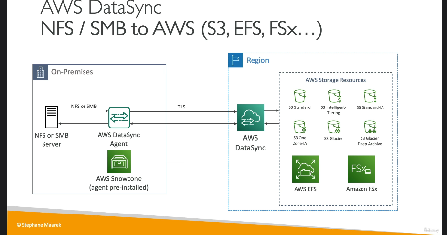
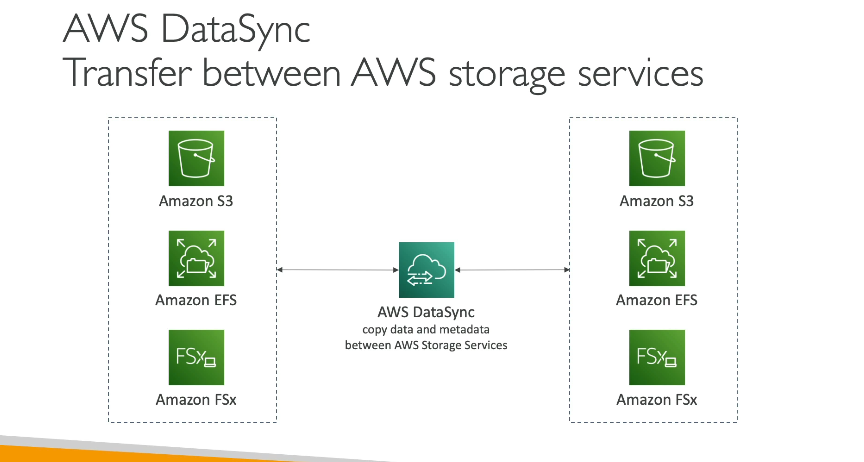

AWS **DataSync** là một dịch vụ giúp bạn di chuyển và đồng bộ hóa dữ liệu giữa các hệ thống lưu trữ khác nhau, như giữa các máy chủ tại chỗ (on-premises) và các dịch vụ AWS. Đây là một dịch vụ đơn giản nhưng mạnh mẽ, đặc biệt hữu ích trong việc di chuyển lượng dữ liệu lớn vào và ra từ AWS.

### Các Tính Năng Chính của AWS DataSync:
1. **Đồng Bộ Dữ Liệu**: 
   - Bạn có thể đồng bộ hóa dữ liệu từ các hệ thống tại chỗ như NFS, SMB, HDFS hoặc từ các đám mây khác vào AWS. Các dịch vụ AWS như **Amazon S3**, **Amazon EFS**, và **Amazon FSx** đều hỗ trợ đồng bộ hóa qua DataSync.
   
2. **Quá Trình Di Chuyển Dữ Liệu**:
   - Dịch vụ này yêu cầu một **DataSync agent** được cài đặt trên các máy chủ tại chỗ hoặc đám mây khác. Agent này sẽ kết nối với dịch vụ DataSync của AWS và thực hiện việc di chuyển dữ liệu.
   - **DataSync** hỗ trợ di chuyển dữ liệu theo lịch trình, có thể là hàng giờ, hàng ngày hoặc hàng tuần.
   
3. **Bảo Mật và Metadata**:
   - DataSync bảo vệ dữ liệu trong quá trình di chuyển bằng cách mã hóa khi truyền tải.
   - Đồng thời, dịch vụ này duy trì **metadata** và **quyền truy cập tệp** (permissions), đảm bảo tính toàn vẹn của dữ liệu khi chuyển từ hệ thống này sang hệ thống khác, ví dụ, từ SMB hoặc NFS sang S3 hoặc EFS.

4. **Hiệu Năng**:
   - **DataSync** có thể xử lý tốc độ lên đến **10 Gbps** với mỗi tác vụ di chuyển, tuy nhiên, bạn có thể thiết lập giới hạn băng thông nếu không muốn chiếm dụng hết dung lượng mạng.

5. **Tương Thích với AWS Snowcone**:
   - Nếu không có đủ băng thông mạng, bạn có thể sử dụng **AWS Snowcone**, một thiết bị lưu trữ cầm tay có sẵn DataSync agent cài đặt sẵn. Snowcone sẽ thu thập dữ liệu từ các máy chủ tại chỗ và gửi dữ liệu vào AWS khi được chuyển đến vùng AWS của bạn.

6. **Không Đồng Bộ Liên Tục**:
   - Các tác vụ đồng bộ hóa không phải là liên tục, mà được thực hiện theo một lịch trình nhất định, và bạn có thể tùy chỉnh tần suất (hàng giờ, hàng ngày hoặc hàng tuần).

7. **Ứng Dụng**:
   - **DataSync** rất phù hợp để di chuyển và đồng bộ hóa dữ liệu cho các ứng dụng như sao lưu, phục hồi thảm họa, hoặc chuyển các tệp từ hệ thống này sang hệ thống khác trong AWS.

### Các Dịch Vụ Hỗ Trợ:
- **Amazon S3** (bao gồm tất cả các lớp lưu trữ của S3 như Glacier).
- **Amazon EFS** (Hệ thống tệp mạng).
- **Amazon FSx** (Dịch vụ tệp Windows hoặc Lustre).

Với AWS DataSync, bạn có thể dễ dàng chuyển và đồng bộ hóa dữ liệu giữa các hệ thống và dịch vụ AWS mà không gặp phải vấn đề về bảo mật hay mất mát dữ liệu.