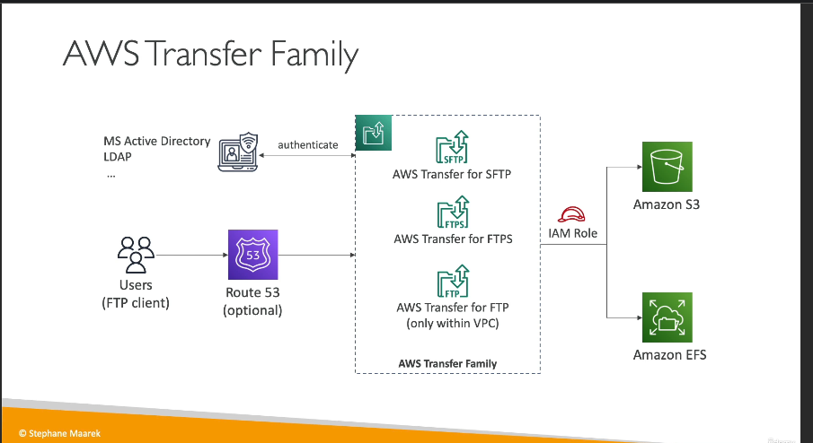

**AWS Transfer Family** là một dịch vụ quản lý hoàn toàn của AWS cho phép truyền tệp tin an toàn vào và ra từ **Amazon S3** hoặc **Amazon EFS** sử dụng các giao thức tiêu chuẩn. Dịch vụ này cho phép người dùng tương tác với Amazon S3 và EFS mà không cần phải sử dụng API của S3 hoặc hệ thống tệp của EFS trực tiếp, thay vào đó sử dụng các giao thức **FTP**, **FTPS** và **SFTP**.

### Các Tính Năng Chính:

1. **Các Giao Thức Hỗ Trợ**:

   - **FTP (File Transfer Protocol)**: Truyền tệp không mã hóa.
   - **FTPS (FTP Secure)**: FTP qua SSL, có mã hóa trong quá trình truyền tải.
   - **SFTP (Secure File Transfer Protocol)**: Truyền tệp an toàn sử dụng SSH.

2. **Các Trường Hợp Sử Dụng**:

   - Dùng khi bạn muốn sử dụng các giao thức **FTP** thay vì API của S3 hoặc hệ thống tệp EFS để tải lên hoặc tải xuống tệp.
   - Thường dùng cho các ứng dụng chia sẻ tệp, dữ liệu công khai, hoặc các hệ thống như **CRM**, **ERP**, v.v.

3. **Quản Lý và Bảo Mật**:

   - **Cơ Sở Hạ Tầng Quản Lý Hoàn Toàn**: AWS đảm nhiệm việc mở rộng, độ tin cậy và tính sẵn sàng.
   - **Xác Thực Người Dùng**: Bạn có thể quản lý thông tin người dùng trực tiếp trong AWS Transfer Family, hoặc tích hợp với các hệ thống xác thực như **Microsoft Active Directory**, **LDAP**, **Okta**, **Amazon Cognito**, hoặc các nguồn tùy chỉnh.
   - **Mã Hóa**: FTPS và SFTP cung cấp truyền tải mã hóa, trong khi FTP không mã hóa.

4. **Giá Cả**:

   - Bạn sẽ phải trả theo:
     - Điểm cuối được cấp phát (theo giờ).
     - Dữ liệu chuyển vào và ra khỏi dịch vụ (theo gigabyte).

5. **IAM Roles và Điểm Cuối**:
   - **IAM Role**: Dịch vụ sử dụng vai trò IAM để gửi hoặc đọc tệp từ Amazon S3 hoặc EFS.
   - **DNS Tùy Chỉnh**: Bạn có thể sử dụng **Route 53** để tạo tên miền riêng cho dịch vụ FTP.
