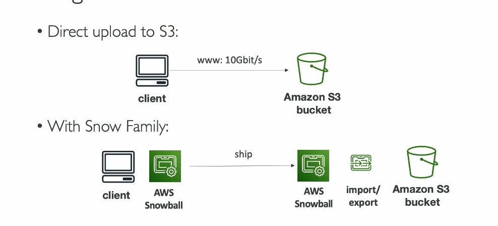
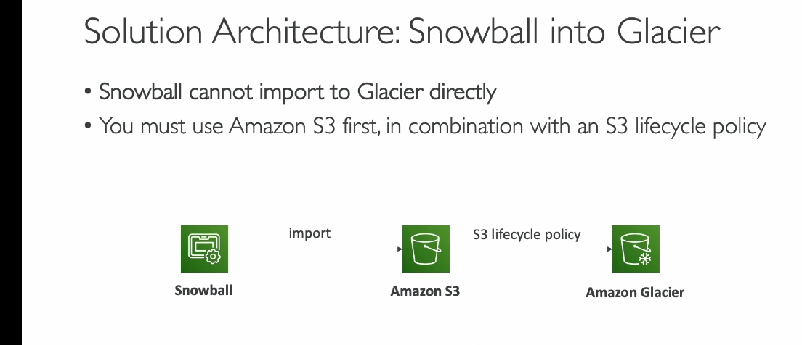

AWS Snow Family bao gồm các thiết bị như **Snowcone** và **Snowball Edge**, phục vụ hai mục tiêu chính: **di chuyển dữ liệu (data migration)** và **xử lý dữ liệu tại biên (edge computing)**. 

---

### **1. Tổng quan AWS Snow Family**
- **Thiết bị di động, bảo mật cao** để thu thập, xử lý dữ liệu tại biên và di chuyển dữ liệu vào/ra AWS.
- **Hai loại thiết bị chính**:
  - **Snowcone**: Dung lượng nhỏ (8-14 TB), phù hợp với khối lượng di chuyển nhỏ (terabyte).
  - **Snowball Edge**: Dung lượng lớn hơn (80-210 TB), hỗ trợ di chuyển dữ liệu lớn hơn (petabyte).

---

### **2. Tại sao cần dùng AWS Snow Family?**
- **Thách thức khi di chuyển dữ liệu qua mạng**:
  - Tốc độ mạng chậm hoặc không ổn định.
  - Bandwidth giới hạn, chi phí cao.
  - Dữ liệu lớn mất nhiều thời gian để di chuyển (ví dụ: 100 TB qua mạng 1 Gbps mất ~12 ngày).
- **Giải pháp Snow Family**:
  - **Di chuyển dữ liệu ngoại tuyến** (offline transfer): Không phụ thuộc vào kết nối mạng.
  - **Thời gian hiệu quả**: Nếu mất hơn 1 tuần để di chuyển dữ liệu qua mạng, nên dùng Snow Family.

---

### **3. Quy trình di chuyển dữ liệu với Snow Family**
1. **Yêu cầu thiết bị Snowcone/Snowball Edge** qua AWS Console.
2. **Cài đặt công cụ**:
   - **Snowball Client** hoặc **AWS OpsHub** trên server.
3. **Kết nối thiết bị Snowcone/Snowball Edge** với server.
4. **Sao chép dữ liệu** vào thiết bị bằng công cụ.
5. **Gửi thiết bị trở lại AWS**, nơi dữ liệu được tải lên Amazon S3.
6. **Xóa sạch dữ liệu** trên thiết bị để tái sử dụng.
### **4. muốn lưu giữ liệu trên s3 glacier thì phải lưu qua s3 trước vì snowball không hỗ trợ chuyển trực tiếp sang glacier**

---
### **Giải thích chi tiết xử lý tại biên (Edge Computing)**

#### **1. Xử lý tại biên là gì?**
Xử lý tại biên (**Edge Computing**) là việc **xử lý và phân tích dữ liệu ngay tại nơi nó được tạo ra**, thay vì gửi dữ liệu đó đến trung tâm dữ liệu (data center) hoặc đám mây (cloud) để xử lý.

- **Từ "biên" (edge)**: Là các vị trí nằm xa trung tâm dữ liệu chính, nơi dữ liệu được tạo ra, ví dụ:
  - Xe tải trên đường.
  - Nhà máy, công trường xa xôi.
  - Tàu biển giữa đại dương.
  - Thiết bị IoT như cảm biến nhiệt độ, camera giám sát.

---

#### **2. Tại sao cần xử lý tại biên?**
Xử lý tại biên rất hữu ích trong các trường hợp sau:

1. **Không có mạng hoặc mạng kém**:
   - Ví dụ: Một trạm nghiên cứu trên núi cao không có kết nối internet ổn định.
   - Dữ liệu phải được xử lý tại chỗ vì không thể gửi về trung tâm dữ liệu để xử lý.

2. **Giảm độ trễ (latency)**:
   - Ví dụ: Xe tự lái cần phản ứng ngay lập tức với tình huống giao thông, không thể chờ dữ liệu được gửi về đám mây rồi trả kết quả.
   - Xử lý ngay tại biên giúp đưa ra quyết định nhanh chóng.

3. **Giảm chi phí truyền dữ liệu**:
   - Dữ liệu thô thường rất lớn, việc gửi toàn bộ về đám mây tốn nhiều băng thông và chi phí.
   - Xử lý tại biên chỉ gửi dữ liệu cần thiết hoặc kết quả đã xử lý.

4. **Bảo mật**:
   - Dữ liệu nhạy cảm có thể được xử lý tại chỗ thay vì gửi qua mạng, giảm nguy cơ bị đánh cắp.

---

#### **3. Cách AWS Snow Family hỗ trợ xử lý tại biên**
AWS cung cấp các thiết bị như **Snowcone** và **Snowball Edge**, cho phép xử lý dữ liệu tại biên với sức mạnh tính toán tích hợp:

- **Snowcone**:
  - Nhỏ gọn, CPU và bộ nhớ cơ bản.
  - Dùng cho các tác vụ nhẹ như thu thập dữ liệu từ cảm biến.

- **Snowball Edge**:
  - Có hai loại chính:
    - **Compute Optimized**: Xử lý tính toán nặng.
    - **Storage Optimized**: Lưu trữ lớn, hỗ trợ xử lý cơ bản.
  - Chạy được:
    - **EC2 instances**: Máy ảo để xử lý dữ liệu cục bộ.
    - **Lambda functions**: Xử lý sự kiện cục bộ.

---

#### **4. Ví dụ thực tế về xử lý tại biên**
##### **Ví dụ 1: Camera giám sát ở nhà máy**
- **Vấn đề**: Camera giám sát tạo ra hàng ngàn giờ video mỗi ngày, nhưng không cần lưu trữ toàn bộ.
- **Giải pháp**:
  - Dùng Snowball Edge xử lý video tại chỗ (như nhận diện chuyển động hoặc nén video).
  - Chỉ gửi các đoạn video quan trọng về AWS.

##### **Ví dụ 2: Xe tải thu thập dữ liệu cảm biến**
- **Vấn đề**: Xe tải di chuyển liên tục và không có kết nối internet ổn định.
- **Giải pháp**:
  - Dùng Snowcone để thu thập và phân tích dữ liệu cảm biến.
  - Sau đó, khi xe về trụ sở, Snowcone sẽ tải dữ liệu lên AWS.

##### **Ví dụ 3: Máy dò địa chất tại mỏ khai thác**
- **Vấn đề**: Máy dò địa chất tạo ra dữ liệu lớn từ cảm biến, nhưng ở khu vực không có internet.
- **Giải pháp**:
  - Dùng Snowball Edge để phân tích dữ liệu tại chỗ (tìm kiếm khoáng sản).
  - Chỉ khi có kết nối mạng, dữ liệu quan trọng mới được tải lên AWS.

---

#### **5. Lợi ích của xử lý tại biên**
- **Nhanh hơn**: Dữ liệu được xử lý ngay lập tức, không chờ gửi đi và trả kết quả.
- **Tiết kiệm băng thông**: Giảm dung lượng dữ liệu cần truyền.
- **Bảo mật hơn**: Dữ liệu không bị gửi qua mạng, tránh rủi ro bảo mật.
- **Linh hoạt**: Có thể chạy các ứng dụng phức tạp ngay tại biên.

---

#### **6. Kết luận**
Xử lý tại biên giúp bạn giải quyết các thách thức khi làm việc ở những nơi xa xôi, mạng yếu hoặc cần xử lý dữ liệu nhanh. AWS Snowcone và Snowball Edge là các thiết bị lý tưởng hỗ trợ xử lý và lưu trữ tại biên một cách hiệu quả.