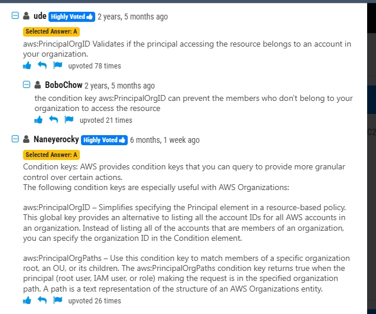

# AWS Organizations

## A company uses AWS Organizations to manage multiple AWS accounts for different departments. The management account has an Amazon S3 bucket that contains project reports. The company wants to limit access to this S3 bucket to only users of accounts within the organization in AWS Organizations.

Which solution meets these requirements with the LEAST amount of operational overhead?

- **A.** Add the aws PrincipalOrgID global condition key with a reference to the organization ID to the S3 bucket policy.
- **B.** Create an organizational unit (OU) for each department. Add the aws:PrincipalOrgPaths global condition key to the S3 bucket policy.
- **C.** Use AWS CloudTrail to monitor the CreateAccount, InviteAccountToOrganization, LeaveOrganization, and RemoveAccountFromOrganization events. Update the S3 bucket policy accordingly.
- **D.** Tag each user that needs access to the S3 bucket. Add the aws:PrincipalTag global condition key to the S3 bucket policy.

[Reveal Solution](https://www.examtopics.com/exams/amazon/aws-certified-solutions-architect-associate-saa-c03/view/#) [ Discussion **52**](https://www.examtopics.com/exams/amazon/aws-certified-solutions-architect-associate-saa-c03/view/#)

### **Option A: aws:PrincipalOrgID Global Condition Key**

- **Why It’s Correct:**
  - **Built-in Global Condition Key:** AWS provides the `aws:PrincipalOrgID` global condition key that lets you restrict access to only principals (users or roles) that belong to a specific AWS Organization.
  - **Least Operational Overhead:** By adding this condition to the S3 bucket policy, you automatically limit access to only accounts within your AWS Organization, without needing to manage tags, monitor events, or structure organizational units.
  - **Direct and Simple:** This approach directly checks the organization ID in the request context, making it a straightforward way to enforce the policy.

---

**Option B: aws:PrincipalOrgPaths Global Condition Key**

- **Why It’s Incorrect:**
  - **Non-Standard Key:** The `aws:PrincipalOrgPaths` key is not a commonly recognized or standard global condition key for this purpose.
  - **Complexity with OUs:** Even if it were available, structuring and maintaining organizational units (OUs) per department adds additional management complexity and overhead.
  - **Not as Direct:** It would require additional configuration and maintenance compared to using `aws:PrincipalOrgID`.

---

**Option C: Using AWS CloudTrail to Monitor Events**

- **Why It’s Incorrect:**
  - **Reactive Approach:** Relying on CloudTrail means monitoring and then updating the policy manually, which is reactive rather than proactive.
  - **High Operational Overhead:** This solution would require constant monitoring of events (CreateAccount, InviteAccountToOrganization, etc.) and manual updates to the S3 bucket policy, increasing administrative workload.
  - **Not Automatic:** It does not enforce access restrictions at the time of the request, making it less effective for immediate access control.

---

**Option D: Tagging Each User and Using aws:PrincipalTag**

- **Why It’s Incorrect:**
  - **Manual Tagging Requirement:** This method requires tagging each user that needs access, which can be cumbersome and error-prone in a multi-account, multi-department environment.
  - **Additional Management Overhead:** Maintaining correct and up-to-date tags across all users adds an extra layer of management complexity.
  - **Less Scalable:** As the organization grows, managing these tags consistently would become increasingly challenging compared to a policy based on the organization ID.

---

**Summary**

- **Option A** is the most straightforward and efficient solution because it uses the `aws:PrincipalOrgID` condition key to automatically enforce that only principals from the specified AWS Organization can access the bucket.
- The other options introduce additional complexity, require manual intervention, or rely on non-standard methods, making them less desirable for minimizing operational overhead.

Thus, the best choice with the least amount of operational overhead is **Option A** .

