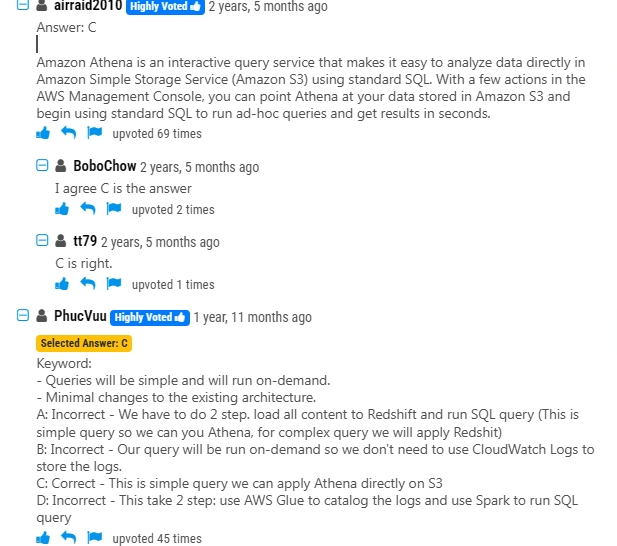

# 1.Amazon Athena

## 1.A company needs the ability to analyze the log files of its proprietary application. The logs are stored in JSON format in an Amazon S3 bucket. Queries will be simple and will run on-demand. A solutions architect needs to perform the analysis with minimal changes to the existing architecture.

What should the solutions architect do to meet these requirements with the LEAST amount of operational overhead?

- **A.** Use Amazon Redshift to load all the content into one place and run the SQL queries as needed.
- **B.** Use Amazon CloudWatch Logs to store the logs. Run SQL queries as needed from the Amazon CloudWatch console.
- **C.** Use Amazon Athena directly with Amazon S3 to run the queries as needed.
- **D.** Use AWS Glue to catalog the logs. Use a transient Apache Spark cluster on Amazon EMR to run the SQL queries as needed.

The best option is:

**C. Use Amazon Athena directly with Amazon S3 to run the queries as needed.**

### Option C (Chosen Answer):

_Use Amazon Athena directly with Amazon S3 to run the queries as needed._

- **Why It’s Correct:**

  Athena enables you to run SQL queries directly on JSON data stored in S3 without the need for any data movement or loading process. It is serverless, which minimizes operational overhead and allows on-demand querying with a straightforward setup.

**Option A:**

_Use Amazon Redshift to load all the content into one place and run the SQL queries as needed._

- **Why It’s Incorrect:**
  - **Data Loading Requirement:** Redshift requires loading data into a database cluster, which adds extra steps and time.
  - **Operational Overhead:** Managing a Redshift cluster is more complex and is typically more suited for larger, more complex analytical workloads rather than on-demand, simple queries.

**Option B:**

_Use Amazon CloudWatch Logs to store the logs and run SQL queries from the CloudWatch console._

- **Why It’s Incorrect:**
  - **Not Designed for S3 Data:** CloudWatch Logs is optimized for monitoring and operational logs, not for ad hoc analysis of JSON files stored in S3.
  - **Re-architecting Data Storage:** Moving the logs from S3 to CloudWatch Logs would require changing the existing architecture, which contradicts the requirement to make minimal changes.

**Option D:**

_Use AWS Glue to catalog the logs and then use a transient Apache Spark cluster on Amazon EMR to run SQL queries as needed._

- **Why It’s Incorrect:**
  - **Complexity and Cost:** Setting up and managing an EMR cluster introduces significant operational overhead and cost.
  - **Overkill for Simple Queries:** For simple, on-demand queries, a transient Spark cluster is unnecessarily complex compared to using Athena, which is built for ad hoc querying on S3 data.

