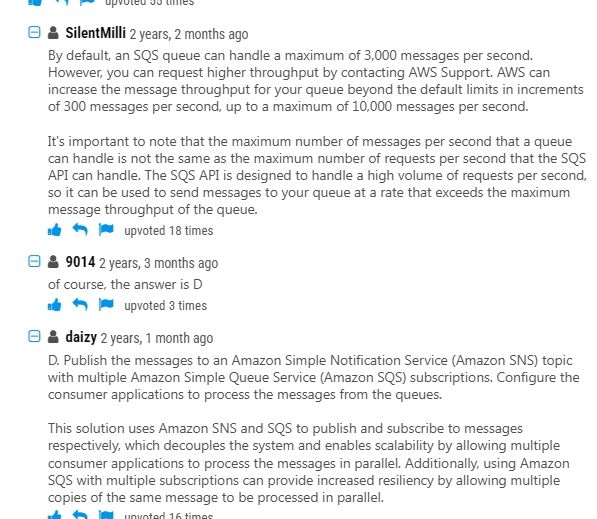
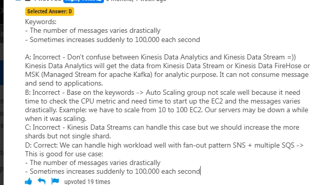
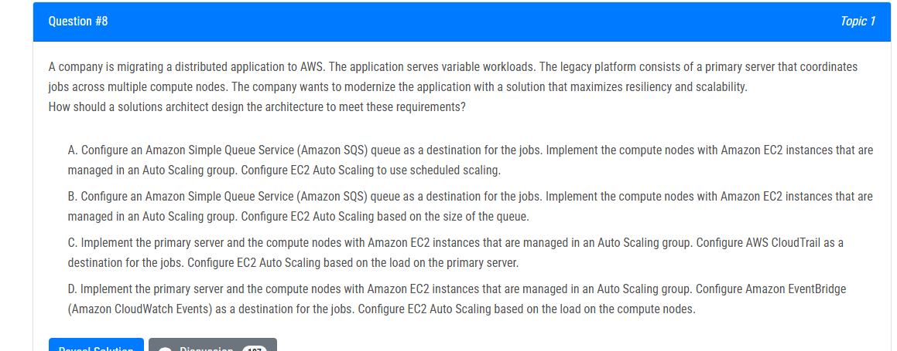
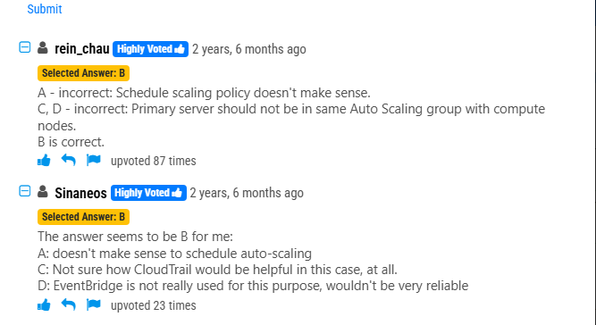
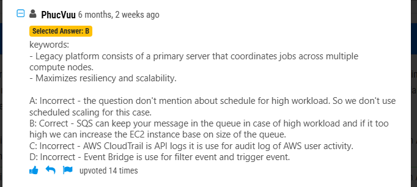
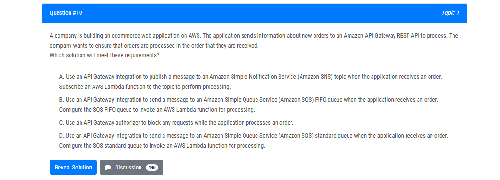
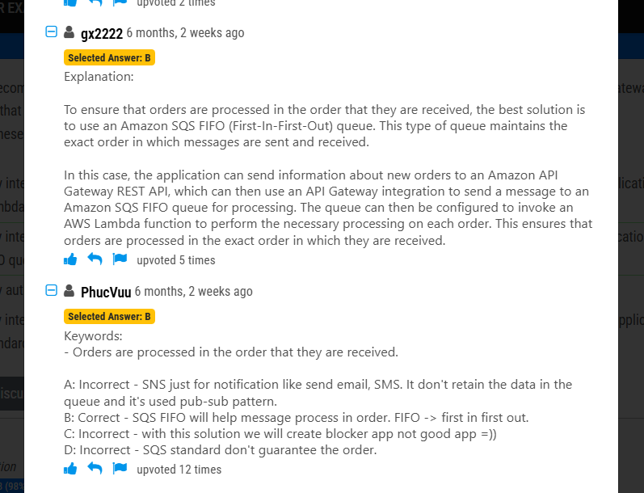

# 1.sqs/sns

## 1.A company has an application that ingests incoming messages. Dozens of other applications and microservices then quickly consume these messages. The number of messages varies drastically and sometimes increases suddenly to 100,000 each second. The company wants to decouple the solution and increase scalability.

Which solution meets these requirements?

- **A.** Persist the messages to Amazon Kinesis Data Analytics. Configure the consumer applications to read and process the messages.
- **B.** Deploy the ingestion application on Amazon EC2 instances in an Auto Scaling group to scale the number of EC2 instances based on CPU metrics.
- **C.** Write the messages to Amazon Kinesis Data Streams with a single shard. Use an AWS Lambda function to preprocess messages and store them in Amazon DynamoDB. Configure the consumer applications to read from DynamoDB to process the messages.
- **D.** Publish the messages to an Amazon Simple Notification Service (Amazon SNS) topic with multiple Amazon Simple Queue Service (Amazon SOS) subscriptions. Configure the consumer applications to process the messages from the queues.

### **D. Publish the messages to an Amazon SNS topic with multiple Amazon SQS subscriptions. Configure the consumer applications to process the messages from the queues.**

**Problem Analysis:**

- **Messages need to be ingested and consumed quickly** by multiple applications and microservices.
- **Message volume is highly variable, reaching up to 100,000 per second** , requiring a scalable and decoupled architecture.
- **The solution must support fan-out processing** , allowing multiple applications to consume messages independently.

**Why Choose SNS + SQS?**

✅ **Amazon SNS + Amazon SQS provides a decoupled and scalable event-driven architecture** :

- **SNS (Simple Notification Service)** → **Broadcasts messages** to multiple **SQS queues** .
- **SQS (Simple Queue Service)** → Each consumer reads messages **independently** at its own pace.
- Supports **high throughput (100,000+ messages/sec)** and **automatic scaling** .

✅ **Benefits:**

- **Event-driven and loosely coupled** → Each application gets its own SQS queue and processes messages independently.
- **Scalable and resilient** → Automatically handles message bursts.
- **Reliability** → Messages are **persisted** in SQS queues for guaranteed delivery.

---

**Why Are the Other Options Incorrect?**

❌ **A. Use Amazon Kinesis Data Analytics** →

- **Kinesis Data Analytics is for real-time analytics, not message ingestion.**
- Does not provide **fan-out** processing to multiple consumers.

❌ **B. Scale EC2 instances in an Auto Scaling group** →

- **Tightly coupled solution** ; not a true **event-driven** architecture.
- **Does not efficiently handle sudden traffic spikes** like 100,000 messages/sec.

❌ **C. Use Kinesis Data Streams with a single shard and DynamoDB** →

- **A single shard** in Kinesis **can only handle 1,000 records/sec** , which is **too low** .
- **DynamoDB is not designed for high-throughput message processing.**

---

**Conclusion:**

✅ **Amazon SNS + SQS provides the best decoupled, scalable, and reliable solution for handling unpredictable message surges and multiple consumers.** 🚀

## 2.B

## 3.

