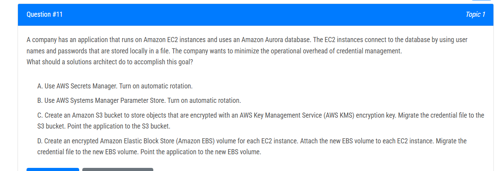
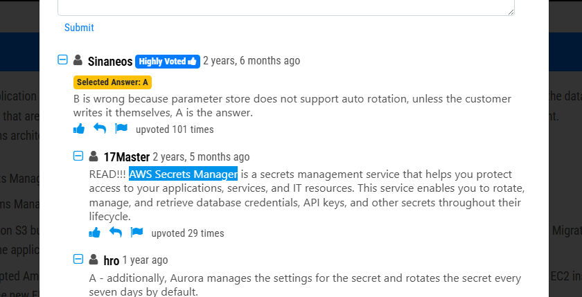
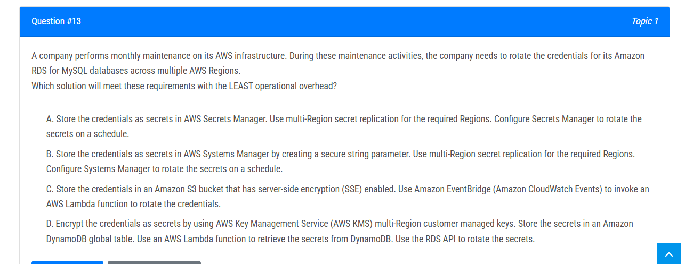
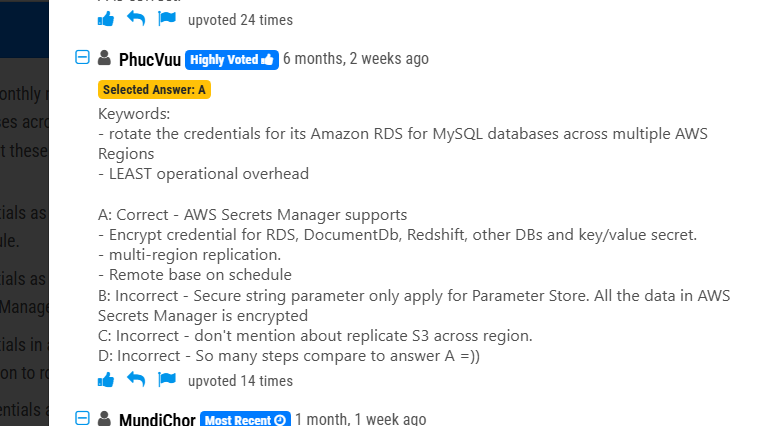

# 1.

# 2.

AWS Secrets Manager is a secrets management service that enables you to store, manage, and rotate secrets such as database credentials, API keys, and SSH keys. Secrets Manager can help you minimize the operational overhead of rotating credentials for your Amazon RDS for MySQL databases across multiple Regions. With Secrets Manager, you can store the credentials as secrets and use multi-Region secret replication to replicate the secrets to the required Regions. You can then configure Secrets Manager to rotate the secrets on a schedule so that the credentials are rotated automatically without the need for manual intervention. This can help reduce the risk of secrets being compromised and minimize the operational overhead of credential management.

# 3.
