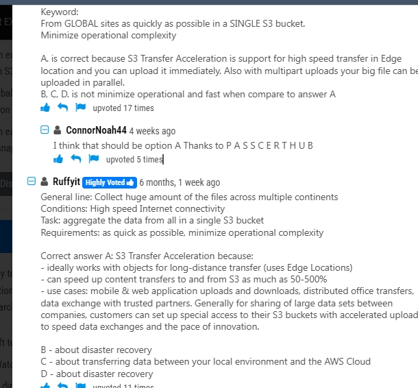
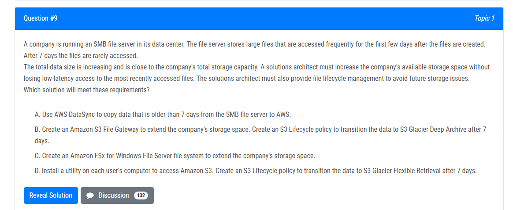
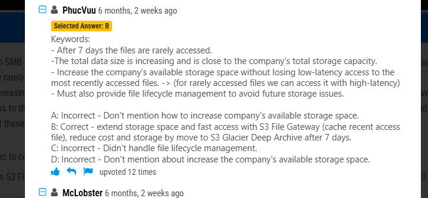

# 1 . S3 Transfer Acceleration

## 1 . A company collects data for temperature, humidity, and atmospheric pressure in cities across multiple continents. The average volume of data that the company collects from each site daily is 500 GB. Each site has a high-speed Internet connection.

The company wants to aggregate the data from all these global sites as quickly as possible in a single Amazon S3 bucket. The solution must minimize operational complexity.
Which solution meets these requirements?

- **A.** Turn on S3 Transfer Acceleration on the destination S3 bucket. Use multipart uploads to directly upload site data to the destination S3 bucket.
- **B.** Upload the data from each site to an S3 bucket in the closest Region. Use S3 Cross-Region Replication to copy objects to the destination S3 bucket. Then remove the data from the origin S3 bucket.
- **C.** Schedule AWS Snowball Edge Storage Optimized device jobs daily to transfer data from each site to the closest Region. Use S3 Cross-Region Replication to copy objects to the destination S3 bucket.
- **D.** Upload the data from each site to an Amazon EC2 instance in the closest Region. Store the data in an Amazon Elastic Block Store (Amazon EBS) volume. At regular intervals, take an EBS snapshot and copy it to the Region that contains the destination S3 bucket. Restore the EBS volume in that Region.

The correct answer is:

### **Option A (Chosen Answer):**

_Turn on S3 Transfer Acceleration on the destination S3 bucket and use multipart uploads to directly upload site data to the destination S3 bucket._

- **Why It’s Correct:**

  This method leverages Amazon’s global edge network to accelerate uploads. With high-speed Internet at each site, data is sent directly to the destination bucket with minimal operational steps, avoiding any intermediate processing or data movement. Multipart uploads efficiently handle large files.

**Option B:**

_Upload the data from each site to an S3 bucket in the closest region, then use S3 Cross-Region Replication to copy objects to the destination S3 bucket, and remove the data from the origin bucket._

- **Why It’s Incorrect:**
  - **Additional Steps:** This approach involves two separate actions—uploading to a regional bucket and then replicating to the destination—which adds operational complexity.
  - **Latency and Delay:** Cross-Region Replication introduces a delay, which might not meet the “as quickly as possible” requirement.
  - **Cost and Management Overhead:** Managing multiple S3 buckets and ensuring proper deletion after replication increases administrative overhead.

**Option C:**

_Schedule AWS Snowball Edge Storage Optimized device jobs daily to transfer data from each site to the closest region, then use S3 Cross-Region Replication to copy objects to the destination S3 bucket._

- **Why It’s Incorrect:**
  - **Physical Device Logistics:** Snowball Edge is designed for large-scale data transfers when network speeds are insufficient. With a high-speed Internet connection available, physically shipping a device is unnecessary.
  - **Time Delay:** Scheduling daily jobs adds latency to data aggregation, contrary to the need for rapid aggregation.
  - **Increased Operational Complexity:** Using hardware devices introduces extra steps such as scheduling, managing the devices, and handling the physical transfer process.

**Option D:**

_Upload the data from each site to an Amazon EC2 instance in the closest region, store it on an Amazon EBS volume, and then periodically take EBS snapshots and copy them to the destination S3 bucket._

- **Why It’s Incorrect:**
  - **High Complexity:** This method requires managing EC2 instances, EBS volumes, snapshots, and orchestrating periodic transfers—all of which significantly increase operational overhead.
  - **Non-Scalable and Error-Prone:** It adds multiple points of failure and does not scale well with large volumes of data.
  - **Not Real-Time:** The snapshot and copy process is not as immediate as direct uploads, delaying data availability in the destination bucket.
  - 

# 2 .S3 Lifecycle policy

## 1.

### B

