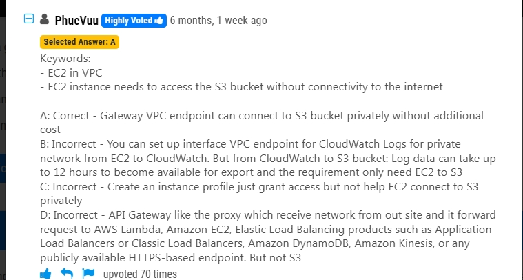

# 1.gw-VPC endpoint

## 1.An application runs on an Amazon EC2 instance in a VPC. The application processes logs that are stored in an Amazon S3 bucket. The EC2 instance needs to access the S3 bucket without connectivity to the internet.

Which solution will provide private network connectivity to Amazon S3?

- **A.** Create a gateway VPC endpoint to the S3 bucket.
- **B.** Stream the logs to Amazon CloudWatch Logs. Export the logs to the S3 bucket.
- **C.** Create an instance profile on Amazon EC2 to allow S3 access.
- **D.** Create an Amazon API Gateway API with a private link to access the S3 endpoint.

### option A . Explanation:

- A **gateway VPC endpoint** allows private connectivity between Amazon VPC and AWS services like Amazon S3 and DynamoDB **without requiring an internet connection, NAT gateway, or VPN** .
- This ensures that the EC2 instance can access S3 securely and privately using AWS’s internal network.
- The other options do not provide a direct private connection to S3:
  - **B** : Streaming logs to CloudWatch Logs and exporting them to S3 does not establish a private connection.ncorrect - You can set up interface VPC endpoint for CloudWatch Logs for private network from EC2 to CloudWatch. But from CloudWatch to S3 bucket: Log data can take up to 12 hours to become available for export and the requirement only need EC2 to S3
  - **C** : An **instance profile** grants permissions via IAM roles but does not provide network connectivity. The instance still needs internet or a VPC endpoint to reach S3.
  - **D** : Amazon API Gateway does not directly facilitate private access to S3.API Gateway like the proxy which receive network from out site and it forward request to AWS Lambda, Amazon EC2, Elastic Load Balancing products such as Application Load Balancers or Classic Load Balancers, Amazon DynamoDB, Amazon Kinesis, or any publicly available HTTPS-based endpoint. But not S3

Thus, **option A is the best choice** for private access to S3 from an EC2 instance in a VPC.can connect to S3 bucket privately without additional cost

