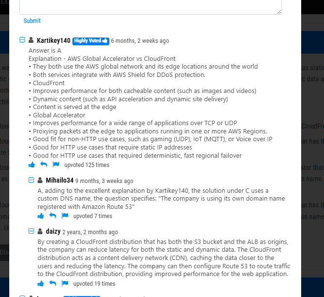
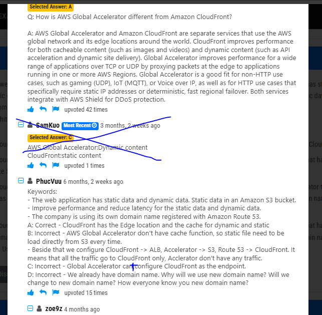

# 1.cloudfront

Trong AWS, **origin** là nơi dữ liệu hoặc nội dung được lưu trữ hoặc nơi mà các dịch vụ (như Global Accelerator hoặc CloudFront) lấy dữ liệu để phục vụ cho người dùng cuối. Khi cấu hình các dịch vụ phân phối nội dung hoặc tối ưu lưu lượng mạng, bạn cần chỉ định các **origin** để xác định nguồn dữ liệu.
