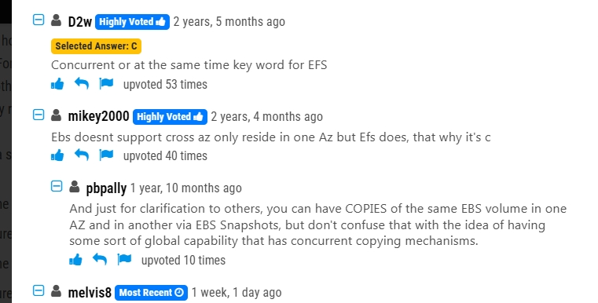

# 1.Amazon EFS

## 1.A company is hosting a web application on AWS using a single Amazon EC2 instance that stores user-uploaded documents in an Amazon EBS volume. For better scalability and availability, the company duplicated the architecture and created a second EC2 instance and EBS volume in another Availability Zone, placing both behind an Application Load Balancer. After completing this change, users reported that, each time they refreshed the website, they could see one subset of their documents or the other, but never all of the documents at the same time.

1. What should a solutions architect propose to ensure users see all of their documents at once?

- **A.** Copy the data so both EBS volumes contain all the documents
- **B.** Configure the Application Load Balancer to direct a user to the server with the documents
- **C.** Copy the data from both EBS volumes to Amazon EFS. Modify the application to save new documents to Amazon EFS
- **D.** Configure the Application Load Balancer to send the request to both servers. Return each document from the correct server

[Reveal Solution](https://www.examtopics.com/exams/amazon/aws-certified-solutions-architect-associate-saa-c03/view/#) [ Discussion **68**](https://www.examtopics.com/exams/amazon/aws-certified-solutions-architect-associate-saa-c03/view/#)

### **C . Explanation:**

- **Problem:**
  - Each EC2 instance has its own **EBS volume** , and EBS volumes are **not shared** across instances or Availability Zones.
  - When a user request is load-balanced between the two instances, they only see the documents stored on the specific instance they were routed to.
  - This results in **inconsistent user experience** , where users see only a subset of their documents.
- **Solution:**
  - **Amazon EFS (Elastic File System)** is a fully managed **shared file system** that is **accessible from multiple EC2 instances** across multiple **Availability Zones** .
  - By **migrating data from both EBS volumes to EFS** , both EC2 instances can access the **same document storage** , ensuring all users see all documents regardless of which instance they connect to.
  - The application should also be modified to store new documents directly in **Amazon EFS** instead of the instance-specific EBS volume.

**Why not the other options?**

❌ **A. Copy the data so both EBS volumes contain all the documents**

- This would require constant **manual synchronization** between EBS volumes, which is **inefficient and difficult to maintain** .
- There is no built-in way for **EBS volumes to sync automatically** .

❌ **B. Configure the Application Load Balancer to direct a user to the server with the documents**

- This approach is **not scalable** and does not work well if new documents are uploaded or if an instance fails.
- Also, Application Load Balancer **does not track stored files** , so it cannot determine which instance has which documents.

❌ **D. Configure the Application Load Balancer to send the request to both servers. Return each document from the correct server**

- Load Balancers **do not work this way** —they do not send requests to multiple backend servers at the same time.
- This would **increase complexity** and require **custom application logic** to merge responses, which is inefficient.

