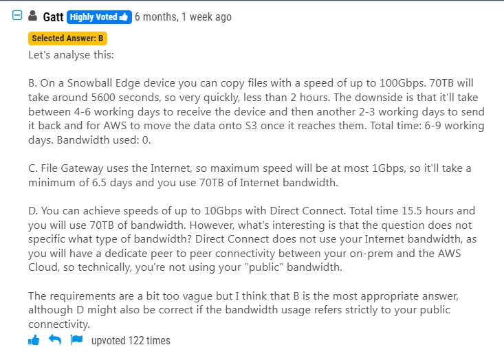
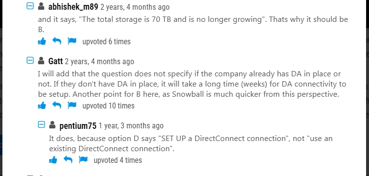

# 1.AWS Snowball Edge

## 1.A company uses NFS to store large video files in on-premises network attached storage. Each video file ranges in size from 1 MB to 500 GB. The total storage is 70 TB and is no longer growing. The company decides to migrate the video files to Amazon S3. The company must migrate the video files as soon as possible while using the least possible network bandwidth.

Which solution will meet these requirements?

- **A.** Create an S3 bucket. Create an IAM role that has permissions to write to the S3 bucket. Use the AWS CLI to copy all files locally to the S3 bucket.
- **B.** Create an AWS Snowball Edge job. Receive a Snowball Edge device on premises. Use the Snowball Edge client to transfer data to the device. Return the device so that AWS can import the data into Amazon S3.
- **C.** Deploy an S3 File Gateway on premises. Create a public service endpoint to connect to the S3 File Gateway. Create an S3 bucket. Create a new NFS file share on the S3 File Gateway. Point the new file share to the S3 bucket. Transfer the data from the existing NFS file share to the S3 File Gateway.
- **D.** Set up an AWS Direct Connect connection between the on-premises network and AWS. Deploy an S3 File Gateway on premises. Create a public virtual interface (VIF) to connect to the S3 File Gateway. Create an S3 bucket. Create a new NFS file share on the S3 File Gateway. Point the new file share to the S3 bucket. Transfer the data from the existing NFS file share to the S3 File Gateway.

### **B. Use AWS Snowball Edge to transfer data to S3.**

**Problem Analysis:**

- **Large data size (70 TB)** → Uploading over the internet would be **too slow** and consume **a lot of bandwidth** .
- **Needs to be migrated as quickly as possible** → Avoid reliance on network speed.
- **Data is not growing** → A **one-time transfer** is sufficient.

**Why Choose Snowball Edge?**

✅ **AWS Snowball Edge** is a **physical storage device** provided by AWS, designed to **transfer large amounts of data** from on-premises to AWS **without using the internet** .

✅ **Simple process:**

1. **Order a Snowball Edge device** from AWS.
2. **Copy data to the device** using the Snowball Edge client.
3. **Ship the device back to AWS** .
4. **AWS uploads the data to S3 quickly** .

---

**Why Are the Other Options Incorrect?**

❌ **A. Use AWS CLI to upload files directly to S3** → **Not feasible** for 70 TB, **too slow** and consumes **too much bandwidth** .

❌ **C. Use S3 File Gateway** → **Still requires network transfer** , making migration **slow** .

❌ **D. Use Direct Connect + S3 File Gateway** → **Direct Connect takes time to set up** , unsuitable for an **immediate** migration need.

