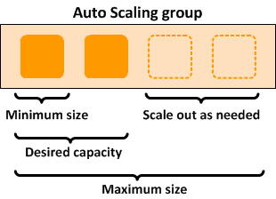
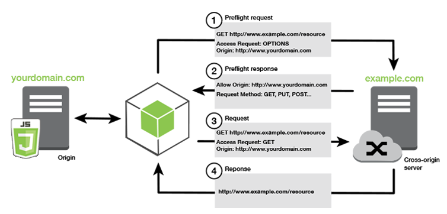
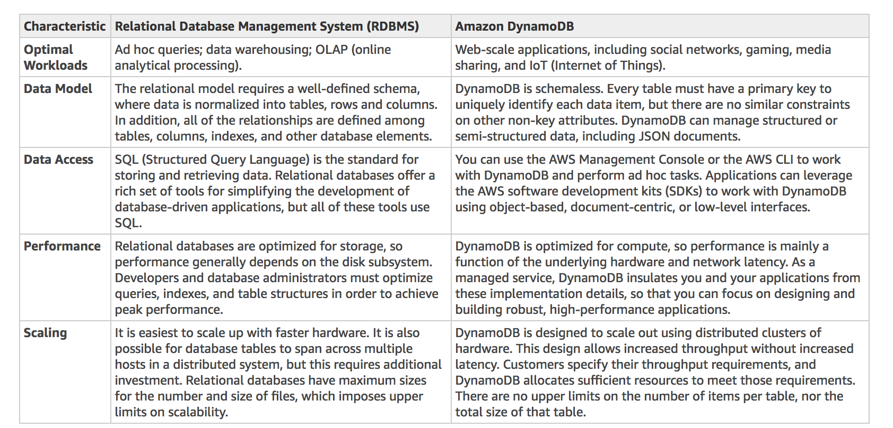

# 1-10

### **1.Tổng quan về Auto Scaling Group (Nhóm Tự động điều chỉnh quy mô):**

- Một Auto Scaling Group chứa một tập hợp các phiên bản Amazon EC2.
- Các phiên bản này được coi là một nhóm logic để phục vụ mục đích tự động điều chỉnh quy mô và quản lý.
- Auto Scaling Group cho phép bạn sử dụng các tính năng của Amazon EC2 Auto Scaling như:
  - **Thay thế phiên bản không khỏe (health check replacements):** Tự động thay thế các phiên bản EC2 bị lỗi.
  - **Chính sách điều chỉnh quy mô (scaling policies):** Tự động thay đổi số lượng phiên bản dựa trên các điều kiện.
- **Chức năng cốt lõi** của dịch vụ EC2 Auto Scaling là:
  - Duy trì số lượng phiên bản trong một Auto Scaling Group theo mong muốn.
  - Tự động điều chỉnh quy mô (tăng/giảm số lượng phiên bản).
- Kích thước của một Auto Scaling Group phụ thuộc vào **Số lượng phiên bản mong muốn (Desired capacity)** mà bạn thiết lập.
- Bạn có thể điều chỉnh kích thước nhóm để đáp ứng nhu cầu, bằng cách **thủ công** hoặc sử dụng **tự động điều chỉnh quy mô**.

**Các Tùy chọn Điều chỉnh Quy mô Động (Dynamic Scaling Options):**

Đoạn văn đề cập đến hai loại chính sách điều chỉnh quy mô động:

1. **Chính sách Điều chỉnh Quy mô theo Bước (Step Scaling Policies):**
2. **Chính sách Điều chỉnh Quy mô Đơn giản (Simple Scaling Policies):**

- **Điểm giống nhau:**
  - Cả hai đều yêu cầu bạn tạo **Báo động CloudWatch (CloudWatch alarms)** để kích hoạt chính sách.
  - Cả hai đều yêu cầu bạn chỉ định **ngưỡng cao và thấp** cho các báo động.
  - Cả hai đều yêu cầu bạn xác định liệu sẽ **thêm hoặc bớt** bao nhiêu phiên bản, hoặc đặt kích thước nhóm về một con số **chính xác**.
- **Điểm khác biệt chính:** Chính sách theo bước (Step Scaling) sử dụng các "điều chỉnh theo bước" (step adjustments). Khi các điều chỉnh theo bước được áp dụng, chúng làm tăng hoặc giảm số lượng phiên bản hiện tại của nhóm. **Các điều chỉnh này thay đổi dựa trên mức độ vượt ngưỡng của báo động (size of the alarm breach).** Nghĩa là, nếu báo động vượt ngưỡng nhiều hơn, sự điều chỉnh theo bước có thể lớn hơn.

**Vấn đề của Chính sách Điều chỉnh Quy mô Đơn giản (Simple Scaling):**

- Vấn đề chính của Simple Scaling là **sau khi một hoạt động điều chỉnh quy mô được bắt đầu, chính sách phải đợi cho hoạt động đó (hoặc việc thay thế phiên bản không khỏe) hoàn thành VÀ thời gian chờ làm mát (cooldown period) kết thúc** trước khi phản hồi các báo động tiếp theo.
- **Thời gian chờ làm mát (Cooldown period):** Giúp ngăn chặn việc bắt đầu các hoạt động điều chỉnh quy mô bổ sung trước khi các hiệu ứng của hoạt động trước đó kịp hiển thị và ổn định. Điều này tránh việc nhóm liên tục tăng/giảm không kiểm soát.

**Chính sách Điều chỉnh Quy mô theo Mục tiêu (Target Tracking Scaling Policy):**

- Với chính sách này, bạn có thể tăng hoặc giảm số lượng phiên bản hiện tại của nhóm dựa trên **giá trị mục tiêu (target value)** cho một **chỉ số (metric)** cụ thể (ví dụ: giữ mức sử dụng CPU trung bình ở mức 60%).
- Chính sách này giúp giải quyết vấn đề **cấp phát dư thừa tài nguyên (over-provisioning)**, tối ưu hóa chi phí.
- Chính sách sẽ tự động thêm hoặc bớt phiên bản khi cần thiết để giữ cho chỉ số ở mức, hoặc **gần mức, giá trị mục tiêu** đã chỉ định.
- Ngoài việc giữ chỉ số gần mục tiêu, chính sách Target Tracking còn tự điều chỉnh theo **sự thay đổi của chỉ số do mô hình tải thay đổi**. Nghĩa là nó phản ứng linh hoạt với sự biến động của lưu lượng truy cập.

**Kết luận\: Sử dụng chính sách điều chỉnh quy mô theo mục tiêu (Target Tracking scaling).**

**Giải thích tại sao các tùy chọn khác không phải là đáp án đúng (dựa trên đoạn văn):**

- **Sử dụng Simple scaling là không đúng:** Bởi vì bạn cần phải đợi thời gian chờ làm mát (cooldown period) hoàn thành trước khi bắt đầu các hoạt động điều chỉnh quy mô bổ sung. Chính sách Target tracking hoặc Step scaling có thể kích hoạt một hoạt động điều chỉnh quy mô ngay lập tức mà không cần đợi thời gian chờ làm mát kết thúc ([đoạn văn ngụ ý vậy, mặc dù Step scaling cũng có cơ chế xử lý cooldown phức tạp hơn Simple scaling](./ngoài-lề/step-scaling-cooldown.md)).
- **Sử dụng Scheduled scaling là không đúng:** Bởi vì chính sách này chủ yếu được sử dụng cho các **mô hình lưu lượng truy cập có thể dự đoán (predictable traffic patterns)** (ví dụ: tăng quy mô vào 8 giờ sáng thứ Hai hàng tuần). Bạn cần sử dụng chính sách Target tracking scaling để tối ưu hóa chi phí cơ sở hạ tầng mà không ảnh hưởng đến hiệu suất khi tải **không thể đoán trước** hoặc thay đổi liên tục.
- **Sử dụng Suspend and resume scaling là không đúng:** Bởi vì loại này được sử dụng để **tạm thời tạm dừng** các hoạt động điều chỉnh quy mô được kích hoạt bởi các chính sách (scaling policies) hoặc các hành động theo lịch trình (scheduled actions) của bạn, chứ không phải là một chính sách để tự động điều chỉnh quy mô theo tải.

Tóm lại, mặc dù Simple và Step scaling đều dựa trên báo động, Simple scaling có nhược điểm là phải đợi cooldown. Target Tracking là lựa chọn tốt hơn để tự động điều chỉnh quy mô một cách linh hoạt, giữ chỉ số mục tiêu và tối ưu chi phí cho tải lượng thay đổi, không thể đoán trước, khác với Scheduled scaling chỉ dùng cho tải lượng có thể dự đoán. "Suspend and resume" không phải là một chính sách điều chỉnh quy mô theo tải. Do đó, trong ngữ cảnh cần tối ưu chi phí và hiệu suất theo tải thay đổi, Target Tracking scaling được đề xuất là giải pháp đúng.

### 2.mã hóa phía client (client-side encryption) trong Amazon S3 và lý do chọn giải pháp sử dụng khóa chính phía client (client-side master key):

**Mã hóa phía Client (Client-side Encryption) là gì?**

- Mã hóa phía client là hành động **mã hóa dữ liệu trước khi gửi nó đến Amazon S3** .
- Điều này có nghĩa là dữ liệu của bạn được mã hóa trên máy tính/máy chủ của bạn (phía client) trước khi nó rời đi để tải lên S3.

**Các Tùy chọn để Bật Mã hóa phía Client:**

Đoạn văn đề cập đến hai tùy chọn chính để thực hiện mã hóa phía client:

1. **Sử dụng Khóa AWS KMS (Use an AWS KMS key):**
   - Khi sử dụng tùy chọn này, bạn cung cấp một **định danh khóa AWS KMS (KeyId)** cho AWS.
   - Quá trình mã hóa dữ liệu thực tế vẫn diễn ra trên phía client (sử dụng AWS SDK), nhưng KMS key của bạn (được quản lý bởi AWS KMS) được sử dụng để mã hóa khóa dữ liệu (data key - sẽ giải thích bên dưới). AWS KMS thực hiện các hoạt động mã hóa/giải mã cho khóa dữ liệu.
2. **Sử dụng Khóa Chính phía Client (Use a client-side master key):**
   - Khi sử dụng tùy chọn này, bạn tự quản lý khóa chính của mình (master key) trên phía client.
   - Điểm cực kỳ quan trọng ở đây là: **Khóa chính phía client của bạn VÀ dữ liệu chưa được mã hóa của bạn KHÔNG BAO GIỜ được gửi đến AWS.**
   - Bạn phải tự quản lý khóa chính này một cách an toàn. Nếu bạn làm mất khóa, bạn sẽ không thể giải mã dữ liệu của mình.

**Cách Hoạt động của Mã hóa phía Client sử dụng Khóa Chính phía Client:**

Quá trình này bao gồm hai giai đoạn:

- **Khi tải lên một đối tượng (Uploading an object):**
  1. Bạn cung cấp khóa chính phía client cho thư viện mã hóa S3 (Amazon S3 encryption client) trên phía client của bạn.
  2. Client (trên máy bạn) **tự tạo ra một khóa đối xứng dùng một lần (one-time-use symmetric key)** , còn gọi là khóa dữ liệu (data encryption key hoặc data key) **ngay tại máy cục bộ** .
  3. Client sử dụng khóa dữ liệu này để mã hóa dữ liệu **của chỉ một đối tượng S3 duy nhất** . Client tạo một khóa dữ liệu riêng biệt cho mỗi đối tượng bạn tải lên.
  4. Sau khi mã hóa dữ liệu đối tượng bằng khóa dữ liệu, client sử dụng **khóa chính phía client (master key bạn cung cấp)** để mã hóa **khóa dữ liệu** (chứ không phải dữ liệu đối tượng).
  5. Client tải lên S3:
     - Dữ liệu đối tượng đã được mã hóa (bằng khóa dữ liệu).
     - Khóa dữ liệu đã được mã hóa (bằng khóa chính phía client), được lưu dưới dạng metadata của đối tượng (ví dụ: `x-amz-meta-x-amz-key`).
     - Thông tin mô tả vật liệu mã hóa (material description) cũng là một phần của metadata, giúp client sau này biết dùng khóa chính nào để giải mã.
- **Khi tải xuống một đối tượng (Downloading an object):**
  1. Client tải xuống đối tượng đã được mã hóa từ S3.
  2. Sử dụng thông tin mô tả vật liệu mã hóa từ metadata của đối tượng, client xác định **khóa chính phía client (master key) nào cần dùng** để giải mã khóa dữ liệu.
  3. Client sử dụng khóa chính đó để giải mã khóa dữ liệu đã được mã hóa từ metadata.
  4. Cuối cùng, client sử dụng khóa dữ liệu đã được giải mã để giải mã dữ liệu đối tượng thực tế.

**Tại sao "Sử dụng S3 client-side encryption với client-side master key" là đáp án đúng?**

Đoạn văn chỉ ra rằng trong kịch bản đang xét, **khóa chính (master keys) VÀ dữ liệu chưa được mã hóa (unencrypted data) KHÔNG BAO GIỜ được gửi đến AWS.**

- Chính sách "Sử dụng S3 client-side encryption với client-side master key" hoàn toàn đáp ứng yêu cầu này:
  - Dữ liệu chưa được mã hóa được mã hóa trên phía client trước khi gửi đi.
  - Khóa chính (client-side master key) được quản lý hoàn toàn bởi bạn trên phía client và không bao giờ rời khỏi môi trường của bạn để đến AWS.

**Giải thích tại sao các tùy chọn khác không đúng (dựa trên kịch bản và đoạn văn):**

1. **"Sử dụng S3 client-side encryption với AWS KMS key" là không đúng:**

   - Mặc dù dữ liệu chưa mã hóa được mã hóa trên client trước khi gửi, nhưng bạn lại **cung cấp định danh khóa AWS KMS (KeyId) cho AWS** .
   - Quan trọng hơn, các hoạt động mã hóa/giải mã cho **khóa dữ liệu** được thực hiện bởi **dịch vụ AWS KMS** do AWS quản lý. Điều này đi ngược lại yêu cầu "khóa chính KHÔNG BAO GIỜ được gửi đến AWS" vì khóa KMS (đóng vai trò là khóa chính để bảo vệ khóa dữ liệu) được quản lý bởi AWS.

2. **"Sử dụng S3 server-side encryption với AWS KMS key" là không đúng:**

   - Đây là mã hóa phía máy chủ (server-side), nghĩa là **dữ liệu chưa được mã hóa được gửi đến S3 trước** và việc mã hóa xảy ra trên phía S3 khi dữ liệu được ghi vào ổ đĩa. Điều này vi phạm yêu cầu "dữ liệu chưa được mã hóa KHÔNG BAO GIỜ được gửi đến AWS".
   - Hơn nữa, khóa chính được sử dụng (KMS key) được quản lý bởi dịch vụ AWS KMS do AWS vận hành, vi phạm yêu cầu "khóa chính KHÔNG BAO GIỜ được gửi đến AWS".

3. **"Sử dụng S3 server-side encryption với customer provided key (SSE-C)" là không đúng:**

   - Đây cũng là mã hóa phía máy chủ (server-side), nên **dữ liệu chưa được mã hóa được gửi đến S3 trước** , vi phạm yêu cầu đầu tiên.
   - Mặc dù bạn "cung cấp" khóa, nhưng bạn **gửi khóa mã hóa đó như một phần của yêu cầu tải lên đối tượng đến S3** . S3 sau đó sử dụng khóa đó để mã hóa/giải mã. Điều này vi phạm yêu cầu "khóa chính KHÔNG BAO GIỜ được gửi đến AWS" vì bạn đã gửi khóa đó đến dịch vụ S3 của AWS.

   giải thích dễ hình dung hơn

   Đây là tóm tắt đầy đủ và logic lại các điểm chính từ đầu đến giờ:

   Chúng ta có các cách chính để mã hóa dữ liệu trên S3:

   1. **Mã hóa phía Máy chủ (Server-Side Encryption - SSE):**
      - Dữ liệu chưa được mã hóa **được gửi đến S3 trước** .
      - AWS (dịch vụ S3) thực hiện việc mã hóa dữ liệu khi ghi vào đĩa.
      - Các loại SSE khác nhau ở cách quản lý khóa: S3 quản lý (SSE-S3), dùng KMS (SSE-KMS), hoặc bạn cung cấp khóa cho S3 (SSE-C).
      - **Điểm mấu chốt:** Phương pháp này **không đáp ứng yêu cầu dữ liệu chưa mã hóa không được gửi đến AWS** , vì dữ liệu đi đến S3 trước khi được mã hóa.
   2. **Mã hóa phía Client (Client-Side Encryption - CSE):**
      - Dữ liệu **được mã hóa trên máy tính/máy chủ của bạn (phía client) trước khi gửi lên S3** .
      - Có hai cách để thực hiện CSE, khác nhau ở việc quản lý "khóa chính" (master key) dùng để bảo vệ "khóa dữ liệu" (Data Key) được dùng mã hóa dữ liệu thực tế:
        - **CSE với Khóa Chính phía Client (CSE with Client-Side Master Key):**
          - Dữ liệu được mã hóa bằng **Data Key** ngay tại client.
          - **Data Key** này được mã hóa bằng **Khóa Chính (Master Key) do bạn TỰ quản lý hoàn toàn trên phía client** .
          - **Điểm mấu chốt:** Cả **dữ liệu chưa mã hóa** và **Khóa Chính** đều **KHÔNG BAO GIỜ được gửi đến AWS** . Đây là phương pháp duy nhất đáp ứng yêu cầu nghiêm ngặt nhất.
        - **CSE với Khóa AWS KMS (CSE with AWS KMS Key):**
          - Dữ liệu được mã hóa bằng **Data Key** ngay tại client.
          - **Data Key** này được mã hóa bằng **Khóa KMS (KMS Key)** mà bạn chỉ định.
          - **Điểm mấu chốt:** Khóa KMS này **được AWS quản lý và lưu trữ trong dịch vụ AWS KMS** ("nằm ở AWS"). Bạn tương tác với dịch vụ KMS (bên phía AWS) thông qua API để mã hóa/giải mã Data Key. Phương pháp này **không đáp ứng yêu cầu Khóa Chính không được gửi đến AWS** (vì Khóa KMS chính là Khóa Chính và nó do AWS quản lý/sử dụng).

   **Kết luận (cho kịch bản nghiêm ngặt):**

   Khi có yêu cầu **nghiêm ngặt** rằng cả **dữ liệu chưa được mã hóa** và **khóa chính (master key)** đều **KHÔNG BAO GIỜ được gửi đến AWS** , thì lựa chọn **duy nhất** phù hợp là **Mã hóa phía Client với Khóa Chính phía Client (CSE with Client-Side Master Key)** .

   Các phương pháp khác đều vi phạm ít nhất một trong hai yêu cầu đó (SSE gửi dữ liệu chưa mã hóa; CSE/KMS sử dụng Khóa Chính nằm ở AWS).

### 3.CORS (Cross-Origin Resource Sharing) trong Amazon S3:

**CORS (Cross-Origin Resource Sharing) là gì?**

- CORS là một cơ chế định nghĩa cách các ứng dụng web phía client (thường là code JavaScript chạy trong trình duyệt) được tải từ một **miền (domain)** này có thể tương tác (gửi yêu cầu) đến các tài nguyên nằm ở một **miền khác** .

**Mục đích sử dụng CORS với Amazon S3:**

- Với sự hỗ trợ của CORS, bạn có thể xây dựng các ứng dụng web phong phú chạy ở phía client và cho phép truy cập tài nguyên S3 của bạn từ các miền khác một cách có chọn lọc.
- Thông thường, vì lý do bảo mật, các trình duyệt sẽ **chặn** các yêu cầu JavaScript được gửi đến một miền khác với miền mà trang web được tải từ đó (gọi là Same-Origin Policy).

Okay, đây là một ví dụ nhỏ và đơn giản hơn để bạn dễ hình dung:

**Ví dụ: Một trang web ghi chú đơn giản lưu trên S3**

1. Bạn có một bucket S3 tên là `my-simple-notes`.
2. Bạn cấu hình bucket này để lưu trữ **trang web tĩnh** (static website hosting). Địa chỉ website sẽ là dạng `http://my-simple-notes.s3-website-us-east-1.amazonaws.com` (gọi tắt là **Endpoint A** ).
3. Trong bucket này, bạn có hai thứ:
   - File `index.html`: File này là giao diện trang web, chứa một ô nhập liệu và 2 nút: "Tải ghi chú" (Load Note) và "Lưu ghi chú" (Save Note). File này được tải từ Endpoint A.
   - Các file `.txt` (ví dụ: `note1.txt`, `note2.txt`): Đây là nơi lưu nội dung các ghi chú của bạn. Các file này là các đối tượng trong bucket, được truy cập qua **Endpoint API** của S3, dạng `my-simple-notes.s3.amazonaws.com/tenfile.txt` (gọi tắt là **Endpoint B** ).
4. Trong file `index.html`, có **mã JavaScript** :
   - Khi bạn bấm nút "Tải ghi chú", mã JS này sẽ cố gắng gửi yêu cầu **GET** đến **Endpoint B** (ví dụ: `my-simple-notes.s3.amazonaws.com/note1.txt`) để lấy nội dung file `note1.txt` về hiển thị trong ô nhập liệu.
   - Khi bạn sửa nội dung và bấm nút "Lưu ghi chú", mã JS này sẽ lấy nội dung trong ô nhập liệu và cố gắng gửi yêu cầu **PUT** đến **Endpoint B** (ví dụ: `my-simple-notes.s3.amazonaws.com/note1.txt`) để lưu nội dung mới vào file đó.

**Vấn đề CORS:**

- Mã JavaScript đang chạy trong trình duyệt được tải về từ **Endpoint A** (`*.s3-website-*`).
- Mã JS này lại cố gắng gửi yêu cầu GET/PUT đến **Endpoint B** (`*.s3.amazonaws.com`).
- Vì `*.s3-website-*` và `*.s3.amazonaws.com` được coi là **hai nguồn (origin) khác nhau** , trình duyệt sẽ **chặn** các yêu cầu GET/PUT này theo chính sách bảo mật mặc định.

**Giải pháp:**

- Bạn cần vào cấu hình của bucket `my-simple-notes` trong S3 và thêm **cấu hình CORS** .
- Cấu hình CORS này sẽ nói rằng: "Tôi (bucket `my-simple-notes`, endpoint B) cho phép các yêu cầu GET và PUT đến từ nguồn (origin) là `http://my-simple-notes.s3-website-us-east-1.amazonaws.com` (endpoint A)".

Lúc này, khi mã JavaScript chạy trong trình duyệt gửi yêu cầu GET/PUT đến Endpoint B, trình duyệt sẽ kiểm tra cấu hình CORS của B. Thấy B cho phép yêu cầu từ A, trình duyệt sẽ cho phép yêu cầu được gửi đi và xử lý phản hồi.

**Cách giải quyết:**

- Cách để bật các yêu cầu xuyên miền hợp lệ trong trường hợp này là **cấu hình CORS (Enable Cross-origin resource sharing (CORS) configuration) trong bucket S3 đó.**
- Cấu hình CORS trong S3 cho phép bạn chỉ định các miền (Origins) được phép gửi yêu cầu, các phương thức HTTP (Methods) được cho phép (GET, PUT, POST, DELETE, HEAD), và các tiêu đề (Headers) được hỗ trợ.

**Giải thích tại sao các tùy chọn khác không đúng**

- **Enable cross-account access (Bật truy cập giữa các tài khoản):** Đây là một tính năng của IAM, liên quan đến việc cho phép một tài khoản AWS truy cập tài nguyên trong một tài khoản AWS khác. Nó không liên quan đến việc cho phép mã JavaScript trong trình duyệt thực hiện yêu cầu xuyên miền đến S3.
- **Enable Cross-Zone Load Balancing (Bật Cân bằng tải xuyên Vùng):** Đây là một tính năng của Elastic Load Balancing (ELB), liên quan đến việc phân phối lưu lượng truy cập đến các phiên bản EC2 trên nhiều Availability Zone. Nó không liên quan gì đến S3 hoặc các yêu cầu web từ trình duyệt.
- **Enable Cross-Region Replication (CRR) (Bật Sao chép xuyên Vùng):** Đây là một cấu hình cấp bucket trong S3, cho phép sao chép tự động và bất đồng bộ các đối tượng từ một bucket ở Vùng này sang một bucket ở Vùng khác. Nó không liên quan đến việc cho phép các yêu cầu HTTP từ một miền khác đến bucket S3.

**Tóm lại:**

Khi bạn cần cho phép mã JavaScript chạy trong trình duyệt (được tải từ một nguồn nào đó, ví dụ: endpoint website S3) thực hiện các yêu cầu HTTP (GET, PUT, v.v.) đến tài nguyên trong một bucket S3 sử dụng một endpoint khác (ví dụ: endpoint API S3), bạn cần cấu hình CORS trên bucket S3 đó để "nói" với trình duyệt rằng yêu cầu xuyên miền từ nguồn cụ thể là an toàn và được phép. Các tùy chọn khác được đưa ra là các tính năng hoàn toàn khác trong AWS và không giải quyết được vấn đề yêu cầu xuyên miền trong trình duyệt.

### 4. RDS-DYNAMO...

**Yêu cầu của Hệ thống:**

Công ty cần một cơ sở dữ liệu có các đặc điểm sau khi di chuyển ứng dụng lên AWS:

- Có khả năng **mở rộng toàn cầu (scale globally)** .
- Có thể xử lý các thay đổi cấu trúc (schema changes) **thường xuyên** .
- Ứng dụng không bị **gián đoạn (downtime)** hoặc gặp vấn đề **hiệu suất** khi cấu trúc cơ sở dữ liệu thay đổi.
- Cung cấp phản hồi **độ trễ thấp (low latency)** cho các truy vấn có **lưu lượng cao (high-traffic queries)** .

**Khái niệm về "Schema":**

Trong ngữ cảnh cơ sở dữ liệu, "schema" được hiểu là **cấu trúc** hoặc **mô hình** của dữ liệu trong cơ sở dữ liệu của bạn. Nó định nghĩa các bảng, cột, kiểu dữ liệu, mối quan hệ giữa các bảng, và các ràng buộc.

**Phân tích Vấn đề cốt lõi: Thay đổi Schema thường xuyên**

- Yêu cầu hệ thống cần xử lý **thay đổi schema thường xuyên** . Điều này là điểm mấu chốt.
- Nó đặt ra bài toán kinh điển về việc lựa chọn giữa **cơ sở dữ liệu quan hệ (relational database)** và **cơ sở dữ liệu phi quan hệ (non-relational / NoSQL database)** .

**Cơ sở dữ liệu Quan hệ (Relational Databases):**

- Đặc trưng bởi có **schema cứng nhắc (rigid schema)** . Việc thêm hoặc xóa các loại dữ liệu mới thường đòi hỏi thay đổi cấu trúc bảng đã được định nghĩa trước, có thể phức tạp và cần thời gian (đặc biệt với các bảng lớn, có nhiều ràng buộc).
- Chủ yếu được sử dụng cho các kịch bản yêu cầu hỗ trợ các **truy vấn phức tạp** (complex queries) truy xuất dữ liệu từ nhiều bảng khác nhau (thường liên quan đến JOIN).
- Phù hợp nhất cho các trường hợp có **quan hệ bảng phức tạp** .
- **Không phù hợp** cho các trường hợp cần schema linh hoạt.
- **Lý do cơ sở dữ liệu quan hệ KHÔNG mở rộng tốt (trong bối cảnh này):**
  - Chuẩn hóa dữ liệu và lưu trữ trên nhiều bảng, đòi hỏi nhiều thao tác ghi đĩa cho một đơn vị dữ liệu logic.
  - Thường chịu chi phí hiệu suất từ hệ thống giao dịch tuân thủ **ACID** (Atomicity, Consistency, Isolation, Durability) - đảm bảo tính toàn vẹn cao nhưng có thể ảnh hưởng đến hiệu suất ở quy mô lớn.
  - Sử dụng các thao tác **JOIN đắt đỏ** để tập hợp lại dữ liệu từ nhiều bảng khi thực hiện truy vấn.

**Cơ sở dữ liệu Phi quan hệ (NoSQL Databases):**

- **Không cứng nhắc** như cơ sở dữ liệu quan hệ.
- Bạn có thể dễ dàng thêm hoặc bớt các trường (elements) trong một mục (item) hoặc tài liệu (document) mà không cần thay đổi cấu trúc tổng thể của "bảng" hay "collection".
- Có **schema linh hoạt hơn** : Có thể lưu trữ dữ liệu phân cấp (hierarchical data) phức tạp **trong một mục duy nhất** . Điều này không đòi hỏi phải thay đổi nhiều bảng liên quan khi cấu trúc dữ liệu thay đổi.
- Nói chung, việc sử dụng hệ thống NoSQL mang lại lợi ích kỹ thuật và kinh tế khi cần phản hồi độ trễ thấp cho các truy vấn lưu lượng cao (khả năng mở rộng).

**Amazon DynamoDB:**

- Là một dịch vụ cơ sở dữ liệu **NoSQL** được quản lý đầy đủ bởi AWS.
- Giải quyết các vấn đề hạn chế khả năng mở rộng của hệ thống quan hệ bằng cách tiếp cận khác.
- Trong DynamoDB, bạn thiết kế schema của mình **đặc biệt tập trung vào việc làm cho các truy vấn phổ biến và quan trọng nhất trở nên nhanh chóng và ít tốn kém nhất có thể** . Cấu trúc dữ liệu được tùy chỉnh cho các yêu cầu cụ thể của từng trường hợp sử dụng trong doanh nghiệp bạn.
- **Lý do DynamoDB mở rộng tốt:**
  - **Schema linh hoạt:** Cho phép lưu trữ dữ liệu phân cấp phức tạp bên trong một mục duy nhất. (Lưu ý: DynamoDB không phải là hoàn toàn "schemaless", nó vẫn có một cấu trúc cơ bản được định nghĩa bởi khóa chính, nhưng linh hoạt hơn nhiều so với RDBMS).
  - Thiết kế khóa phức hợp (Composite key) cho phép lưu trữ các mục dữ liệu liên quan gần nhau trên cùng một bảng, giúp truy vấn hiệu quả.

**Phân tích các Lựa chọn Khác (Tại sao không phù hợp):**

- **An Amazon RDS instance in Multi-AZ Deployments configuration:**
  - **Sai.** Đây là một loại cơ sở dữ liệu **quan hệ** . Nó có schema cứng nhắc, không phù hợp với yêu cầu thay đổi schema thường xuyên.
  - Multi-AZ chỉ tập trung vào **tính sẵn sàng cao (High Availability)** trong một vùng địa lý bằng cách tạo bản sao ở Availability Zone khác, chứ không giải quyết vấn đề mở rộng toàn cầu theo cách của NoSQL hay sự linh hoạt schema.
- **An Amazon Aurora database with Read Replicas:**
  - **Sai.** Amazon Aurora là một cơ sở dữ liệu **quan hệ** tương thích với MySQL/PostgreSQL, được tối ưu hóa cho hiệu suất và khả năng mở rộng **đọc** thông qua Read Replicas.
  - Giống như RDS, nó là cơ sở dữ liệu quan hệ với schema cứng nhắc, không phù hợp với yêu cầu thay đổi schema thường xuyên. Read Replicas giúp mở rộng khả năng đọc nhưng không giải quyết vấn đề ghi ở quy mô lớn hoặc sự cứng nhắc của schema quan hệ.
- **Redshift:**
  - **Sai.** Redshift là dịch vụ kho dữ liệu (Data Warehouse) của AWS, chủ yếu được sử dụng cho các hệ thống **OLAP (Online Analytical Processing)** - tức là phân tích dữ liệu lớn để lập báo cáo, BI.
  - Nó không được thiết kế cho các hệ thống **OLTP (Online Transaction Processing)** yêu cầu độ trễ thấp cho các giao dịch/truy vấn tần suất cao từ ứng dụng hoặc xử lý thay đổi schema thường xuyên theo yêu cầu của kịch bản.

**Kết luận:**

Dựa trên yêu cầu về khả năng mở rộng toàn cầu, xử lý thay đổi schema thường xuyên mà không ảnh hưởng hiệu suất và độ trễ thấp cho truy vấn lưu lượng cao, **Amazon DynamoDB** là lựa chọn phù hợp nhất vì nó là cơ sở dữ liệu NoSQL, cung cấp schema linh hoạt và được thiết kế để mở rộng ở quy mô lớn với hiệu suất cao, khắc phục các hạn chế của cơ sở dữ liệu quan hệ trong kịch bản này.

### 5.**Kịch bản:** Cơ quan chính phủ lưu trữ thông tin điều tra dân số (chứa PII) trong các file mã hóa trên S3. Cần kiểm tra tính tuân thủ dữ liệu PII và nhận cảnh báo về vi phạm chính sách bảo mật S3.

**Giải pháp phù hợp nhất:** **Thiết lập và cấu hình Amazon Macie để giám sát dữ liệu Amazon S3 của họ.**

- **Lý do:** Amazon Macie là dịch vụ bảo mật dùng ML để **tự động phát hiện, phân loại và bảo vệ dữ liệu nhạy cảm** (như PII) trong S3. Macie tạo ra các phát hiện (findings) về **vi phạm chính sách** bảo mật/quyền riêng tư của bucket S3 và phát hiện về **dữ liệu nhạy cảm** tìm thấy trong các đối tượng S3. Điều này đáp ứng trực tiếp yêu cầu kiểm tra tuân thủ PII và cảnh báo vi phạm chính sách.
  Okay, hãy dùng một ví dụ nhỏ để dễ hình dung Amazon Macie làm gì nhé:

**Ví dụ: Công ty lưu trữ hồ sơ khách hàng trên S3**

1. Tưởng tượng công ty bạn có một bucket S3 tên là `ho-so-khach-hang`. Nhân viên hay tải các file liên quan đến khách hàng lên đây (ví dụ: ghi chú cuộc gọi, yêu cầu hỗ trợ).
2. Theo quy định của công ty (và luật pháp), các file này **không được phép chứa thông tin nhạy cảm** như Số Chứng minh nhân dân/Căn cước công dân, số thẻ tín dụng, hoặc toàn bộ địa chỉ nhà của khách hàng. Đồng thời, bucket `ho-so-khach-hang` này **không được phép công khai** cho bất kỳ ai trên Internet truy cập.

**Amazon Macie sẽ giúp gì trong tình huống này?**

- **Macie đi "quét" tìm thông tin nhạy cảm (PII):**

  - Bạn cấu hình Macie để quét các file trong bucket `ho-so-khach-hang`.
  - Macie sử dụng trí tuệ nhân tạo (ML) để "đọc" nội dung các file và tìm kiếm các mẫu dữ liệu trông giống như số CMND/CCCD, số thẻ tín dụng, địa chỉ email, v.v. (PII).
  - Nếu Macie tìm thấy một file nào đó vô tình chứa những thông tin nhạy cảm này (mà đáng lẽ không được có), Macie sẽ tạo ra một **"Sensitive Data Finding"** (phát hiện dữ liệu nhạy cảm) và thông báo cho bạn biết file nào, ở đâu, chứa loại PII gì.
  - _Ví dụ:_ Nhân viên A vô tình copy nguyên email khách hàng (có đủ tên, địa chỉ, SĐT, email) vào một file ghi chú và tải lên. Macie quét file đó và báo cáo: "File `/ghi-chu/nhan-vien-A/ghi-chu-cuoc-goi-123.txt` chứa thông tin định danh cá nhân (PII): địa chỉ, email, SĐT".

- **Macie đi "kiểm tra luật" cho bucket (tìm vi phạm chính sách):**

  - Macie liên tục giám sát cấu hình bảo mật của bucket `ho-so-khach-hang`.
  - Nếu ai đó vô tình hoặc cố ý thay đổi cài đặt bucket khiến nó bị công khai (public), hoặc cấu hình quyền truy cập không an toàn, Macie sẽ phát hiện ra sự thay đổi đó.
  - Macie sẽ tạo ra một **"Policy Finding"** (phát hiện vi phạm chính sách) và cảnh báo cho bạn biết: "Bucket `ho-so-khach-hang` hiện đang bị công khai!" hoặc "Bucket này có chính sách cho phép tài khoản ngoài truy cập quá rộng rãi".

**Tóm lại:** Macie giống như một "người bảo vệ thông minh" cho dữ liệu S3 của bạn. Nó không chỉ giúp bạn tìm ra **những viên kim cương ẩn** (dữ liệu nhạy cảm) mà bạn không biết mình đang có, mà còn giúp bạn biết ngay lập tức nếu **cửa két sắt của bạn đang mở** (vi phạm chính sách bảo mật bucket).

- **Tại sao các lựa chọn khác không phù hợp:**
  - **Amazon Kendra:** Dịch vụ tìm kiếm doanh nghiệp, không dùng để quét dữ liệu nhạy cảm hoặc giám sát bảo mật S3.
  - **Amazon Polly:** Dịch vụ chuyển văn bản thành giọng nói, không liên quan đến quét dữ liệu S3.
  - **Amazon Fraud Detector:** Dịch vụ phát hiện gian lận, không kiểm tra dữ liệu PII trong S3.

### **6.Kịch bản:** Một công ty toàn cầu có nhiều tài khoản AWS muốn quản lý tài nguyên tập trung và chia sẻ các tài nguyên cụ thể (như Transit Gateway, License Manager, Route 53 Resolver rules) giữa các tài khoản để tăng hiệu quả và giảm chi phí.

**Giải pháp kết hợp phù hợp nhất:**

1. **Hợp nhất các tài khoản bằng AWS Organizations:** Dịch vụ này cho phép bạn gộp nhiều tài khoản AWS vào một tổ chức duy nhất và quản lý chúng tập trung. Đây là bước nền tảng để có cái nhìn tổng thể và quản lý chính sách (Service Control Policies - SCPs) trên toàn bộ các tài khoản.
2. **Sử dụng AWS Resource Access Manager (RAM):** Dịch vụ này cho phép bạn **chia sẻ các tài nguyên cụ thể** (như Transit Gateways, Subnets, License Manager configs, Route 53 Resolver rules) một cách **dễ dàng và an toàn** giữa các tài khoản trong cùng một Tổ chức AWS (hoặc với các tài khoản AWS bất kỳ). RAM giúp tránh tạo tài nguyên trùng lặp ở mỗi tài khoản, giảm chi phí vận hành.

**Tại sao các lựa chọn khác không phù hợp:**

- **IAM (Identity and Access Management):** Mặc dù có thể dùng IAM để thiết lập truy cập xuyên tài khoản, nhưng nó rất phức tạp và tốn công thiết lập thủ công cho từng tài khoản và từng tài nguyên khi có số lượng lớn tài khoản. RAM là giải pháp hiệu quả hơn cho việc chia sẻ tài nguyên diện rộng.
- **AWS Control Tower:** Giúp thiết lập và quản lý môi trường đa tài khoản mới an toàn, nhưng không phải dịch vụ chính để chia sẻ tài nguyên giữa các tài khoản hiện có.
- **AWS ParallelCluster:** Công cụ quản lý High-Performance Computing (HPC) cluster, không liên quan đến việc hợp nhất tài khoản hay chia sẻ tài nguyên thông thường.

**Cô đọng:** Để quản lý tập trung các tài khoản và chia sẻ tài nguyên hiệu quả trong môi trường đa tài khoản toàn cầu, bạn cần **dùng AWS Organizations để hợp nhất tài khoản** và **dùng AWS RAM để chia sẻ các tài nguyên cụ thể** giữa chúng.
