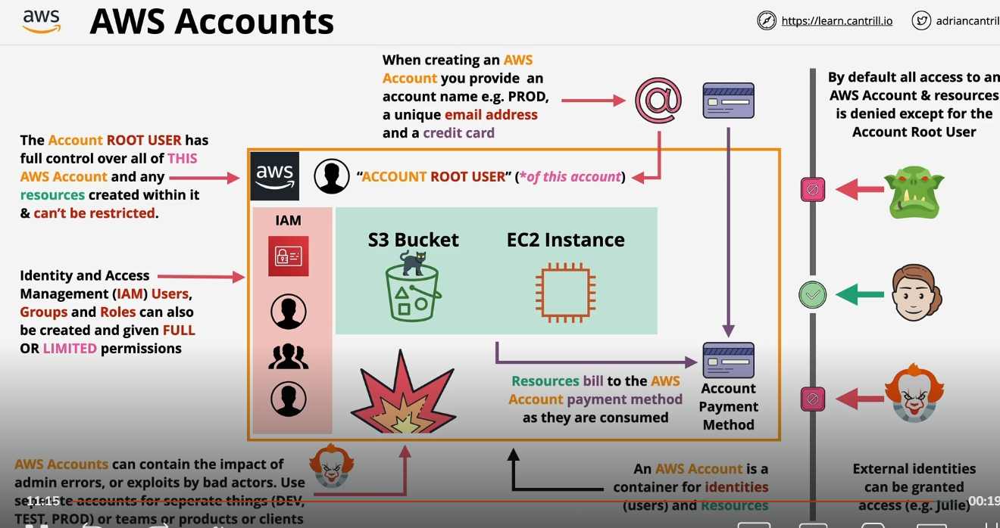

---

## 1. AWS Account Là Gì?

* **Định nghĩa:**

  AWS Account là một "container" chứa các **đối tượng nhận dạng (identities)** và **tài nguyên (resources)** mà bạn sử dụng trên AWS.
* **Đối tượng nhận dạng(identities):**

  Bao gồm các user (các tài khoản đăng nhập) và các thành phần khác như IAM roles, groups…
* **Tài nguyên:**

  Tất cả các dịch vụ và cơ sở hạ tầng AWS được tạo ra (EC2, S3, RDS, …).

---

## 2. Phân Biệt Giữa AWS Account và IAM Users

* **AWS Account:**

  Là thực thể độc lập quản lý tất cả các tài nguyên và bảo mật bên trong.

  * Mỗi AWS Account đều có một **root user** (tài khoản gốc) được tạo ra khi đăng ký account mới.
  * **Thông tin đăng nhập:** Root user đăng nhập bằng email (phải duy nhất cho mỗi account) và mật khẩu.
  * **Phương thức thanh toán:** Khi tạo account, bạn phải cung cấp một phương thức thanh toán (thường là thẻ tín dụng). Mặc dù một thẻ có thể dùng cho nhiều account, nhưng email tạo tài khoản phải là duy nhất.
* **IAM Users:**

  Là các đối tượng nhận dạng được tạo ra bên trong một AWS Account bằng dịch vụ Identity and Access Management (IAM).

  * Bắt đầu với quyền truy cập **mặc định không có quyền** (default deny). Bạn phải gán chính sách (policy) để cấp quyền sử dụng các dịch vụ.
  * Phục vụ việc phân quyền và quản lý an toàn cho các nhóm người dùng, ứng dụng, và dịch vụ bên trong cùng một AWS Account.

**Lưu ý:**

Nhiều người mới bắt đầu thường nhầm lẫn giữa việc tạo AWS Account và tạo IAM user; tuy nhiên, AWS Account là một container cấp cao bao gồm cả root user và các IAM identities đã được gán quyền dùng để truy cập tài nguyên bên trong account.

---

## 3. Tính Năng và Lợi Ích của AWS Accounts

### A. Quản Lý Tài Nguyên và Bảo Mật

* **Quyền kiểm soát hoàn toàn:**

  Root user có quyền truy cập tối đa (toàn quyền) và không thể bị giới hạn; do đó, việc bảo vệ thông tin đăng nhập của root user là rất quan trọng.
* **Phân chia và cách ly:**

  * Mỗi AWS Account được xem là một "bức tường" an ninh.
  * Nếu xảy ra lỗi hoặc rủi ro (ví dụ: do hành động sai của quản trị viên hoặc bị tấn công), các tác động đó thường chỉ giới hạn trong account đó.
  * Điều này cho phép doanh nghiệp tạo ra các AWS Accounts riêng biệt cho môi trường  **production** ,  **development** ,  **testing** , hoặc cho các nhóm, bộ phận hay sản phẩm khác nhau nhằm **cách ly rủi ro** và quản lý dễ dàng hơn.

### B. Liên Quan Đến Thanh Toán

* **Phương thức thanh toán và chi phí:**
  * Mỗi account được liên kết với một phương thức thanh toán cụ thể (thẻ tín dụng).
  * Hệ thống tính phí dựa trên cách bạn sử dụng dịch vụ (pay-as-you-go hoặc free tier cho một số dịch vụ).
  * Tối ưu chi phí bằng cách tách các môi trường (ví dụ, không cho phép tài nguyên thử nghiệm gây ảnh hưởng đến bill production).

### C. Kiểm Soát và Giám Sát

* **Mặc định từ chối truy cập (Default Deny):**
  * Trừ account root user, các IAM identities ban đầu **không có quyền truy cập** đến tài nguyên. Bạn phải thiết lập và gán quyền cụ thể.
* **Biên giới(boundary) của AWS Account:**
  * AWS Account là ranh giới an toàn, cho phép bạn hạn chế truy cập nội bộ và ngăn chặn các truy cập không mong muốn từ bên ngoài (ngoại trừ khi bạn cấu hình cho phép).

---

## 4. Cách Tạo và Quản Lý AWS Account

* **Thông tin bắt buộc khi tạo AWS Account:**
  1. **Tên Account:** Ví dụ, "Production", "Developer", "Test".
  2. **Email duy nhất:** Email phải là duy nhất với mỗi AWS Account.
  3. **Phương thức thanh toán:** Cung cấp thông tin thẻ tín dụng.
* **Account Root User:**
  * Là người dùng duy nhất ban đầu trong AWS Account.
  * Root user có toàn quyền quản lý tài nguyên và không bị giới hạn.
  * Cần được bảo vệ cẩn thận (ví dụ: sử dụng MFA, không dùng cho các tác vụ hàng ngày).
* **Tạo IAM Users và Phân Quyền:**
  * Sau khi tạo account, bạn nên tạo IAM user, IAM group và IAM roles cho các quản trị viên, developer…
  * Chính sách quản lý quyền (permissions) được gán rõ ràng để giới hạn quyền truy cập vào tài nguyên.

---

## 5. Quy Trình Quản Lý AWS Accounts trong Môi Trường Doanh Nghiệp

* **Single vs Multi-Account Strategy:**
  * Các hệ thống nhỏ có thể hoạt động trong một AWS Account duy nhất.
  * Các hệ thống phức tạp hoặc doanh nghiệp lớn thường sử dụng nhiều AWS Accounts (hàng chục đến hàng trăm) để cách ly môi trường, giảm thiểu rủi ro và tối ưu quản trị.
* **An toàn và Giới Hạn Rủi Ro:**
  * Bằng cách chia nhỏ các tài nguyên qua nhiều AWS Accounts, nếu một account bị xâm phạm hoặc xảy ra sai sót, thì tác động bị giới hạn trong account đó.
* **Tích Hợp với AWS Organizations:**
  * AWS Organizations cho phép bạn quản lý, giám sát và kiểm soát truy cập cho nhiều AWS Accounts từ một nơi duy nhất.
  * Có thể áp dụng Service Control Policies (SCPs) để định rõ giới hạn và quy định trên cấp tổ chức.

---

## 6. Tóm Lại và Tầm Quan Trọng

* **AWS Account là nền tảng:**

  Hiểu rõ AWS Account giúp bạn thiết kế hệ thống phân chia nguồn lực, quản lý bảo mật và tối ưu hóa chi phí một cách chuyên nghiệp.
* **Sự khác biệt giữa AWS Account và IAM:**

  Account là container cấp cao chứa root user và các IAM identities. Trong khi đó, IAM dùng để quản lý chi tiết quyền truy cập các dịch vụ bên trong account.
* **Cách quản trị an toàn:**

  Luôn bảo vệ thông tin đăng nhập root user; tạo và quản lý các IAM identities với quyền hạn cụ thể; sử dụng các AWS Accounts riêng biệt để cách ly các môi trường và giảm thiểu rủi ro.

---

Hiểu rõ và vận dụng đúng cách quản lý AWS Accounts sẽ giúp bạn xây dựng hệ thống hạ tầng AWS an toàn, hiệu quả và dễ dàng mở rộng khi doanh nghiệp phát triển.
