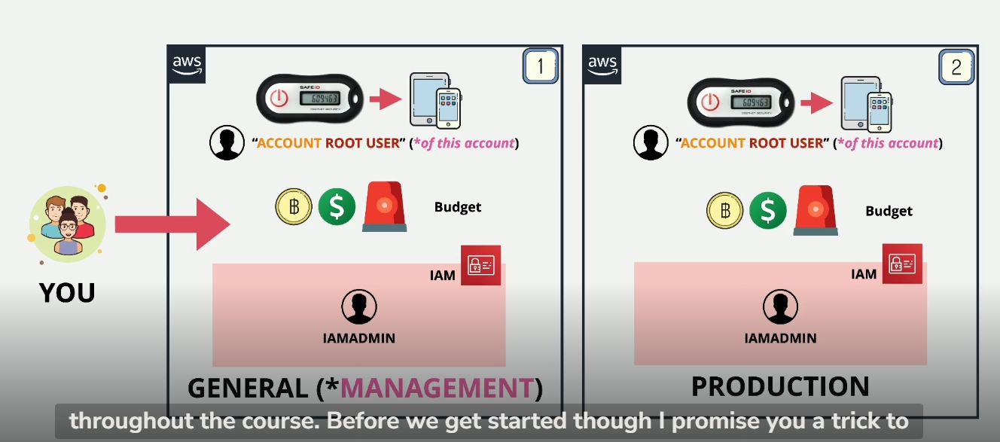

**Giới thiệu về việc tạo tài khoản AWS**

- Việc tạo tài khoản AWS có vẻ đơn giản nhưng rất quan trọng để bắt đầu với nền tảng thực hành tốt nhất.
- Trong thực tế, hầu hết các doanh nghiệp sử dụng nhiều hơn một tài khoản AWS để cách ly các môi trường (như dev, test, prod) hoặc các dự án.
- Thay vì chỉ dùng một tài khoản sandbox, khóa học này sẽ hướng dẫn bạn tạo và sử dụng nhiều tài khoản.
- Sau này trong khóa học, bạn sẽ học cách liên kết các tài khoản này bằng AWS Organizations để quản lý đa tài khoản.

**Cấu trúc tài khoản ban đầu cho khóa học**

Bạn sẽ tạo ít nhất hai tài khoản AWS:

1.  **Tài khoản Tổng quát (General AWS Account) / Tài khoản Quản lý (Management AWS Account):**

    - Đây là tài khoản đầu tiên bạn tạo và sẽ đăng nhập vào ban đầu.
    - Trong khóa học, ban đầu sẽ gọi là "General Account", sau khi học về AWS Organizations, nó sẽ trở thành "Management Account". Cả hai tên này đều chỉ cùng một tài khoản đầu tiên này.
    - Khi tạo tài khoản AWS, một **Người dùng Gốc (Account Root User)** sẽ được tạo cùng với nó. Người dùng gốc này có toàn quyền kiểm soát tài khoản và chỉ dành riêng cho tài khoản đó.
    - Ban đầu, bạn sẽ đăng nhập vào tài khoản này bằng người dùng gốc.

2.  **Tài khoản Sản xuất (Production AWS Account):** - Sau khi cấu hình xong tài khoản tổng quát, bạn sẽ lặp lại quy trình để tạo một tài khoản thứ hai gọi là "Production Account". - Đây là một tài khoản hoàn toàn mới, có người dùng gốc mới và bạn cũng sẽ tạo một **Định danh IAM (IAM Identity)** mới (gọi là IAM admin) trong tài khoản này. - Đây là cấu trúc ban đầu bạn sẽ sử dụng trong suốt khóa học.
    
    **Bảo mật Tài khoản Tổng quát (và các tài khoản khác)**

Sau khi tạo tài khoản đầu tiên, bạn cần bảo mật nó:

- **Thêm Xác thực Đa yếu tố (Multi-Factor Authentication - MFA) cho Người dùng Gốc:**
  - Đây là bước quan trọng để bảo mật người dùng có quyền lực nhất trong tài khoản.
  - MFA yêu cầu ngoài mật khẩu, bạn cần nhập thêm một mã dùng một lần (one-time code) được tạo bởi thiết bị vật lý hoặc ứng dụng trên điện thoại/máy tính bảng của bạn (Virtual MFA).
  - Điều này giúp tăng cường đáng kể tính bảo mật, vì chỉ cần lộ mật khẩu là chưa đủ để đăng nhập.
- **Thiết lập Ngân sách (Budget):**
  - Mặc dù khóa học sẽ cố gắng nằm trong gói miễn phí (Free Tier) nhiều nhất có thể, nhưng nếu bạn vô tình để tài nguyên nào đó chạy, nó có thể phát sinh chi phí.
  - Việc cấu hình ngân sách giúp bạn nhận được thông báo ngay khi chi phí vượt quá ngưỡng bạn đặt ra, phòng tránh các chi phí không mong muốn.
- **Tránh sử dụng Người dùng Gốc cho các tác vụ hàng ngày:**
  - Người dùng gốc có toàn quyền và không thể bị giới hạn, đồng thời chỉ có một cho mỗi tài khoản.
  - Thực hành tốt nhất là tạo các **Định danh IAM (IAM Identities)** trong tài khoản AWS để thực hiện các tác vụ hàng ngày.
- **Tạo Người dùng IAM Admin:**
  - Bạn sẽ tạo một người dùng IAM tên là `IAM admin` trong tài khoản tổng quát.
  - Người dùng này sẽ được cấp quyền quản trị (administrator permissions) đối với tài khoản tổng quát.
  - Đây sẽ là định danh (IAM Identities) mà bạn sử dụng cho phần còn lại của khóa học khi tương tác với tài khoản tổng quát, thay vì sử dụng người dùng gốc(root).

**Thủ thuật giúp tạo nhiều tài khoản AWS dễ dàng hơn (áp dụng cho Gmail)**

- AWS yêu cầu mỗi tài khoản phải có một địa chỉ email duy nhất. Việc tạo nhiều tài khoản có thể phức tạp nếu bạn cần nhiều địa chỉ email khác nhau.
- **Sử dụng dấu cộng (+) trong địa chỉ Gmail:** Gmail (và một số nhà cung cấp email khác) hỗ trợ tạo các địa chỉ email "động" bằng cách thêm `+` và bất kỳ văn bản nào sau tên người dùng (trước `@`).
- **Ví dụ:** Nếu email chính của bạn là `tendangnhap@gmail.com`, bạn có thể sử dụng các địa chỉ như:
  - `tendangnhap+awsaccount1@gmail.com`
  - `tendangnhap+production@gmail.com`
  - `tendangnhap+dev@gmail.com`
- Từ góc độ của AWS, những địa chỉ này là duy nhất. Tuy nhiên, tất cả email gửi đến các địa chỉ này đều được chuyển về hộp thư đến chính của bạn (`tendangnhap@gmail.com`).
- Điều này cho phép bạn tạo số lượng tài khoản AWS gần như không giới hạn chỉ với một tài khoản Gmail duy nhất.
- Thủ thuật này rất hữu ích khi bạn coi các tài khoản cho mục đích đào tạo là "dùng một lần" và muốn tạo môi trường mới, sạch sẽ cho mỗi khóa học để đảm bảo cách ly và an toàn.

**Các yêu cầu để tạo một tài khoản AWS:**

1.  **Địa chỉ email:** Duy nhất cho tài khoản gốc (có thể dùng thủ thuật dấu cộng của Gmail). Địa chỉ này phải nhận được email để xác minh.
2.  **Tên tài khoản AWS:** Một tên giúp bạn dễ dàng nhận biết tài khoản (ví dụ: `AC-tenviet-training-AWS-general`).
3.  **Mật khẩu:** Đặt mật khẩu mạnh cho người dùng gốc (nên dùng trình quản lý mật khẩu).
4.  **Thông tin thanh toán (Billing information):** Cần cung cấp thẻ tín dụng/ghi nợ. Thẻ sẽ được dùng để xác minh danh tính (có thể thấy mất một khoản phí chờ xử lý nhỏ, khoản này sẽ hoàn sau vài ngày) và chỉ bị tính phí nếu bạn phát sinh chi phí ngoài Free Tier.
5.  **Xác minh danh tính:** Qua SMS hoặc cuộc gọi thoại đến số điện thoại cung cấp , trường hợp sms không gửi hãy gọi điện , không được nữa tạo support nhắn tin kêu xác thực giúp sdt .
6.  **Chọn gói hỗ trợ (Support plan):** Chọn gói **Basic Support** (miễn phí) là đủ cho mục đích đào tạo. Các gói khác (Developer, Business) cung cấp mức độ hỗ trợ cao hơn cho môi trường production.

**Quy trình tạo tài khoản (các bước thực hiện trên Console):**

1.  Truy cập trang tạo tài khoản AWS.
2.  Nhập địa chỉ email và tên tài khoản AWS. Nhấp "Verify email address".
3.  Nhập mã xác minh gửi đến email.
4.  Đặt mật khẩu mạnh cho người dùng gốc.
5.  Cung cấp thông tin tài khoản (cá nhân/doanh nghiệp).
6.  Nhập thông tin thanh toán.
7.  Xác minh danh tính qua số điện thoại (SMS hoặc voice call). Nhập mã xác minh.
8.  Chọn gói hỗ trợ (chọn Basic Support).
9.  AWS bắt đầu kích hoạt tài khoản (quá trình này có thể mất từ vài phút đến một giờ).
10. Sau khi nhận được email xác nhận kích hoạt, bạn có thể đăng nhập vào Management Console bằng email và mật khẩu của người dùng gốc.

**Các bước cuối cùng sau khi đăng nhập lần đầu:**

1.  **Tùy chọn: Thêm liên hệ thay thế (Alternate contacts):** Trong mục "Account" trên Console, bạn có thể thêm thông tin liên hệ khác cho mục đích thanh toán (billing), vận hành (operations) và bảo mật (security). Điều này hữu ích cho tài khoản doanh nghiệp.
2.  **Quan trọng: Bật quyền truy cập thông tin thanh toán cho người dùng/vai trò IAM (Enable IAM user and role access to billing information):**
    - Trong mục "Account", tìm đến phần "IAM user and role access to billing information".
    - Nhấp "Edit" và tích chọn ô "Activate IAM access".
    - Nhấp "Update".
    - **Lý do:** Nếu không bật tùy chọn này, ngay cả khi một người dùng IAM được cấp quyền quản trị đầy đủ, họ sẽ không thể truy cập vào Billing Console để xem chi phí. Việc này đảm bảo rằng các người dùng IAM được cấp quyền phù hợp có thể theo dõi chi phí.

**Chọn Vùng AWS (AWS Region):**

- Trong suốt khóa học, khi tương tác với các dịch vụ AWS, nên chọn vùng **US East (N. Virginia) có phí thấp nhất - us-east-1**.
- Vùng mặc định có thể khác nhau tùy thuộc vào vị trí của bạn hoặc thay đổi theo thời gian.
- Luôn kiểm tra và đảm bảo rằng vùng được chọn là `US East (N. Virginia)`. Nếu là `Global`, đó là bình thường cho một số dịch vụ, nhưng nếu hiển thị một vùng cụ thể khác, hãy chuyển nó về `US East (N. Virginia)`.
