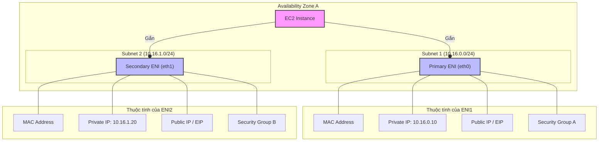

## 💻 Mạng EC2: ENI, IP, DNS – Kiến trúc, quy trình & mẹo thi (đầy đủ)

---

## 1. Kiến trúc mạng EC2 & ENI (Elastic Network Interface)

- **ENI (Elastic Network Interface):** Là card mạng ảo gắn vào EC2 instance.
- **Mỗi EC2 instance có:**
    - **1 ENI chính (primary):** Gắn cố định, không thể gỡ ra.
    - **0 hoặc nhiều ENI phụ (secondary):** Có thể gắn/gỡ và di chuyển giữa các instance.
- **Quan trọng:** Tất cả các ENI của một instance có thể ở các subnet khác nhau, nhưng **phải nằm trong cùng một Availability Zone (AZ)**.

---

## 2. Các thành phần gắn với một ENI

Các thuộc tính mạng thực chất được gắn vào ENI, không phải trực tiếp vào instance.

| Thành phần               | Mô tả & Lưu ý                                                                                             |
|--------------------------|------------------------------------------------------------------------------------------------------------|
| **MAC Address**          | Địa chỉ phần cứng tĩnh của ENI. Dùng cho các phần mềm license theo MAC.                                     |
| **Primary Private IPv4** | 1 địa chỉ private IPv4 chính, lấy từ dải IP của subnet. Tĩnh, không đổi suốt vòng đời instance.                |
| **Secondary Private IPv4** | 0 hoặc nhiều địa chỉ private IPv4 phụ.                                                                      |
| **Public IPv4**          | 0 hoặc 1 địa chỉ public IPv4 (loại dynamic).                                                               |
| **Elastic IP (EIP)**     | 1 EIP cho mỗi địa chỉ private IPv4 (cả chính và phụ).                                                       |
| **IPv6 Address**         | 0 hoặc nhiều địa chỉ IPv6 (mặc định là public).                                                            |
| **Security Groups**      | Gắn vào ENI. Muốn có rule khác nhau cho các IP khác nhau → dùng nhiều ENI với nhiều security group.        |
| **Source/Dest Check**    | Mặc định bật. Tắt đi để instance hoạt động như một NAT instance.                                            |

---

## 3. Phân loại IP và DNS trên EC2

### A. Private IP & DNS

- **Private IPv4 (vd: `10.16.0.10`):**
    - Tĩnh, không đổi.
    - Dùng cho giao tiếp nội bộ trong VPC.
- **Internal DNS (vd: `ip-10-16-0-10.ec2.internal`):**
    - Tự động tạo, trỏ đến Private IPv4.
    - **Chỉ phân giải được bên trong VPC**.

### B. Public IP (Dynamic) & DNS

- **Public IPv4 (Dynamic):**
    - Cấp phát tự động nếu subnet được cấu hình.
    - **Thay đổi khi instance stop/start**.
    - **Không đổi khi reboot (restart)**.
- **Public DNS (vd: `ec2-xx-xx-xx-xx.compute-1.amazonaws.com`):**
    - Trỏ đến Public IPv4.
    - **Đặc biệt:**
        - **Bên trong VPC:** Phân giải ra **Private IPv4** (để tối ưu traffic nội bộ).
        - **Bên ngoài VPC:** Phân giải ra **Public IPv4**.

### C. Elastic IP (EIP)

- **Là địa chỉ Public IPv4 tĩnh, thuộc về tài khoản AWS của bạn.**
- **Quy trình hoạt động:**
    1. **Allocate EIP:** Xin một EIP từ AWS.
    2. **Associate EIP:** Gắn EIP vào một địa chỉ private IPv4 trên ENI.
    3. Khi gắn EIP, địa chỉ Public IPv4 (dynamic) cũ sẽ bị **mất vĩnh viễn**.
    4. Khi gỡ EIP, instance sẽ nhận một địa chỉ Public IPv4 (dynamic) **mới hoàn toàn**, không lấy lại được IP cũ.

---

## 4. Mẹo thi & thực tế quan trọng (Exam Power-ups)

1.  **License theo MAC Address:** Gắn ENI phụ vào instance, dùng MAC của ENI phụ để license. Khi cần di chuyển license, chỉ cần gỡ ENI phụ và gắn sang instance khác.
2.  **Multi-homed System:** Dùng nhiều ENI cho các mục đích khác nhau (vd: 1 ENI cho management, 1 ENI cho data). Vì Security Group gắn vào ENI, đây là cách để áp các bộ quy tắc firewall khác nhau cho các luồng traffic khác nhau.
3.  **OS không thấy Public IP:** Hệ điều hành bên trong EC2 (Windows/Linux) **không bao giờ nhìn thấy Public IPv4**. Nó chỉ làm việc với Private IPv4. Quá trình NAT 1-1 được xử lý bởi Internet Gateway.
4.  **Public IP (Dynamic) vs. EIP (Static):**
    - Public IP (dynamic) sẽ thay đổi khi **stop/start**.
    - Muốn IP public cố định, **phải dùng Elastic IP (EIP)**.
5.  **Public DNS Resolution:** Nhớ kỹ cơ chế phân giải kép của Public DNS:
    - **Trong VPC → Private IP.**
    - **Ngoài VPC → Public IP.**
    (Rất quan trọng cho các chủ đề như VPC Peering, Hybrid Networking).
6.  **Gỡ EIP:** Khi gỡ EIP, không có cách nào lấy lại được địa chỉ Public IP (dynamic) ban đầu. Instance sẽ được cấp một IP public mới.

---

## 5. Sơ đồ kiến trúc (tóm tắt)

---

## 6. Tổng kết dễ nhớ

- **ENI là card mạng ảo, Security Group gắn vào ENI.**
- **Tất cả ENI phải trong cùng một AZ.**
- **OS chỉ thấy Private IP, không thấy Public IP.**
- **Muốn IP public cố định, dùng EIP. Gắn/gỡ EIP làm mất IP public động cũ.**
- **Public DNS phân giải ra Private IP (nội bộ VPC) hoặc Public IP (bên ngoài).**

---
??? info "Ghi chú thêm & chi tiết"

    -   **Số lượng ENI & IP phụ thuộc vào Instance Type:**  
        Mỗi loại instance (vd: `t3.micro`, `m5.large`) có giới hạn khác nhau về số lượng ENI có thể gắn và số lượng địa chỉ IP phụ trên mỗi ENI.
    
    -   **Primary ENI vs. Secondary ENI:**  
        -   **Primary ENI (eth0):** Không thể gỡ khỏi instance, nó gắn liền với vòng đời của instance.  
        -   **Secondary ENI:** Có thể gắn/gỡ và di chuyển giữa các instance (trong cùng AZ). Hữu ích cho các kịch bản **failover** hoặc **di chuyển license**.
    
    -   **Source/Destination Check:**  
        -   Khi **bật** (mặc định), ENI sẽ kiểm tra mọi packet đi qua nó. Gói tin sẽ bị **discard** nếu:  
            -   IP **nguồn** không phải là một trong các IP gắn với ENI.  
            -   IP **đích** không phải là một trong các IP gắn với ENI.  
    
            👉 Nói cách khác: ENI chỉ cho phép gói tin mà nó **thực sự gửi đi hoặc nhận về chính nó**. Nó sẽ không cho gói tin “đi nhờ” qua nó.  
    
            **Ví dụ:** Một EC2 có ENI giống như **cửa nhà bạn**.  
            - Bạn chỉ nhận thư gửi đúng địa chỉ nhà mình.  
            - Bạn chỉ gửi thư có ghi địa chỉ nhà mình.  
            - Nếu có thư ghi địa chỉ nhà khác nhưng gửi qua bạn, bạn sẽ **không chuyển hộ** mà vứt đi.  
    
        -   Cần **tắt (disable)** khi instance đóng vai trò **router, firewall, NAT instance**, hoặc bất kỳ dịch vụ nào cần **chuyển tiếp traffic cho máy khác**.
    
    -   **IPv6:**  
        Không có khái niệm *private* hay *public* như IPv4. Tất cả địa chỉ IPv6 cấp cho EC2 đều có thể được định tuyến công khai trên Internet (tất nhiên vẫn bị kiểm soát bởi **Security Group** và **Network ACL**).
    
    -   **Gắn nhiều EIP trên một ENI:**  
        Mỗi địa chỉ private IPv4 trên ENI có thể gắn một Elastic IP.  
        Ví dụ: ENI có 1 private IP chính + 2 private IP phụ → gắn tối đa **3 EIP**.
    
    -   **Góc nhìn khái niệm:**  
        Có thể coi **Primary ENI chính là "instance"** từ góc độ mạng. Hầu hết cấu hình mạng hiển thị trên console EC2 thực chất là thuộc tính của **Primary ENI**.
