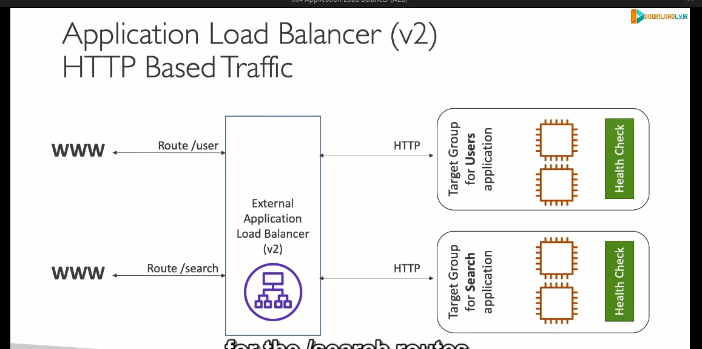
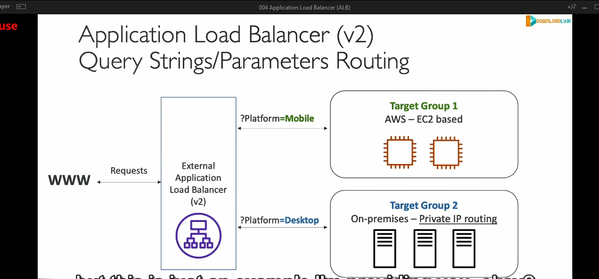
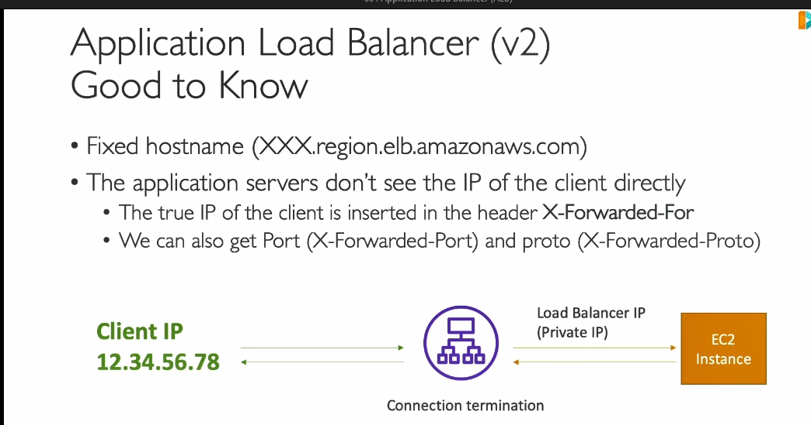

---

### **1. Tổng quan về Application Load Balancer (ALB):**
- **ALB** là một loại **Load Balancer** hoạt động tại **Layer 7** (tầng ứng dụng) của mô hình OSI. Điều này có nghĩa là nó xử lý lưu lượng truy cập **HTTP/HTTPS** và cung cấp các tính năng nâng cao liên quan đến web như định tuyến URL, chuyển hướng HTTP/HTTPS, hỗ trợ HTTP/2 và WebSocket.

### **2. Đặc điểm chính của ALB:**
1. **Định tuyến nâng cao (Advanced Routing):**
   - **Routing theo đường dẫn URL (Path-based routing):**
     - Ví dụ: `example.com/users` và `example.com/posts` có thể được chuyển đến các nhóm mục tiêu khác nhau (target groups).
   - **Routing theo tên miền (Host-based routing):**
     - Ví dụ: `one.example.com` và `other.example.com` có thể chuyển hướng đến các nhóm mục tiêu khác nhau.
   - **Routing theo chuỗi truy vấn và header (Query string & Header routing):**
     - Ví dụ: URL có chuỗi truy vấn `?Platform=Mobile` sẽ được định tuyến đến nhóm mục tiêu cho di động, còn `?Platform=Desktop` sẽ đến nhóm mục tiêu cho máy tính bàn.

2. **Hỗ trợ nhiều ứng dụng trên cùng một EC2 instance:**
   - Thay vì cần nhiều **Classic Load Balancer**, ALB cho phép định tuyến đến nhiều ứng dụng hoặc container (sử dụng Amazon ECS) trên cùng một instance EC2.

3. **Tích hợp với các công nghệ hiện đại:**
   - Hỗ trợ **HTTP/2**, **WebSockets**, và tự động chuyển hướng **HTTP sang HTTPS**.
   - Tích hợp tốt với các dịch vụ serverless như **AWS Lambda**.

4. **Cung cấp thông tin chi tiết qua header:**
   - ALB thêm thông tin như IP của khách hàng (`X-Forwarded-For`), port (`X-Forwarded-Port`), và giao thức (`X-Forwarded-Proto`) vào request.
   

---

### **3. Target Groups (Nhóm mục tiêu):**
- **Target Groups** là nơi ALB chuyển hướng lưu lượng truy cập đến. Các mục tiêu có thể là:
  - **EC2 Instances:** Được quản lý thông qua **Auto Scaling Group**.
  - **ECS Tasks:** Chạy container trên ECS.
  - **AWS Lambda Functions:** Dành cho ứng dụng serverless.
  - **Private IPs:** Các máy chủ nội bộ trong hệ thống mạng của bạn (on-premises).

- **Health Check:** ALB sẽ thực hiện kiểm tra sức khỏe (health check) trên từng mục tiêu để đảm bảo chỉ chuyển hướng lưu lượng truy cập đến các mục tiêu khỏe mạnh.

---

### **4. Kiến trúc ví dụ:**
#### Trường hợp sử dụng:
- Một ALB công khai (**public-facing**) có thể định tuyến cho hai ứng dụng khác nhau:
  1. Ứng dụng **User Management** (đường dẫn `/user`) chạy trên một nhóm EC2 instances.
  2. Ứng dụng **Search Service** (đường dẫn `/search`) chạy trên một nhóm EC2 khác.
 

#### Quy trình hoạt động:
1. **Client Request:** Người dùng gửi yêu cầu HTTP/HTTPS đến ALB.
2. **ALB Routing:**
   - Dựa vào đường dẫn URL hoặc tên miền, ALB chuyển hướng lưu lượng đến đúng nhóm mục tiêu.
3. **Target Group Health Check:**
   - Chỉ các mục tiêu "khỏe mạnh" mới nhận được lưu lượng từ ALB.

---

### **5. Kịch bản thực tế:**
- **Truy cập từ thiết bị di động và desktop:**
  - Nếu URL chứa `?Platform=Mobile`, lưu lượng sẽ được chuyển đến nhóm EC2 dành cho di động.
  - Nếu URL chứa `?Platform=Desktop`, lưu lượng sẽ được chuyển đến nhóm EC2 dành cho desktop.
 
---

### **6. Ưu điểm của ALB so với Classic Load Balancer( lỗi thời ):**
- Thay vì sử dụng nhiều **Classic Load Balancer** để phục vụ nhiều ứng dụng, ALB có thể xử lý nhiều ứng dụng trên cùng một load balancer, tiết kiệm chi phí và tài nguyên.
- Hỗ trợ các tính năng định tuyến nâng cao và tích hợp tốt với kiến trúc hiện đại (microservices, containers, serverless).

---

### **7. Thông tin bổ sung:**
- ALB sử dụng một IP riêng để giao tiếp với EC2 instances. Để biết địa chỉ IP thực của client, bạn cần kiểm tra các header như `X-Forwarded-For`.
- When using an Application Load Balancer (ALB), the traffic from clients (users) first passes through the load balancer before reaching your EC2 instances. The ALB forwards requests to your EC2 instances, but by default, the IP address visible on the backend is that of the ALB, not the client. To capture the actual IP address of the client (the user), the ALB adds an HTTP header called X-Forwarded-For, which contains the real client IP address.X-Forwarded-For Header: This header is specifically used to pass the original client IP address through the load balancer. It holds a comma-separated list of IP addresses where the left-most IP is the real client IP, and the rest are intermediate proxies (like your ALB).

- The X-Forwarded-Proto header indicates the protocol (HTTP or HTTPS) used by the client to connect to the load balancer. It does not contain the client IP address
- The X-Forwarded-Port header contains the port number that the client used to connect to the load balancer. It also does not hold the client IP address.

---

