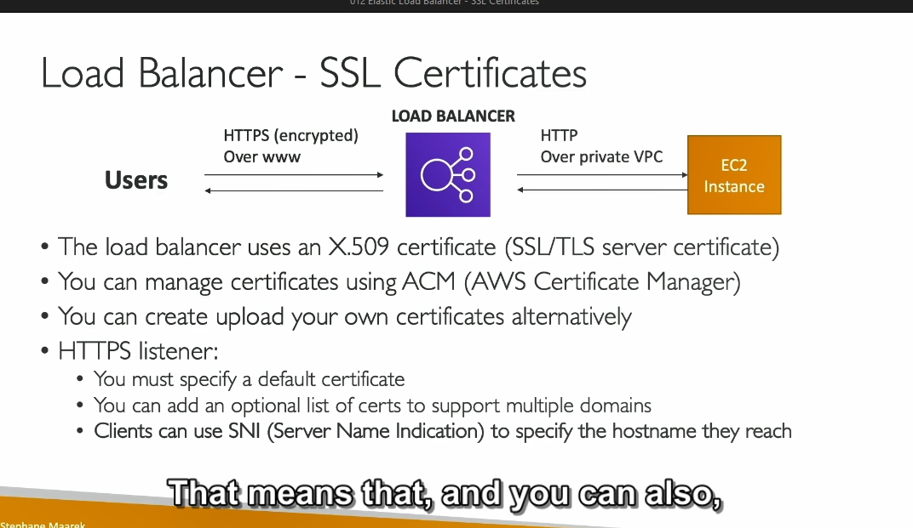
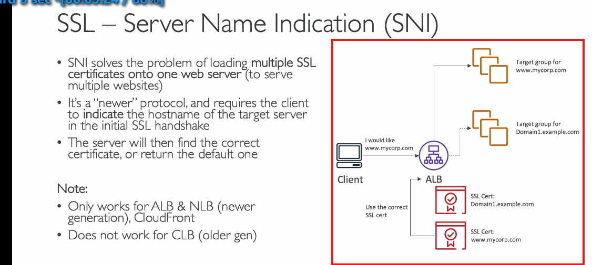

### SSL/TLS và tích hợp Load Balancer

#### **1. SSL và TLS là gì?**
- **SSL (Secure Sockets Layer):** 
  - Công nghệ mã hóa kết nối truyền tải dữ liệu, đảm bảo tính bảo mật trong quá trình truyền.
  - **TLS (Transport Layer Security):** Phiên bản cải tiến của SSL, được sử dụng phổ biến hơn.
  - **Lưu ý:** Dù TLS là chuẩn hiện tại, người ta thường gọi chung là "SSL" vì quen thuộc.

#### **2. Chứng chỉ SSL/TLS**
- **Vai trò:** 
  - Mã hóa dữ liệu giữa client và Load Balancer (LB).
  - Đảm bảo dữ liệu chỉ có thể giải mã bởi người gửi và nhận.
- **Chứng chỉ công khai:** Được cấp bởi các **Certificate Authorities (CA)** như:
  - Comodo, Symantec, GoDaddy, Let's Encrypt...
- **Thời hạn:** Cần gia hạn định kỳ để duy trì tính hợp lệ.
  
#### **3. Cách hoạt động của Load Balancer với SSL**
- **Quy trình:**
  1. **Kết nối HTTPS**: Client kết nối tới LB qua giao thức HTTPS (mã hóa).
  2. **SSL Termination**:
     - LB nhận và giải mã dữ liệu.
     - Trong nội bộ, LB có thể gửi dữ liệu tới backend server qua HTTP (không mã hóa) nhưng trong mạng nội bộ VPC, đảm bảo an toàn.
  3. **Quản lý chứng chỉ:** 
     - AWS cung cấp **AWS Certificate Manager (ACM)** để quản lý SSL/TLS.
     - Hỗ trợ tải lên chứng chỉ bên ngoài.

#### **4. SNI (Server Name Indication)**
- **Vấn đề cần giải quyết:** Cho phép một server hỗ trợ nhiều chứng chỉ SSL/TLS cho nhiều domain khác nhau.
- **Cách hoạt động:**
  - Client chỉ định hostname trong quá trình handshake SSL.
  - Server sẽ phản hồi với chứng chỉ tương ứng.
- **Hỗ trợ SNI:**
  - Chỉ hoạt động trên **ALB (Application Load Balancer)**, **NLB (Network Load Balancer)** và **CloudFront**.

#### **5. Ứng dụng thực tế**
- **Ví dụ:**
  - LB có 2 domain:
    - `www.mycorp.com` và `domain1.example.com`.
  - Mỗi domain sử dụng một chứng chỉ SSL khác nhau.
  - Sử dụng SNI, LB sẽ chọn đúng chứng chỉ dựa trên yêu cầu của client.
- **Sơ đồ:**
  - ALB → Lấy chứng chỉ phù hợp (qua SNI) → Điều hướng đến nhóm mục tiêu tương ứng (Target Group).

#### **Tóm tắt**
- Sử dụng **ALB/NLB** nếu cần hỗ trợ nhiều domain và chứng chỉ.
- **SNI** giúp phân biệt các domain dựa trên hostname.
- ACM là công cụ AWS hỗ trợ quản lý chứng chỉ SSL/TLS tiện lợi.
- setting trong listener ở LB 

---
**ALPN trong SSL Load Balancer là cách để chọn giao thức ứng dụng phù hợp khi client kết nối với server qua TLS.** 

Nói dễ hiểu: 
- Khi bạn dùng HTTPS để kết nối, thường có nhiều "phiên bản" hoặc cách giao tiếp khác nhau, ví dụ: HTTP/1.1, HTTP/2, hoặc gRPC.
- ALPN giúp **client (trình duyệt, ứng dụng)** và **server (hoặc load balancer)** quyết định sẽ sử dụng giao thức nào trong các giao thức mà cả hai hỗ trợ.

---

### Ví dụ cụ thể: 

1. **Client hỏi:** 
   - "Tôi muốn kết nối! Tôi biết dùng **HTTP/1.1** và **HTTP/2**. Bạn hỗ trợ cái nào?"

2. **Load Balancer trả lời:** 
   - "OK, tôi hỗ trợ cả hai, nhưng tôi sẽ chọn **HTTP/2** vì nó tốt hơn."

3. **Kết quả:** 
   - Cả hai đồng ý dùng **HTTP/2**, và kết nối tiếp tục bằng giao thức đó.

---

### Tại sao ALPN quan trọng với Load Balancer?
- **Giảm độ trễ (latency):** Vì ALPN chọn giao thức ngay khi kết nối TLS bắt đầu, không cần thêm bước nào khác để thương lượng.
- **Hỗ trợ nhiều giao thức:** Một load balancer có thể quản lý nhiều loại kết nối khác nhau (HTTP/1.1, HTTP/2, gRPC) trên cùng một cổng (thường là 443).

---

### Khi nào cần chú ý đến ALPN?
- Khi bạn muốn dùng HTTP/2 hoặc gRPC qua TLS, vì các giao thức này bắt buộc phải có ALPN.
- Nếu ứng dụng hoặc server không hỗ trợ ALPN, chúng sẽ chỉ hoạt động với HTTP/1.1 (hoặc giao thức cũ hơn).

