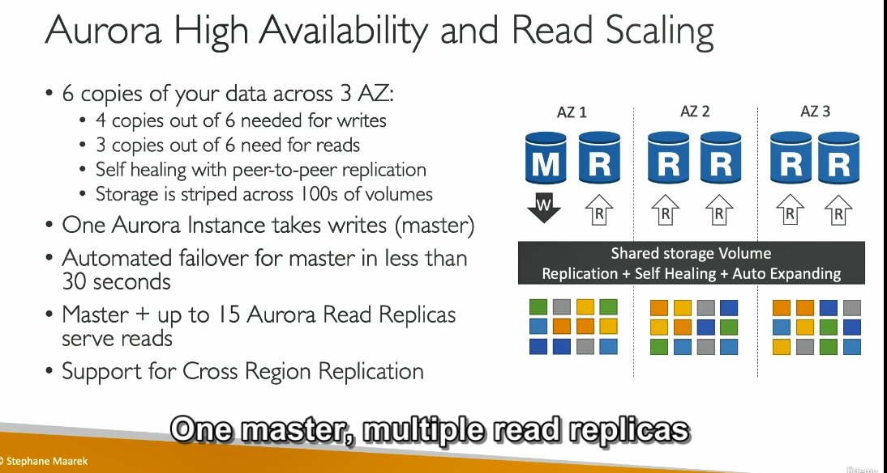
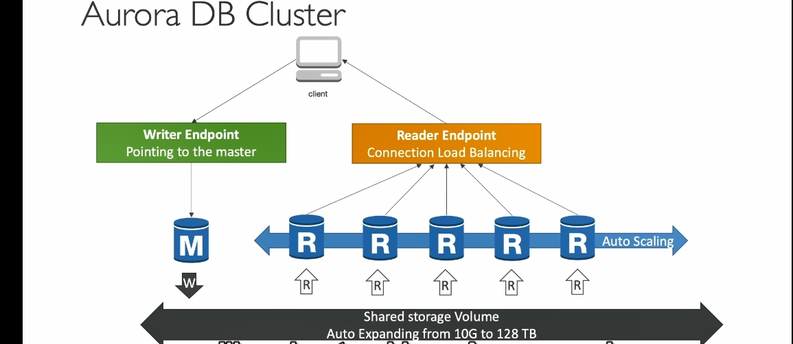
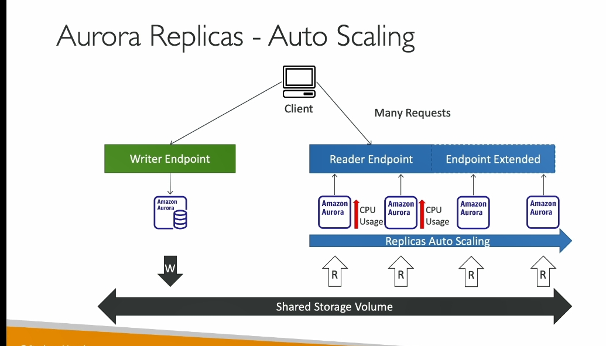
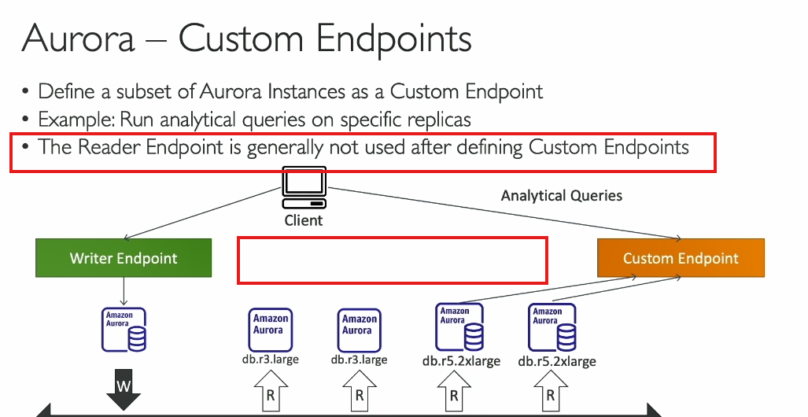
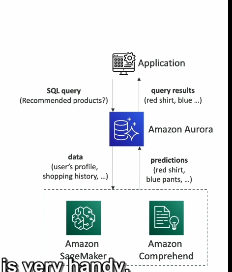

#### **Giới Thiệu**
- **Amazon Aurora**: Dịch vụ cơ sở dữ liệu quan hệ độc quyền của AWS, được tối ưu hóa cho môi trường đám mây.
- **Tương thích với PostgreSQL và MySQL**: Aurora hỗ trợ driver tương thích, giúp việc tích hợp và di chuyển từ các cơ sở dữ liệu này trở nên dễ dàng.

---

### **Tính Năng Chính**

#### **Hiệu Năng**
- **Cải thiện hiệu năng**:
  - Nhanh hơn **5 lần** so với MySQL trên RDS.
  - Nhanh hơn **3 lần** so với PostgreSQL trên RDS.
- Tối ưu hóa cho đám mây với kiến trúc nội bộ tiên tiến.

#### **Dung Lượng Lưu Trữ**
- **Dung lượng tự động mở rộng**:
  - Bắt đầu từ **10GB** và tự động tăng lên đến **128TB** khi dữ liệu lớn hơn.
  - Giúp quản trị viên cơ sở dữ liệu (DBA) không cần lo lắng về việc theo dõi và mở rộng dung lượng thủ công.
- **Sao chép dữ liệu**:
  - Lưu trữ **6 bản sao dữ liệu** trên **3 Vùng Sẵn Sàng (AZ)**.

---

### **Khả Năng Sẵn Sàng Cao (High Availability)**
- **Tự phục hồi**: Dữ liệu bị lỗi hoặc hỏng sẽ được sửa chữa tự động nhờ sao chép ngang hàng (peer-to-peer replication).
- **Aurora lưu 6 bản sao dữ liệu trên 3 Vùng Sẵn Sàng (AZ).**
    Mỗi bản sao dữ liệu được lưu trữ trên các ổ đĩa khác nhau để đảm bảo tính sẵn sàng và độ tin cậy.
- **Yêu cầu số lượng bản sao thấp**:
  - **4 trên 6 bản sao cho hoạt động ghi (write):** Khi bạn ghi dữ liệu mới, Aurora chỉ cần xác nhận rằng 4 trong số 6 bản sao đã được cập nhật thành công. vẫn diễn ra mà không bị gián đoạn.
  - **3 trên 6 bản sao cho hoạt động đọc (read):** Đọc dữ liệu yêu cầu ít bản sao hơn so với ghi, vì việc đọc không thay đổi trạng thái dữ liệu.Aurora chỉ cần đảm bảo 3 trong 6 bản sao còn khả dụng để xử lý yêu cầu đọc, giúp hệ thống hoạt động ổn định kể cả khi một số bản sao gặp sự cố.
- **Failover nhanh**: Chuyển đổi dự phòng trong vòng chưa đến **30 giây** khi máy chủ chính gặp sự cố.

#### **Kiến Trúc**
- Dữ liệu được chia thành các khối nhỏ và lưu trữ trên hàng trăm ổ đĩa.
- **Dữ liệu chung (Shared Storage Volume)**:
  - Tự động mở rộng, sao chép, và tự phục hồi.

---

### **Khả Năng Mở Rộng**
- **Hỗ trợ tối đa 15 read replicas**:
  - **Độ trễ sao chép dưới 10ms**, nhanh hơn MySQL thông thường.
  - Có thể mở rộng quy mô đọc.
- **Replication liên vùng (Cross-region replication)**: Sao chép dữ liệu giữa các khu vực.

---

### **Kết Nối và Điểm Nổi Bật**
- **Writer Endpoint**:
  - Là DNS trỏ đến máy chủ chính (master).
  - Tự động chuyển hướng đến máy chủ mới khi failover xảy ra.
- **Reader Endpoint**:
  - Kết nối đến tất cả read replicas.
  - Khi ứng dụng cần đọc dữ liệu, nó không cần chỉ định replica cụ thể mà chỉ cần kết nối đến Reader Endpoint.
- **Hỗ trợ cân bằng tải ở mức kết nối, không phải mức câu lệnh.**
    - Ở mức kết nối:
        Mỗi khi ứng dụng mở một kết nối đến Aurora thông qua Reader Endpoint, Aurora sẽ chỉ định một read replica cụ thể để xử lý toàn bộ kết nối đó.
        - Ví dụ: Nếu có 5 kết nối từ ứng dụng, mỗi kết nối sẽ được phân phối đến một read replica khác nhau để đảm bảo cân bằng tải.
    - Ở mức câu lệnh (statement-level):
        Cân bằng tải không diễn ra trong một kết nối duy nhất. Điều này nghĩa là nếu bạn thực hiện nhiều câu lệnh SQL trên cùng một kết nối, tất cả các câu lệnh sẽ được xử lý bởi một replica duy nhất mà kết nối đó đã chỉ định ban đầu.
- **Auto-Scaling**:
  - Tự động thêm hoặc giảm read replicas dựa trên tải.

---

### **Tính Năng Bổ Sung**
1. **Tự động chuyển đổi dự phòng (Automatic Failover)**.
2. **Sao lưu và khôi phục (Backup and Recovery)**.
3. **Cách ly và bảo mật (Isolation and Security)**.
4. **Tuân thủ tiêu chuẩn công nghiệp (Industry Compliance)**.
5. **Mở rộng dễ dàng (Push-button Scaling)** thông qua Auto-Scaling.
6. **Patching tự động không downtime**.
7. **Giám sát nâng cao (Advanced Monitoring)** và bảo trì định kỳ.

---

 

Dưới đây là chi tiết các kiến thức nâng cao về Amazon Aurora được dịch sang tiếng Việt:

---

### **1. Replica Auto Scaling (Tự động mở rộng bản sao)**

Giả sử bạn có một ứng dụng khách và hiện có ba phiên bản Aurora: 
- Một phiên bản được sử dụng để ghi thông qua **writer endpoint** (writer endpoint). 
- Hai phiên bản còn lại được sử dụng để đọc thông qua **reader endpoint** (reader endpoint).

Nếu số lượng yêu cầu đọc tăng đột biến, dẫn đến mức sử dụng CPU trên các cơ sở dữ liệu Aurora tăng cao, bạn có thể thiết lập tính năng **tự động mở rộng bản sao**. Khi kích hoạt:
- Aurora sẽ tự động thêm các bản sao mới.
- **reader endpoint** sẽ mở rộng để bao gồm các bản sao này.
- Các bản sao mới sẽ bắt đầu nhận lưu lượng đọc, phân phối đều công việc và giúp giảm mức sử dụng CPU tổng thể.

### **2. Custom Endpoints (Custom Endpoints)**

Trong trường hợp bạn có nhiều loại bản sao khác nhau, ví dụ:
- Một số bản sao là loại **DBR3 Large**.
- Một số bản sao là loại **DBR5 2xLarge** (mạnh hơn).

Bạn có thể định nghĩa một tập hợp con các bản sao Aurora thành **Custom Endpoints**. Lợi ích:
- Tập trung vào các bản sao mạnh hơn để xử lý **truy vấn phân tích** hoặc các tác vụ cụ thể.
- Khi sử dụng **Custom Endpoints**, bạn thường sẽ không sử dụng **reader endpoint thông thường** nữa (dù nó không bị xóa).

Trong thực tế, bạn có thể thiết lập nhiều Custom Endpoints để phục vụ các loại khối lượng công việc khác nhau, tối ưu hóa hiệu suất và tính linh hoạt.

### **3. Aurora Serverless (Aurora không máy chủ)**

Đây là dịch vụ cung cấp khả năng:
- **Tự động khởi tạo và mở rộng cơ sở dữ liệu** dựa trên mức sử dụng thực tế.
- Phù hợp với khối lượng công việc không thường xuyên, gián đoạn hoặc khó dự đoán.
- Không cần lập kế hoạch dung lượng, và bạn chỉ phải trả tiền **theo giây** cho từng phiên bản Aurora được tạo ra.

**Cách hoạt động:**
- Ứng dụng khách giao tiếp với một **proxy fleet** (đội ngũ proxy) được Aurora quản lý.
- Ở phía sau, Aurora sẽ tự động tạo các phiên bản cơ sở dữ liệu dựa trên khối lượng công việc, mà không cần bạn cấp phát trước dung lượng.

### **4. Global Aurora (Aurora toàn cầu)**

Aurora hỗ trợ cấu hình cơ sở dữ liệu toàn cầu, gồm:
- **Bản sao đọc chéo khu vực** (Cross-region read replica): Hữu ích cho khôi phục thảm họa và dễ dàng triển khai.
- **Cơ sở dữ liệu toàn cầu Aurora** (Aurora Global Database): Là cách thức được khuyến nghị hiện nay.

**Lợi ích của Aurora Global Database:**
- Có một **khu vực chính** (primary region) để thực hiện đọc và ghi.
- Tối đa 5 khu vực phụ (secondary region) chỉ đọc, với thời gian sao chép **dưới 1 giây**.
- Mỗi khu vực phụ có thể chứa tối đa **16 bản sao đọc**.

**Ưu điểm:**
- **Giảm độ trễ đọc** cho khối lượng công việc toàn cầu.
- **Khôi phục thảm họa nhanh chóng**: Nếu khu vực chính bị sự cố, bạn có thể chuyển đổi khu vực phụ thành khu vực chính trong **dưới 1 phút**.

**Ví dụ:**
- Khu vực chính là **us-east1**, nơi ứng dụng thực hiện đọc và ghi.
- Khu vực phụ được thiết lập ở một vị trí khác để sao chép dữ liệu.
- Nếu **us-east1** gặp sự cố, bạn có thể nâng cấp khu vực phụ thành cụm Aurora chính để tiếp tục hoạt động.

### **5. Aurora Machine Learning (Máy học Aurora)**

Aurora tích hợp với các dịch vụ máy học của AWS, cho phép thực hiện các dự đoán dựa trên ML thông qua giao diện SQL. 

- **Dịch vụ tích hợp:** Amazon SageMaker (mô hình ML), Amazon Comprehend (phân tích cảm xúc).
- Không cần kinh nghiệm về máy học, phù hợp với các trường hợp sử dụng như:
  - Phát hiện gian lận.
  - Nhắm mục tiêu quảng cáo.
  - Phân tích cảm xúc.
  - Gợi ý sản phẩm.

**Kiến trúc:**
- Ứng dụng thực thi truy vấn SQL đơn giản.
- Aurora giao tiếp với dịch vụ máy học để lấy dự đoán.
- Kết quả dự đoán được trả về ứng dụng.

---

