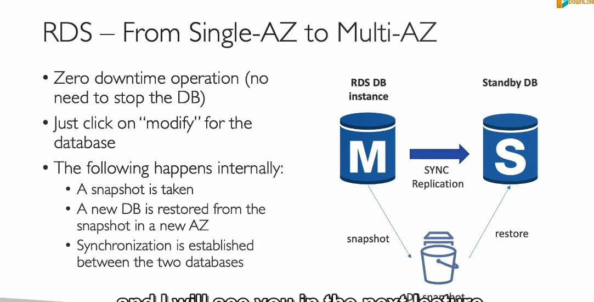
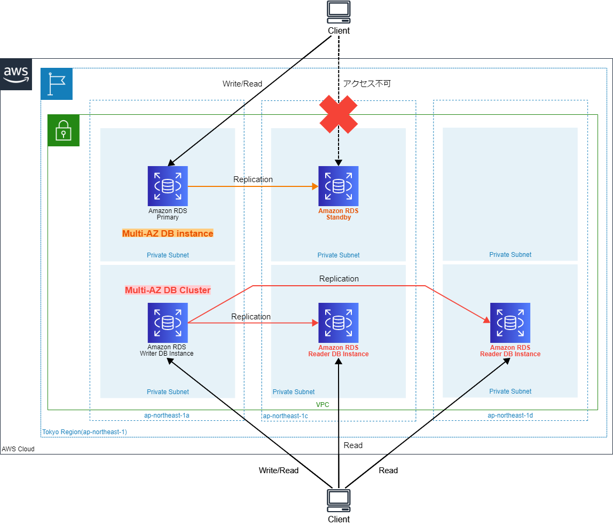

### **Chi Tiết Hoàn Chỉnh về AWS RDS Read Replicas và Multi-AZ**  

Khi làm việc với cơ sở dữ liệu quan hệ trên AWS, bạn sẽ thường xuyên gặp hai giải pháp quan trọng: **Read Replicas** và **Multi-AZ Deployments**. Dưới đây là các thông tin đầy đủ để bạn hiểu sâu sắc về cách sử dụng và sự khác biệt của hai tính năng này.  

---

### **1. RDS Read Replicas**  

#### **Chức năng chính**:  
- Dùng để **mở rộng khả năng đọc (Read Scalability)** của cơ sở dữ liệu mà không gây áp lực lên cơ sở dữ liệu chính.  

#### **Cách hoạt động**:  
- **Replication không đồng bộ (Asynchronous Replication)**:  
  + Khi dữ liệu được ghi vào RDS chính, AWS sẽ sao chép dữ liệu này tới các Read Replica thông qua một tiến trình không đồng bộ.  
  + Vì tính chất không đồng bộ, các Replica này có thể chứa dữ liệu trễ hơn một chút so với RDS chính.  

#### **Đặc điểm quan trọng**:  
1. **Hỗ trợ các DB engines**:  
   - Amazon Aurora  
   - MySQL  
   - MariaDB  
   - PostgreSQL  
   - SQL Server (chỉ hỗ trợ Read Scale-Out trên Aurora)  

2. **Số lượng tối đa**:  
   - Tối đa **15 Read Replicas** với Aurora và **5 Read Replicas** với các engine khác.  
   Amazon Relational Database Service (RDS) for MySQL, MariaDB and PostgreSQL now support 15 read replicas per instance, including up to 5 cross region read replicas, delivering up to 3X the previous read capacity.

3. **Phạm vi hoạt động**:  
   - **Cùng AZ (Same AZ)**: Tăng hiệu suất khi độ trễ mạng thấp.  
   - **Khác AZ (Cross-AZ)**: Cung cấp khả năng khôi phục trong một vùng sẵn sàng khác.  
   - **Khác khu vực (Cross-Region)**: Hỗ trợ sao chép dữ liệu giữa các khu vực địa lý để tăng khả năng chịu lỗi và phục vụ người dùng toàn cầu.  

4. **Tự động nâng cấp (Promotion)**:  
   - Một Read Replica có thể được **thăng cấp thành cơ sở dữ liệu độc lập** trong trường hợp cần thiết, ví dụ khi bạn muốn chuyển đổi nó thành cơ sở dữ liệu chính.  

#### **Trường hợp sử dụng**:  
- **Tăng cường hiệu suất đọc**:  
  + Sử dụng các Read Replica cho các truy vấn phức tạp (báo cáo, thống kê) thay vì để RDS chính xử lý.  
- **Backup dữ liệu liên tục**:  
  + Nếu xảy ra sự cố với RDS chính, bạn có thể nhanh chóng thăng cấp một Replica để tiếp tục hoạt động.  
- **Phân tán tải đọc (Load Balancing)**:  
  + Sử dụng nhiều Read Replicas với DNS hoặc cơ chế cân bằng tải để phục vụ nhiều ứng dụng truy vấn cùng lúc.  

#### **Chi phí**:  
- **Replication trong cùng khu vực (Intra-Region)**: Miễn phí.  
- **Replication giữa các khu vực (Inter-Region)**: Có phí truyền dữ liệu.  

---

### **2. Multi-AZ Deployments**  

#### **Chức năng chính**:  
- Cung cấp **khả năng khôi phục sau thảm họa (Disaster Recovery)** và **độ sẵn sàng cao (High Availability)** cho cơ sở dữ liệu.  

#### **Cách hoạt động**:  
- **Replication đồng bộ (Synchronous Replication)**:  
  + Dữ liệu được sao chép đồng bộ giữa cơ sở dữ liệu chính (Master) và một phiên bản dự phòng (Standby) trong một vùng sẵn sàng khác (AZ).  
  + Điều này đảm bảo dữ liệu luôn nhất quán giữa Master và Standby.  

#### **Đặc điểm quan trọng**:  
1. **Failover tự động**:  
   - Khi cơ sở dữ liệu chính gặp sự cố (lỗi mạng, lỗi phần cứng, mất AZ), AWS sẽ tự động kích hoạt Standby Instance làm cơ sở dữ liệu chính.  
   - Quá trình chuyển đổi hoàn toàn tự động và ứng dụng chỉ cần kết nối với **Endpoint DNS** chung.  

2. **Chỉ sử dụng cho khôi phục (Standby)**:  
   - Standby Instance không thể đọc hoặc ghi dữ liệu trong điều kiện bình thường.  
   - Chỉ hoạt động khi xảy ra failover.  

3. **Sao lưu (Backup)**:  
   - Sao lưu tự động của RDS Multi-AZ luôn được thực hiện từ Standby Instance để giảm tải trên cơ sở dữ liệu chính. 
   

4. **Phạm vi triển khai**:  
   - Triển khai Multi-AZ chỉ trong một khu vực (Region), giữa các vùng sẵn sàng (AZ).  
   - Không hỗ trợ Multi-AZ giữa các khu vực (Cross-Region).  

#### **Trường hợp sử dụng**:  
- **Tăng độ sẵn sàng**:  
  + Dùng cho các ứng dụng quan trọng cần thời gian hoạt động liên tục (99.95% SLA).  
- **Đảm bảo tính toàn vẹn dữ liệu**:  
  + Dữ liệu luôn được sao chép đồng bộ, tránh mất mát dữ liệu khi xảy ra lỗi.  
- **Khôi phục thảm họa nhanh chóng**:  
  + Ứng dụng có thể tiếp tục hoạt động mà không cần thao tác thủ công khi Master gặp sự cố.  

#### **Chi phí**:  
- Multi-AZ tốn thêm chi phí so với triển khai Single-AZ, do bạn phải trả cho cả Standby Instance và các tài nguyên liên quan.  

---

### **So sánh chi tiết giữa Read Replicas và Multi-AZ**  

| **Tiêu chí**              | **Read Replicas**                                  | **Multi-AZ**                                  |
|---------------------------|----------------------------------------------------|----------------------------------------------|
| **Chức năng chính**        | Mở rộng khả năng đọc                              | Tăng độ sẵn sàng (HA)                         |
| **Replication**            | Không đồng bộ (Asynchronous)                     | Đồng bộ (Synchronous)                        |
| **Failover**               | Không tự động                                    | Tự động                                       |
| **Dùng để đọc**            | Có, sử dụng cho truy vấn SELECT                  | Không, chỉ Master nhận đọc/ghi               |
| **Tối đa số lượng bản sao**| 5 (RDS thường) / 15 (Aurora)                     | 1 Standby Instance                           |
| **Khôi phục sau thảm họa** | Hỗ trợ thủ công thông qua việc nâng cấp Replica  | Tự động failover                             |
| **Phạm vi**                | Same AZ, Cross-AZ, Cross-Region                  | Chỉ Cross-AZ (trong cùng một Region)         |
| **Chi phí**                | Phí theo số lượng Replica và vùng sẵn sàng       | Chi phí cho cả Standby Instance và dữ liệu   |

---

### **Tóm tắt cách sử dụng**  
1. **Khi nào dùng Read Replicas?**  
   - Bạn cần tăng hiệu suất đọc và giảm tải cho cơ sở dữ liệu chính.  
   - Bạn có các yêu cầu truy vấn dữ liệu phức tạp (báo cáo, phân tích).  
   - Bạn cần sao lưu dữ liệu sang các khu vực khác để phục vụ người dùng toàn cầu.  

2. **Khi nào dùng Multi-AZ?**  
   - Bạn cần đảm bảo ứng dụng luôn khả dụng, ngay cả khi cơ sở dữ liệu chính gặp sự cố.  
   - Dữ liệu quan trọng cần bảo vệ khỏi mất mát.  
   - Ứng dụng không cần mở rộng khả năng đọc.  

