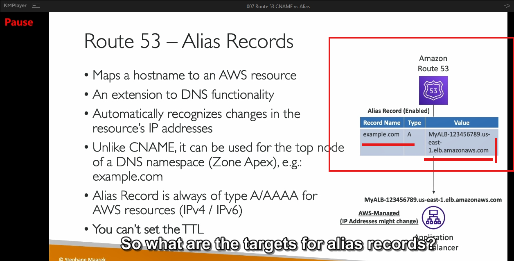
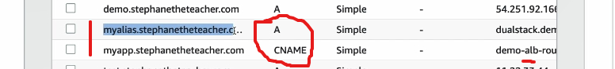

---

### **Bản ghi CNAME**  
1. **Định nghĩa**:  
   - Bản ghi CNAME dùng để ánh xạ một tên miền (hostname) tới một tên miền khác.

2. **Trường hợp sử dụng**:  
   - Thích hợp cho các tên miền con, ví dụ: `app.mydomain.com`, nơi bạn muốn chuyển hướng đến một hostname khác.

3. **Hạn chế**:  
   - Không hoạt động với tên miền gốc (root domain), như `mydomain.com`.  
   - Dành cho các bản ghi không phải là Apex Zone (tên miền đỉnh của DNS).

4. **Cách thức hoạt động**:  
   - Ví dụ: Bạn có thể ánh xạ `app.mydomain.com` đến `blabla.anything.com`.  

---

### **Bản ghi Alias**  
1. **Định nghĩa**:  
   - Alias là loại bản ghi đặc biệt trong AWS Route 53, cho phép ánh xạ một hostname đến một tài nguyên AWS cụ thể (như Load Balancer, CloudFront, S3 Websites).  

2. **Trường hợp sử dụng**:  
   - Thích hợp cho cả tên miền gốc (`mydomain.com`) và tên miền con (`app.mydomain.com`).  
   - Hỗ trợ các Apex Zone, điều mà CNAME không làm được.  

3. **Ưu điểm**:  
   - Miễn phí truy vấn DNS (không mất phí).  
   - Tích hợp sẵn chức năng kiểm tra sức khỏe (health check).  
   - Tự động cập nhật IP nếu tài nguyên AWS (ví dụ: Load Balancer) thay đổi.  

4. **Hạn chế**:  
   - Chỉ hoạt động với các tài nguyên AWS. Không thể ánh xạ Alias đến DNS của EC2 instance.  

5. **Các loại tài nguyên AWS hỗ trợ**:  
   - Elastic Load Balancer (ALB/NLB/CLB).  
   - CloudFront Distributions.  
   - API Gateway.  
   - Elastic Beanstalk Environments.  
   - S3 Websites (không phải S3 Bucket).  
   - VPC Interface Endpoints.  
   - Global Accelerator.  
   - Các bản ghi Route 53 khác trong cùng Hosted Zone.  

---

### **So sánh chi tiết**  

| Đặc điểm                   | CNAME                              | Alias                          |
|----------------------------|-------------------------------------|--------------------------------|
| **Hỗ trợ Apex Zone**       | Không                              | Có                            |
| **Miễn phí truy vấn**      | Không                              | Có                            |
| **Chỉ dùng trong AWS**     | Không                              | Có                            |
| **Tự động cập nhật IP**    | Không                              | Có                            |
| **Hỗ trợ kiểm tra sức khỏe** | Không                              | Có                            |

---

### **Thực hành (Hands-on)**  
- **Tạo CNAME**:  
   - Tạo bản ghi `myapp.mydomain.com` ánh xạ tới DNS của Load Balancer.  
   - Khi truy cập `myapp.mydomain.com`, bạn sẽ được chuyển hướng đến Load Balancer.

- **Tạo Alias**:  
   - Tạo bản ghi `myalias.mydomain.com` (kiểu A hoặc AAAA) ánh xạ tới Load Balancer trong cùng vùng (region).  
   - Alias hỗ trợ tự động kiểm tra sức khỏe và miễn phí truy vấn DNS.  

---