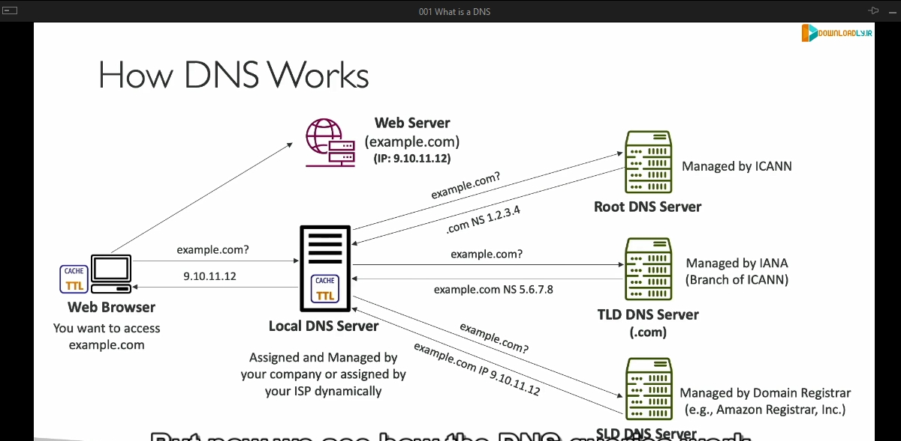

### Chi tiết về kiến thức trong bài giảng:

#### 1. **DNS là gì?**
- **DNS** (Domain Name System) là hệ thống dùng để dịch tên miền thân thiện với con người (hostname) thành địa chỉ IP của máy chủ mục tiêu.
- Ví dụ: Khi bạn nhập **www.google.com** trên trình duyệt, DNS sẽ trả về địa chỉ IP tương ứng mà trình duyệt có thể sử dụng để truy cập Google.

#### 2. **Vai trò của DNS:**
- DNS là xương sống của Internet, giúp dịch các URL hoặc tên miền thành địa chỉ IP để các thiết bị kết nối có thể giao tiếp với nhau.

#### 3. **Cấu trúc phân cấp của DNS:**
- **Root Domain**: Là cấp cao nhất, thường được biểu diễn bằng một dấu chấm "." ở cuối (thường bị ẩn đi).
- **TLD (Top-Level Domain)**: Là các phần mở rộng như **.com**, **.org**, **.us**, **.gov**, v.v.
- **Second-Level Domain**: Là phần tên miền phía trước TLD, ví dụ: **google** trong **google.com**.
- **Subdomain**: Là phần bổ sung trước Second-Level Domain, ví dụ: **www** hoặc **api** trong **www.google.com** hoặc **api.google.com**.
- **FQDN (Fully Qualified Domain Name)**: Là tên miền đầy đủ bao gồm cả root, ví dụ: **http://api.www.example.com.**

#### 4. **Thuật ngữ cơ bản trong DNS:**
- **Domain Registrar**: Nơi đăng ký tên miền (ví dụ: Amazon Route 53, GoDaddy).
- **DNS Records**: Các loại bản ghi DNS (A, AAAA, CNAME, NS, v.v.).
- **Zone File**: Chứa tất cả các bản ghi DNS để ánh xạ hostname với địa chỉ IP.
- **Name Server**: Máy chủ chịu trách nhiệm giải quyết các truy vấn DNS.

#### 5. **Quá trình hoạt động của DNS:**
1. **Trình duyệt**: Người dùng nhập tên miền, ví dụ: **example.com**.
2. **Local DNS Server**: Trình duyệt hỏi máy chủ DNS cục bộ (do nhà cung cấp Internet hoặc tổ chức quản lý).
3. **Truy vấn đệ quy (Recursive Query)** trong DNS:

    Truy vấn đệ quy là một quá trình mà máy chủ DNS cục bộ (Local DNS Server) chịu trách nhiệm tìm kiếm và trả về địa chỉ IP chính xác cho tên miền được yêu cầu. Dưới đây là từng bước chi tiết:

- **1. Máy chủ DNS cục bộ truy vấn Root DNS Server**
    - Khi người dùng nhập một tên miền, ví dụ: **example.com**, trình duyệt sẽ yêu cầu máy chủ DNS cục bộ (Local DNS Server) tìm kiếm địa chỉ IP của tên miền này.
    - Nếu Local DNS Server không có thông tin trong bộ nhớ cache, nó sẽ gửi một truy vấn đến **Root DNS Server**.
    - **Root DNS Server** là cấp cao nhất trong hệ thống DNS, chịu trách nhiệm quản lý các thông tin về các Top-Level Domains (TLDs) như **.com**, **.org**, **.net**, v.v.

---

-   **2. Root DNS Server trả về thông tin về TLD**
    - Root DNS Server không biết địa chỉ IP của **example.com**, nhưng nó biết máy chủ DNS nào quản lý TLD tương ứng (trong trường hợp này là **.com**).
    - Root DNS Server trả về địa chỉ của máy chủ TLD DNS chịu trách nhiệm cho **.com**.

---

-    **3. Máy chủ DNS cục bộ hỏi máy chủ TLD về domain cụ thể**
        - Local DNS Server sử dụng thông tin từ Root DNS Server để gửi truy vấn đến máy chủ TLD DNS của **.com**.
        - Máy chủ TLD DNS không biết địa chỉ IP cụ thể của **example.com**, nhưng nó biết máy chủ DNS nào quản lý domain **example.com** (tức là Name Server của domain này).
        - Máy chủ TLD trả về địa chỉ của Name Server chịu trách nhiệm cho **example.com**.

---

-    **4. Máy chủ quản lý domain trả về địa chỉ IP**
        - Local DNS Server gửi truy vấn đến Name Server của **example.com**.
        - Name Server này chứa thông tin chi tiết về domain **example.com**, bao gồm địa chỉ IP của máy chủ web mà tên miền này ánh xạ đến (ví dụ: **9.10.11.12**).
        - Name Server trả về địa chỉ IP này cho Local DNS Server.

---

-    **5. Local DNS Server trả lời trình duyệt**
        - Sau khi nhận được địa chỉ IP từ Name Server, Local DNS Server lưu kết quả vào bộ nhớ cache để xử lý các yêu cầu tương tự trong tương lai nhanh hơn.
        - Cuối cùng, Local DNS Server trả địa chỉ IP này cho trình duyệt.
        - Trình duyệt sử dụng địa chỉ IP để gửi yêu cầu HTTP hoặc HTTPS đến máy chủ web và tải nội dung trang web.

- **Minh họa cụ thể với ví dụ:**
    - Người dùng nhập **www.example.com**:
  1. Trình duyệt hỏi Local DNS Server: "IP của www.example.com là gì?"
  2. Local DNS Server hỏi Root DNS Server: "Máy chủ TLD của **.com** ở đâu?"
  3. Root DNS Server trả lời: "Máy chủ TLD cho **.com** là tại địa chỉ X."
  4. Local DNS Server hỏi máy chủ TLD: "Name Server nào quản lý **example.com**?"
  5. Máy chủ TLD trả lời: "Name Server cho **example.com** là tại địa chỉ Y."
  6. Local DNS Server hỏi Name Server của **example.com**: "IP của **www.example.com** là gì?"
  7. Name Server trả lời: "IP là 9.10.11.12."
  8. Local DNS Server trả về kết quả cho trình duyệt: "IP của **www.example.com** là 9.10.11.12."
  9. Trình duyệt gửi yêu cầu đến máy chủ có địa chỉ IP 9.10.11.12 để tải nội dung.
4. **Caching**: Máy chủ DNS cục bộ lưu trữ kết quả để trả lời nhanh hơn cho các truy vấn sau.
5. **Trình duyệt sử dụng địa chỉ IP**: Truy cập vào máy chủ web và hiển thị nội dung.

#### 6. **Ví dụ về các loại DNS Records:**
- **A Record**: Ánh xạ hostname sang địa chỉ IPv4.
- **AAAA Record**: Ánh xạ hostname sang địa chỉ IPv6.
- **CNAME Record**: Chuyển hướng hostname này sang hostname khác.
- **NS Record**: Chỉ định Name Server chịu trách nhiệm cho domain.
- **MX Record**: Quản lý email server.

#### 7. **Tóm lược quá trình hoạt động DNS:**
- DNS hoạt động đằng sau mỗi khi bạn truy cập website.
- Quy trình giải quyết truy vấn DNS giúp kết nối tên miền với IP của máy chủ một cách hiệu quả.

### Mối liên hệ với Amazon Route 53:
- Route 53 là dịch vụ DNS do Amazon cung cấp, giúp quản lý DNS, đăng ký tên miền, và đảm bảo độ tin cậy cùng hiệu suất cao. Các kiến thức cơ bản về DNS là bước đệm để hiểu cách sử dụng Route 53 trong việc quản lý DNS.