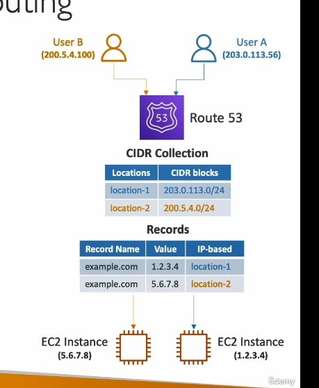

### **Chi tiết kiến thức về IP-Based Routing trong Amazon Route 53**

#### **1. Giới thiệu về IP-Based Routing**
- **Định nghĩa**:  
  IP-Based Routing cho phép định tuyến lưu lượng dựa trên địa chỉ IP của client.  
  Bạn định nghĩa một danh sách các dải địa chỉ IP (CIDR) và chỉ định nơi lưu lượng từ các IP này sẽ được chuyển đến.
  
- **Ứng dụng**:  
  - **Tối ưu hiệu năng**: Biết trước IP để giảm độ trễ.  
  - **Giảm chi phí mạng**: Điều hướng lưu lượng qua các tuyến đường chi phí thấp.

---

#### **2. Cách hoạt động**
- **Xác định danh sách CIDR (IP Ranges)**:  
  Bạn cung cấp các dải IP (CIDR) để xác định khu vực mà lưu lượng từ các IP này sẽ được gửi tới.  

- **Liên kết với tài nguyên cụ thể**:  
  Mỗi CIDR được ánh xạ đến một tài nguyên như EC2, Load Balancer hoặc IP tĩnh.

---

#### **3. Ví dụ minh họa**
- **Kịch bản**:  
  - **Location 1**: CIDR 203.x.x.x → EC2 instance với IP công khai `1.2.3.4`.  
  - **Location 2**: CIDR 200.x.x.x → EC2 instance với IP công khai `5.6.7.8`.

- **Kết quả**:  
  - Người dùng A từ IP thuộc CIDR 203.x.x.x sẽ được điều hướng đến EC2 `1.2.3.4`.  
  - Người dùng B từ CIDR 200.x.x.x sẽ được điều hướng đến EC2 `5.6.7.8`.

---

#### **4. Trường hợp sử dụng**
1. **Nhà cung cấp dịch vụ Internet (ISP) cụ thể**:  
   - Bạn biết dải CIDR mà ISP của khách hàng sử dụng và muốn định tuyến lưu lượng đến các endpoint gần họ nhất.  

2. **Phân phối lưu lượng mạng nội bộ và quốc tế**:  
   - Nếu biết trước dải IP của các vùng địa lý, bạn có thể định tuyến lưu lượng hiệu quả để giảm chi phí mạng.

3. **Tối ưu hóa tài nguyên đám mây**:  
   - Chuyển lưu lượng từ các client khác nhau đến các tài nguyên tối ưu trong từng khu vực.

---

#### **5. Điểm cần lưu ý**
- **Độ phức tạp của CIDR**:  
  Hiểu rõ các dải CIDR và cách ánh xạ IP đến tài nguyên.  
- **Quyền quản lý Route 53**:  
  Cần có quyền cấu hình đầy đủ trên bảng điều khiển AWS để thiết lập IP-Based Routing.

---

#### **6. Tóm tắt**
- **IP-Based Routing** là một chiến lược mạnh mẽ trong Amazon Route 53, đặc biệt hiệu quả khi bạn cần kiểm soát chi tiết lưu lượng mạng dựa trên địa chỉ IP.  
- Đây là lựa chọn lý tưởng cho các doanh nghiệp có yêu cầu định tuyến chính xác theo IP, tối ưu hóa hiệu năng và giảm chi phí mạng.  
