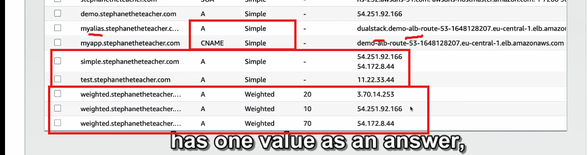

## 


---
**Chi tiết về chính sách định tuyến theo trọng số (Weighted Routing Policy):**

### 1. **Khái niệm và nguyên lý hoạt động**  
- Chính sách định tuyến theo trọng số cho phép bạn phân phối phần trăm lưu lượng truy cập đến các tài nguyên cụ thể dựa trên trọng số (weights).  
- Ví dụ: Có 3 instance EC2 được gán trọng số lần lượt là **70, 20, và 10**. Điều này có nghĩa:  
  - 70% lưu lượng truy cập DNS sẽ được chuyển đến instance đầu tiên.  
  - 20% chuyển đến instance thứ hai.  
  - 10% chuyển đến instance thứ ba.  

### 2. **Tính toán trọng số**  
- Trọng số có thể là bất kỳ giá trị nào và không cần tổng là 100.  
- Phần trăm lưu lượng được phân phối sẽ được tính bằng công thức:  
  \[
  \text{Tỷ lệ lưu lượng} = \frac{\text{Trọng số của bản ghi}}{\text{Tổng trọng số của tất cả bản ghi DNS}}
  \]  

### 3. **Cách hoạt động trong DNS**  
- Các bản ghi DNS phải có cùng tên và loại (A record, CNAME, v.v.).  
- Có thể liên kết với kiểm tra trạng thái (health check).  
- Nếu tất cả các bản ghi có trọng số bằng 0, thì DNS sẽ phân phối lưu lượng đồng đều.  

### 4. **Trường hợp sử dụng**  
- **Cân bằng tải (Load balancing):** Phân phối lưu lượng giữa các vùng khác nhau.  
- **Kiểm thử phiên bản mới:** Chuyển một phần nhỏ lưu lượng đến ứng dụng mới để kiểm thử.  
- **Thay đổi trọng số động:** Ngừng hoặc tăng dần lưu lượng đến một tài nguyên cụ thể.  

### 5. **Thực hành tạo bản ghi weighted trên AWS Route 53**  
**Ví dụ:** Tạo 3 bản ghi cho các instance tại các khu vực khác nhau:  
- **Bản ghi 1:**  
  - Tên: `weighted.example.com`  
  - Loại: A  
  - Giá trị IP: `ap-southeast-1`  
  - Trọng số: 10  
  - TTL: 3 giây (chỉ để kiểm tra nhanh).  
- **Bản ghi 2:**  
  - Giá trị IP: `us-east-1`  
  - Trọng số: 70.  
- **Bản ghi 3:**  
  - Giá trị IP: `eu-central-1`  
  - Trọng số: 20.  

**Kết quả:**  
- Truy cập vào `weighted.example.com` sẽ thấy phần lớn truy cập đến `us-east-1`, nhưng đôi khi sẽ có kết quả từ các vùng khác tùy theo trọng số.  

### 6. **Công cụ kiểm tra**  
- Sử dụng trình duyệt web hoặc lệnh `dig`:  
```bash
  dig weighted.example.com
```  
  Kết quả trả về sẽ thay đổi dựa trên trọng số đã cấu hình.  

---

### 7. **Tổng kết**  
- Chính sách định tuyến theo trọng số là một công cụ mạnh mẽ giúp kiểm soát lưu lượng DNS đến các tài nguyên dựa trên nhu cầu thực tế.  
- Được áp dụng hiệu quả trong các trường hợp kiểm thử, triển khai từng bước, và cân bằng tải.  

