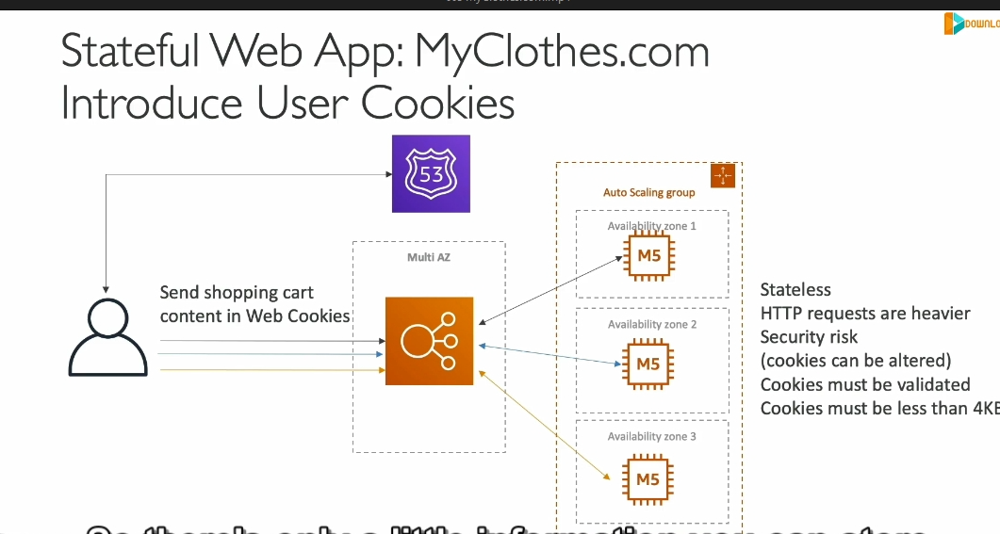
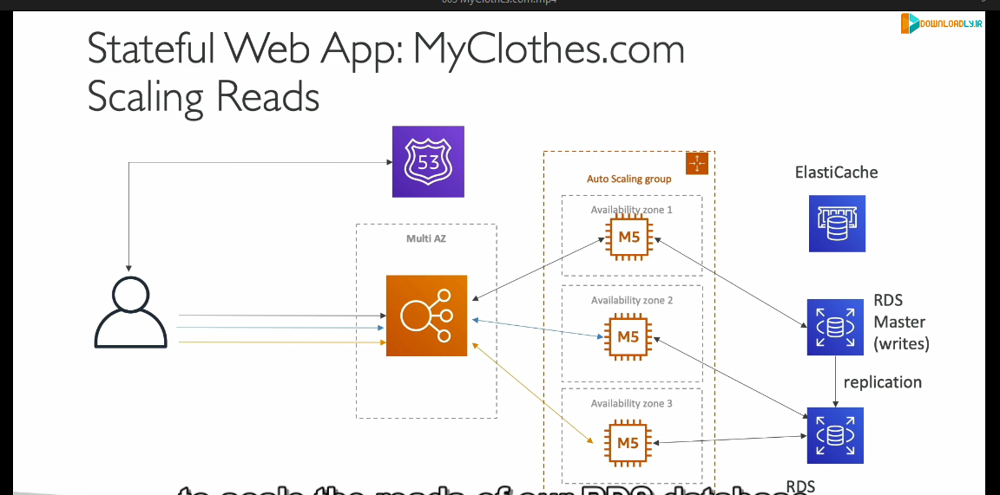

### Phân tích chi tiết nội dung bài giảng:

#### 1. **Ứng dụng Stateless và Stateful**
   - **Stateless Application (WhatIsTheTime.com)**:
     - Không cần trạng thái, không dùng cơ sở dữ liệu.
     - Chỉ trả về thời gian, không lưu thông tin người dùng.
   - **Stateful Application (MyClothes.com)**:
     - Lưu trữ trạng thái (shopping cart, địa chỉ khách hàng).
     - Yêu cầu khả năng mở rộng ngang (horizontal scalability) mà vẫn giữ trạng thái.

#### 2. **Kiến trúc ban đầu**
   - Sử dụng **Route 53**, **ELB**, **Autoscaling Group** trong **Multi-AZ**.
   - Shopping cart được lưu trên **EC2 instance**.
     - Nếu người dùng truy cập EC2 khác trong lần yêu cầu tiếp theo → Mất shopping cart → Trải nghiệm tệ.

#### 3. **Giải pháp 1: ELB Stickiness (Session Affinity)**

   - **Nguyên lý**:
     - ELB luôn gửi yêu cầu của người dùng về cùng một EC2 instance.
   - **Ưu điểm**:
     - Trạng thái không bị mất khi phiên bản EC2 còn hoạt động.
   - **Nhược điểm**:
     - Nếu EC2 instance bị hỏng hoặc bị thay thế → Mất trạng thái.

#### 4. **Giải pháp 2: User Cookies**

   - **Nguyên lý**:
     - Shopping cart được lưu trong cookies của trình duyệt người dùng.
     - Cookies được gửi kèm mỗi yêu cầu HTTP.
   - **Ưu điểm**:
     - Stateless: Bất kỳ EC2 nào cũng có thể xử lý yêu cầu vì dữ liệu trạng thái nằm trong cookies.
   - **Nhược điểm**:
     - **Tăng kích thước HTTP request**: Thêm dữ liệu mỗi lần mua hàng.
     - **Bảo mật**: Cookies có thể bị thay đổi hoặc giả mạo.
     - **Hạn chế kích thước**: Cookies chỉ lưu trữ tối đa 4 KB.

#### 5. **Giải pháp 3: Server Session (ElastiCache)**

   - **Nguyên lý**:
     - Lưu shopping cart trong **ElastiCache** (Redis/Memcached).
     - Trình duyệt chỉ lưu **Session ID** → Dùng ID để lấy dữ liệu từ ElastiCache.
   - **Ưu điểm**:
     - Tối ưu hiệu suất: **Sub-millisecond latency**.
     - EC2 nào cũng có thể truy cập trạng thái qua Session ID.
   - **Khả năng mở rộng**:
     - Phù hợp với ứng dụng cần lưu trữ trạng thái lớn hơn (so với cookies).

#### 6 **. RDS (Relational Database Service)**  

- **Khái niệm**: Dịch vụ cơ sở dữ liệu quan hệ của AWS hỗ trợ lưu trữ lâu dài dữ liệu có cấu trúc.  
- **Từ vựng liên quan**:  
  - *Long-term storage*: Lưu trữ dài hạn.  
  - *Multi-AZ*: Cấu hình để cơ sở dữ liệu có thể hoạt động qua nhiều vùng sẵn sàng (Availability Zones), tăng khả năng chịu lỗi.  

#### 7 **. Lazy Loading với ElastiCache**  

- **Khái niệm**: Chiến lược chỉ lưu trữ dữ liệu vào cache khi dữ liệu đó được truy cập lần đầu.  
- **Từ vựng liên quan**:  
  - *Cache hit*: Truy vấn tìm thấy dữ liệu trong bộ nhớ cache.  
  - *Cache maintenance*: Quản lý và duy trì bộ nhớ cache.  

#### 8 **. Kiến trúc Multi-AZ (Multi-Availability Zones)**  

- **Khái niệm**: Một thiết kế đảm bảo ứng dụng vẫn hoạt động khi có sự cố ở một khu vực.  
- **Từ vựng liên quan**:  
  - *Standby replica*: Bản sao dự phòng, chỉ hoạt động khi bản chính gặp sự cố.  
  - *Disaster recovery*: Khôi phục ứng dụng sau thảm họa.  
#### 9 **Bạn sẽ cài đặt**
    
- Ở đây, load balancer (bộ cân bằng tải) nhận lưu lượng truy cập từ người dùng (HTTP/HTTPS) và sau đó phân phối đến các EC2 instances (máy chủ ứng dụng).
- security groups trên EC2 instances để chỉ cho phép lưu lượng truy cập đến từ security group của load balancer, thay vì cho phép từ bất kỳ nguồn nào. Điều này giúp bảo vệ EC2 instances khỏi truy cập trái phép trực tiếp.
#### 10 **. Kiến trúc 3-tier (Three-tier architecture)**  

- **Khái niệm**: Kiến trúc chia ứng dụng thành 3 lớp:  
  - **Client tier**: Lớp giao diện người dùng.  
  - **Web tier**: Lớp xử lý logic ứng dụng.  
  - **Database tier**: Lớp lưu trữ dữ liệu.  
- **Từ vựng liên quan**:  
  - *Trade-offs*: Sự đánh đổi.  
  - *Web clients*: Các trình duyệt hoặc ứng dụng truy cập web.  

---

### **Tóm tắt ngắn gọn các nội dung chính:**  
1. **ElastiCache làm nguồn dữ liệu tin cậy**: Đảm bảo bảo mật, tránh bị tấn công và cải thiện hiệu suất.  
2. **Sử dụng RDS cho lưu trữ lâu dài**: Hỗ trợ đọc/ghi dữ liệu lớn với khả năng mở rộng thông qua Read Replicas.  
3. **Lazy Loading**: Cải thiện hiệu suất bằng cách giảm tải cho cơ sở dữ liệu RDS qua việc lưu trữ thông tin đọc thường xuyên trong ElastiCache.  
4. **Multi-AZ để tăng khả năng chịu lỗi**: Bảo vệ ứng dụng trước thảm họa thông qua các bản sao dữ liệu và cấu hình nhiều vùng.  
5. **Tăng cường bảo mật với Security Groups**: Hạn chế quyền truy cập giữa các dịch vụ AWS.  

#### 6. **So sánh các giải pháp**
   | **Giải pháp**      | **Ưu điểm**                                  | **Nhược điểm**                                |
   |---------------------|----------------------------------------------|----------------------------------------------|
   | ELB Stickiness      | Dễ triển khai, giảm mất trạng thái.          | Phụ thuộc vào EC2 instance.                  |
   | User Cookies        | Stateless, dễ mở rộng.                      | Tăng kích thước HTTP request, rủi ro bảo mật.|
   | Server Session      | Hiệu suất cao, bảo mật tốt hơn cookies.      | Cần thêm tài nguyên (ElastiCache).           |

#### 7. **Giải pháp khác**
   - **DynamoDB**:
     - Lưu trạng thái như một cơ sở dữ liệu NoSQL phân tán.
     - Phù hợp cho ứng dụng có khối lượng dữ liệu lớn hơn.

---

#### Kết luận:
- Nếu ứng dụng cần **tính mở rộng cao** và **dữ liệu trạng thái nhỏ** → Cookies.
- Nếu cần lưu trữ nhiều trạng thái phức tạp, yêu cầu hiệu suất cao → **ElastiCache/DynamoDB**.