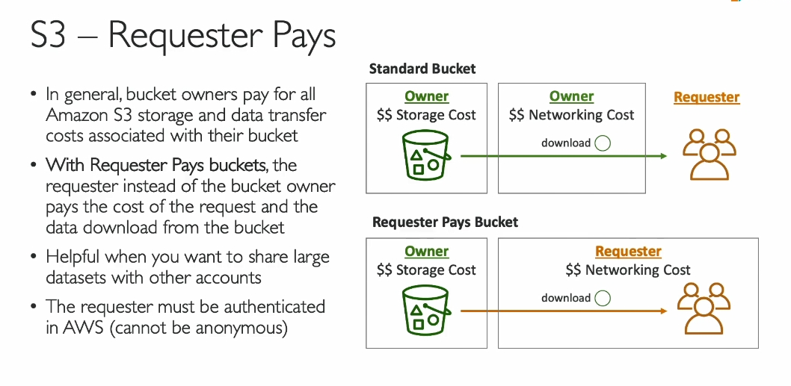

### **Tóm tắt nội dung về tính năng S3 Requester Pays**

**S3 Requester Pays** là một tính năng cho phép người tải xuống (requester) chịu chi phí dữ liệu mạng thay vì chủ sở hữu bucket. Đây là một tính năng quan trọng có thể xuất hiện trong kỳ thi AWS.

---

### **1. Mặc định chi phí được tính như thế nào?**

- Chủ sở hữu bucket sẽ trả tiền cho:
  - **Chi phí lưu trữ (storage costs)**.
  - **Chi phí truyền dữ liệu (data transfer costs)** khi người khác tải file từ bucket.

#### Ví dụ:

- Một user tải file từ bucket của bạn.
- Chi phí mạng sẽ được tính vào tài khoản của **chủ sở hữu bucket**.

---

### **2. Khi nào cần bật Requester Pays?**

- Nếu bucket chứa **dữ liệu lớn** và bạn chia sẻ với nhiều người dùng khác (các tài khoản AWS khác).
- Để giảm gánh nặng chi phí cho chủ sở hữu, bạn có thể bật tính năng **Requester Pays**.

---

### **3. Requester Pays hoạt động như thế nào?**

- **Chủ sở hữu bucket** vẫn trả tiền cho chi phí lưu trữ dữ liệu.
- **Người tải xuống (requester)** chịu chi phí truyền dữ liệu mạng khi tải file.

#### Điều kiện:

- Requester **không được là tài khoản ẩn danh**.
- Requester phải **được xác thực (authenticated)** bằng tài khoản AWS.
  - AWS cần xác thực để biết ai sẽ bị tính phí cho việc tải file.

---

### **4. Ứng dụng thực tế**

- Phù hợp để chia sẻ các **bộ dữ liệu lớn** hoặc file nặng với các tài khoản AWS khác.
- Tính năng này đảm bảo:
  - Chủ sở hữu bucket giảm được chi phí truyền dữ liệu.
  - Người sử dụng dữ liệu sẽ tự trả chi phí cho việc tải xuống.

---

### **5. Lưu ý quan trọng**

- Tính năng này có thể xuất hiện trong đề thi dưới dạng **câu hỏi tình huống**.
- Hãy ghi nhớ quy tắc:
  - **Storage costs**: Chủ sở hữu bucket trả.
  - **Data transfer costs**: Người tải xuống trả.
