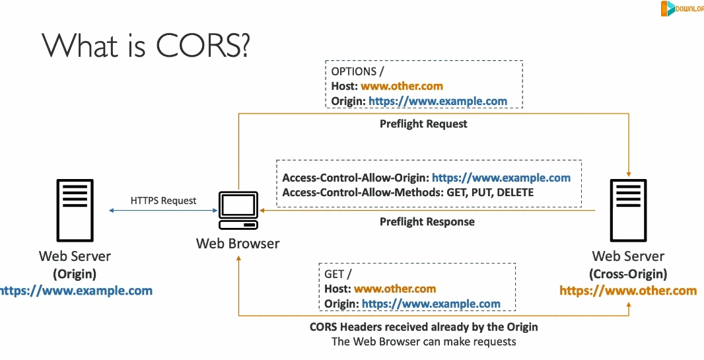

### Chi tiết về CORS (Cross-Origin Resource Sharing)

CORS là một cơ chế bảo mật dựa trên trình duyệt web, cho phép hoặc từ chối các yêu cầu từ các **origin khác nhau**. Đây là kiến thức quan trọng khi làm việc với các ứng dụng web và dịch vụ như **Amazon S3**.

---

### **1. Origin là gì?**

Origin bao gồm:

- **Scheme (Protocol):** Ví dụ, HTTP hoặc HTTPS.
- **Host (Domain):** Ví dụ, `www.example.com`.
- **Port:** Ví dụ, `443` cho HTTPS (ngầm định) hoặc `80` cho HTTP.

**Ví dụ:**

- URL: `https://www.example.com`
  - Scheme: HTTPS
  - Host: www.example.com
  - Port: 443 (ngầm định)

---

### **2. Same-Origin vs Cross-Origin**

- **Same-Origin**: Khi cả **scheme**, **host**, và **port** đều giống nhau.
  - Ví dụ: `https://www.example.com/page1` và `https://www.example.com/page2` là cùng origin.
- **Cross-Origin**: Khi có bất kỳ sự khác biệt nào giữa scheme, host hoặc port.
  - Ví dụ: `https://www.example.com` và `https://other.example.com` là khác origin.

---

### **3. Tại sao cần CORS?**

- Trình duyệt web có cơ chế bảo mật gọi là **Same-Origin Policy** để ngăn các trang web khác nhau truy cập tài nguyên lẫn nhau.
- CORS cho phép vượt qua giới hạn này bằng cách cho phép một **origin** cụ thể hoặc tất cả (**\***).

---

### **4. Quy trình hoạt động của CORS**

#### **Kịch bản cơ bản:**

1. **Web Browser** gửi một yêu cầu tới server của trang web chính (origin chính).
2. Trang web chính yêu cầu thêm tài nguyên (ví dụ, hình ảnh) từ một server khác (**cross-origin**).
3. Trình duyệt kiểm tra nếu server khác hỗ trợ CORS:
   - **Preflight Request:** Trình duyệt gửi yêu cầu HTTP `OPTIONS` đến server khác để hỏi xem liệu có cho phép cross-origin hay không.
   - Nếu server khác trả về header `Access-Control-Allow-Origin` phù hợp:
     - Trình duyệt cho phép yêu cầu tiếp tục.
   - Nếu không:
     - Trình duyệt chặn yêu cầu.

---

### **5. Các Header CORS quan trọng**

- **Access-Control-Allow-Origin:**
  - Xác định origin nào được phép truy cập.
  - Giá trị: Tên origin cụ thể hoặc `*` (cho phép tất cả).
- **Access-Control-Allow-Methods:**
  - Xác định các phương thức HTTP được phép (`GET`, `POST`, `PUT`, v.v.).
- **Access-Control-Allow-Headers:**
  - Xác định các header cụ thể mà client có thể gửi.
- **Access-Control-Expose-Headers:**
  - Xác định các header mà client có thể truy cập từ phản hồi.

---

### **6. Áp dụng trong Amazon S3**

#### **Kịch bản trong S3:**

1. **Bucket 1:** Chứa file HTML tĩnh.
2. **Bucket 2:** Chứa hình ảnh hoặc tài nguyên khác.
3. **Trình duyệt web:** Truy cập file HTML từ **Bucket 1**.
4. Trong file HTML, có một hình ảnh được lưu trữ trong **Bucket 2**.

#### **Yêu cầu:**

- Cấu hình **CORS headers** trong **Bucket 2** để cho phép yêu cầu cross-origin.

#### **Cấu hình mẫu CORS cho S3:**

```xml
<CORSConfiguration>
  <CORSRule>
    <AllowedOrigin>https://www.example.com</AllowedOrigin>
    <AllowedMethod>GET</AllowedMethod>
    <AllowedMethod>POST</AllowedMethod>
    <AllowedMethod>PUT</AllowedMethod>
    <MaxAgeSeconds>3000</MaxAgeSeconds>
    <AllowedHeader>*</AllowedHeader>
  </CORSRule>
</CORSConfiguration>
```

- **AllowedOrigin:** Chỉ định origin được phép.
- **AllowedMethod:** Phương thức HTTP được phép.
- **AllowedHeader:** Cho phép tất cả header.

---

### **7. Tóm tắt**

- **CORS** giúp truy cập tài nguyên từ các **origin khác nhau** bằng cách sử dụng các header bảo mật.
- Trong S3, bạn cần cấu hình các CORS header phù hợp để cho phép truy cập cross-origin.
- Đây là kiến thức quan trọng để đảm bảo an toàn và tuân thủ chính sách trình duyệt web khi làm việc với ứng dụng sử dụng nhiều nguồn tài nguyên.

áp cors cho origin2 sử dụng link của origin1 ,code trong origin1 reference tới lấy hay làm gì đó trong origin2

