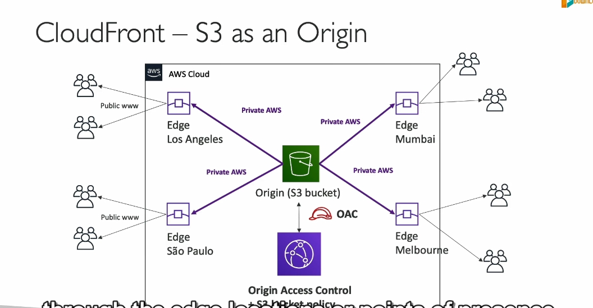

#### **CloudFront là gì?**

- **CloudFront** là một **Content Delivery Network (CDN)**:
  - Nhiệm vụ: Cải thiện hiệu suất đọc bằng cách **lưu trữ (cache)** nội dung tại các **edge location**.
  - Tác dụng:
    - Giảm độ trễ (**latency**) cho người dùng trên toàn cầu.
    - Cải thiện trải nghiệm người dùng.

#### **Cấu trúc và hoạt động của CloudFront:**

1. **Edge Location**:

   - CloudFront có **216 điểm hiện diện (Points of Presence)** toàn cầu (AWS Edge Locations).
   - AWS liên tục mở rộng mạng lưới này.

2. **Hoạt động của CloudFront**:

   - Khi một người dùng yêu cầu nội dung:
     - CloudFront kiểm tra nội dung trong cache tại edge location gần nhất.
     - Nếu chưa có, CloudFront lấy nội dung từ **origin** (ví dụ: S3 bucket) và lưu vào cache.
     - Các yêu cầu tiếp theo sẽ được phục vụ từ cache, không cần truy cập origin.

3. **Caching**:
   - Nội dung được lưu trong các edge location và có thời gian tồn tại cụ thể (thường là 1 ngày).

#### **Tính năng bảo mật:**

- **Bảo vệ DDoS**:
  - Do nội dung được phân phối trên toàn cầu, CloudFront giúp giảm tác động của tấn công từ chối dịch vụ phân tán (**DDoS**).
  - Hỗ trợ các công cụ bảo mật như:
    - **AWS Shield**.
    - **Web Application Firewall (WAF)**.

#### **Ứng dụng của CloudFront:**

1. **Nguồn gốc (Origins)**:
   - **S3 bucket**: Phân phối và cache tệp tĩnh.
     - **Origin Access Control (OAC)** bảo vệ quyền truy cập vào S3 bucket.
   - **Backend HTTP Custom**: CloudFront có thể đứng trước:
     - Application Load Balancer (ALB).
     - EC2 Instance.
     - Static S3 Website.
2. **Ingress**:

   - Có thể sử dụng CloudFront để **upload (ingress)** dữ liệu vào S3.

3. **Ứng dụng thực tế**:
   - Nội dung từ một S3 bucket (ví dụ: ở Australia) có thể được phân phối nhanh chóng đến người dùng ở Mỹ thông qua edge location tại Mỹ.

#### **So sánh CloudFront và S3 Replication:**

| **Đặc điểm**               | **CloudFront**                                 | **S3 Cross-Region Replication**                    |
| -------------------------- | ---------------------------------------------- | -------------------------------------------------- |
| **Phạm vi phân phối**      | 216 điểm trên toàn cầu                         | Chỉ các vùng được chỉ định                         |
| **Chức năng**              | Lưu trữ nội dung tĩnh trong cache              | Sao chép dữ liệu từ S3 bucket này sang bucket khác |
| **Thời gian cập nhật**     | Nội dung cache tạm thời, thường là 1 ngày      | Dữ liệu cập nhật gần như theo thời gian thực       |
| **Loại nội dung**          | Nội dung tĩnh                                  | Nội dung động, yêu cầu cập nhật thường xuyên       |
| **Mục đích sử dụng chính** | Hiệu suất và độ trễ thấp cho nội dung toàn cầu | Đồng bộ dữ liệu giữa các vùng                      |

#### **Tóm lại:**

- CloudFront là lựa chọn lý tưởng để **tăng tốc nội dung tĩnh** và cải thiện trải nghiệm người dùng toàn cầu.
- S3 Replication phù hợp với việc **sao lưu và đồng bộ hóa dữ liệu giữa các vùng AWS**.
