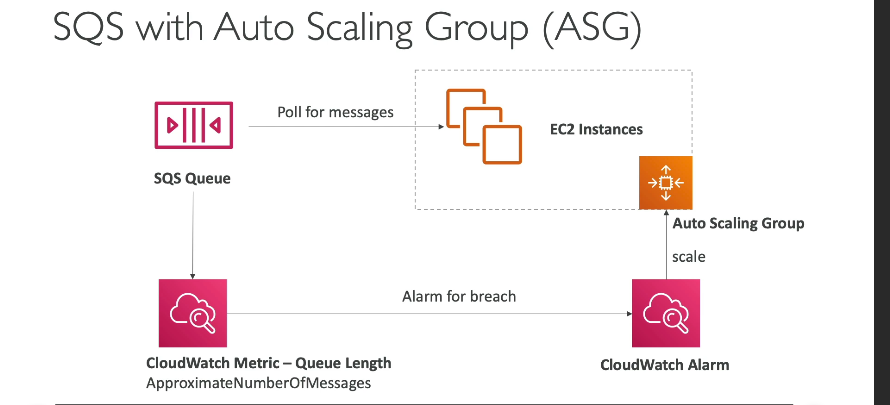
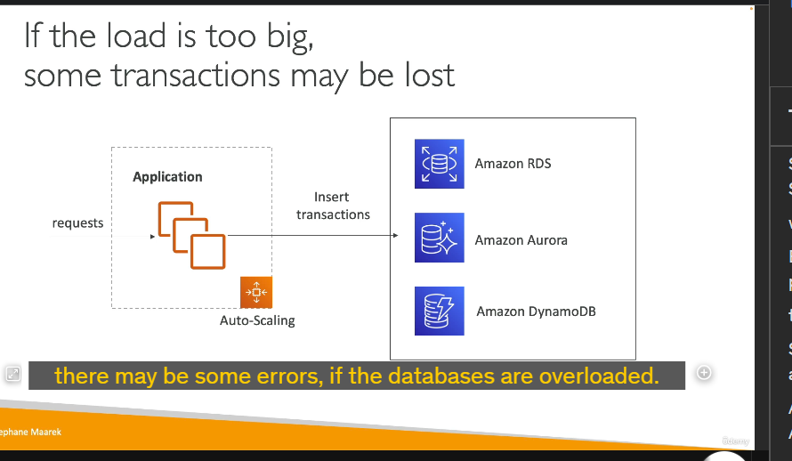
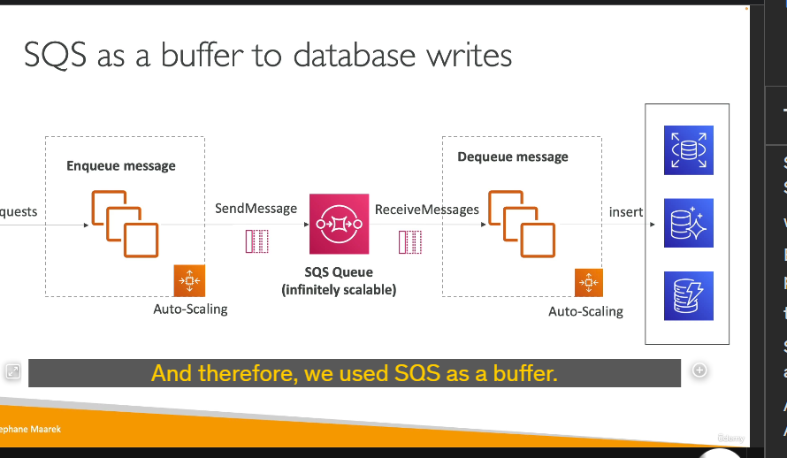
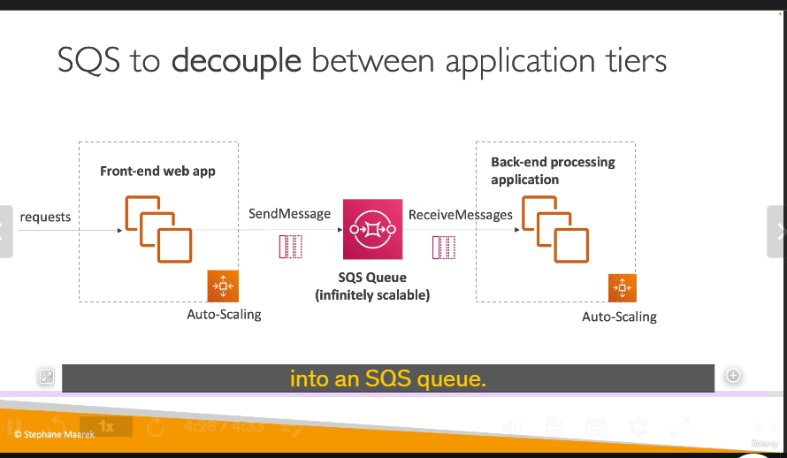

### Chi tiết kiến thức: Sử dụng SQS Queue và Auto Scaling Group trong AWS

#### 1. **Tổng quan về SQS Queue và Auto Scaling Group**

- **SQS Queue**: Dịch vụ hàng đợi tin nhắn được quản lý hoàn toàn bởi AWS, cho phép tách rời các thành phần của hệ thống, đảm bảo giao tin đáng tin cậy.
- **Auto Scaling Group (ASG)**: Tự động điều chỉnh số lượng EC2 instances dựa trên khối lượng công việc.

---

#### 2. **Cách hoạt động**

- **EC2 instances trong ASG**:
  
  - Liên tục truy vấn (poll) tin nhắn từ SQS queue.
  - Kích thước ASG được tự động mở rộng hoặc thu hẹp dựa trên **số lượng tin nhắn trong hàng đợi**.
- **CloudWatch Metric**:
  - Sử dụng **queue length (ApproximateNumberOfMessages)** để theo dõi số lượng tin nhắn trong hàng đợi.
  - Nếu số lượng tin nhắn vượt quá ngưỡng (VD: 1,000), kích hoạt một alarm trong CloudWatch.
  - Alarm này sẽ thực hiện hành động mở rộng (scale-out) ASG để xử lý nhanh hơn.
  - Khi số lượng tin nhắn giảm, ASG sẽ thu hẹp (scale-in).

---

#### 3. **Ứng dụng trong các mô hình thực tế**

##### a. **Tăng tải lớn, đột biến**

- Ví dụ: Trong một chiến dịch bán hàng lớn, lượng đơn hàng tăng đột biến có thể gây quá tải cơ sở dữ liệu (RDS, Aurora, DynamoDB).
- **Giải pháp**:
  
  - Sử dụng SQS làm bộ đệm (buffer) để lưu trữ tạm thời các yêu cầu trước khi ghi vào cơ sở dữ liệu.
  - Ứng dụng phía trước (frontend application) sẽ gửi yêu cầu vào SQS queue thay vì ghi trực tiếp vào cơ sở dữ liệu.
  - Một ASG khác được triển khai để xử lý tin nhắn từ hàng đợi và ghi vào cơ sở dữ liệu. Tin nhắn chỉ bị xóa khỏi SQS khi đã ghi thành công.

##### b. **Tách rời (decoupling) giữa các tầng của ứng dụng**

- Thay vì thực hiện toàn bộ xử lý trong một ứng dụng duy nhất:
  - Yêu cầu từ ứng dụng phía trước được gửi vào SQS queue.
  - Công việc xử lý (backend processing) nhận tin nhắn từ queue và xử lý chúng theo cách mở rộng linh hoạt.

---

#### 4. **Lợi ích chính**

- **Đảm bảo độ tin cậy**:
  - Tin nhắn được lưu trữ bền vững trong SQS, không bị mất dữ liệu ngay cả khi cơ sở dữ liệu hoặc hệ thống gặp lỗi.
- **Mở rộng linh hoạt**:
  - SQS có khả năng mở rộng vô hạn, ASG có thể điều chỉnh nhanh chóng để xử lý khối lượng công việc.
- **Tách rời kiến trúc**:
  - Decoupling các thành phần giúp hệ thống dễ bảo trì và nâng cấp.

---

### **Tóm tắt**

Sử dụng SQS Queue với Auto Scaling Group là một mô hình mạnh mẽ để xử lý tải công việc lớn và đột biến trong AWS. SQS đóng vai trò như một bộ đệm giữa các thành phần, đảm bảo hệ thống không bị quá tải và dữ liệu được xử lý đáng tin cậy. CloudWatch Metric và ASG tự động giúp tối ưu hóa hiệu suất và chi phí.
