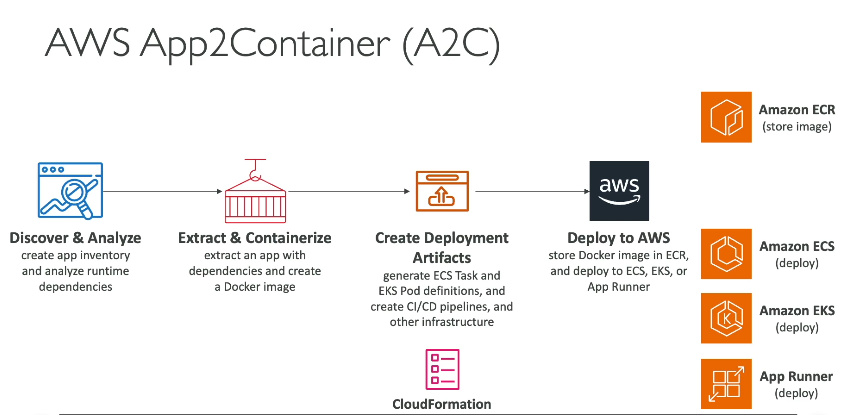

### **AWS App2Container (A2C)**

---

### **1. AWS App2Container là gì?**

**AWS App2Container (A2C)** là một công cụ dòng lệnh (CLI) được sử dụng để **di chuyển và hiện đại hóa** các ứng dụng web Java và .NET bằng cách chuyển đổi chúng thành các container Docker.

- **Mục đích chính**: Hỗ trợ di chuyển các ứng dụng hiện có (legacy apps) lên AWS mà **không cần thay đổi mã nguồn**.
- **Phương pháp**: "Lift-and-Shift Migration" - Di chuyển ứng dụng từ môi trường hiện tại (on-premises hoặc máy chủ ảo) lên AWS với ít thay đổi nhất.

---

### **2. Cách hoạt động của App2Container**

Quy trình hoạt động của A2C được chia thành các bước sau:

#### **Bước 1: Phân tích và khám phá**

- Dùng CLI của A2C để xác định và phân tích các ứng dụng Java hoặc .NET hiện đang chạy trên môi trường của bạn (on-premises hoặc máy chủ ảo).

#### **Bước 2: Trích xuất và container hóa**

- Tạo **Docker container** cho ứng dụng mà không cần thay đổi mã nguồn.
- Container này chứa đầy đủ mã ứng dụng, phụ thuộc, và môi trường cần thiết.

#### **Bước 3: Tạo các thành phần triển khai**

- A2C tự động sinh ra các thành phần cần thiết cho triển khai trên AWS, bao gồm:
  - **CloudFormation templates**: Định nghĩa hạ tầng (compute, network, storage).
  - **ECS Task Definitions** và **EKS Pod Definitions**.
  - Pipeline CI/CD nếu cần.

#### **Bước 4: Đăng ký Docker container vào Amazon ECR**

- Hình ảnh Docker container được lưu trữ trong **Amazon Elastic Container Registry (ECR)**.

#### **Bước 5: Triển khai lên AWS**

- Triển khai container lên các dịch vụ AWS như:
  - **Amazon ECS** (Elastic Container Service).
  - **Amazon EKS** (Elastic Kubernetes Service).
  - **AWS App Runner** (để triển khai ứng dụng web hoặc API).

---

### **3. Tính năng chính**

- **Hỗ trợ Java và .NET**: Chỉ dành cho các ứng dụng web chạy trên Java hoặc .NET.
- **Lift-and-Shift Migration**: Di chuyển ứng dụng mà không cần thay đổi mã nguồn, giúp tiết kiệm thời gian và chi phí.
- **Tích hợp CI/CD**: Hỗ trợ các pipeline CI/CD tích hợp sẵn để triển khai nhanh chóng.
- **Tạo tài nguyên AWS tự động**:
  - CloudFormation templates.
  - Định nghĩa container cho ECS, EKS.
- **Lưu trữ container trong Amazon ECR**: Dễ dàng quản lý và tái sử dụng hình ảnh container.

---

### **4. Lợi ích**

1. **Di chuyển dễ dàng**:
   - Di chuyển ứng dụng từ môi trường on-premises hoặc máy chủ ảo lên AWS mà không cần thay đổi code.
2. **Hiện đại hóa**:
   - Đưa ứng dụng vào kiến trúc hiện đại hơn (container-based).
3. **Tự động hóa cao**:
   - A2C tự động phân tích, container hóa, và tạo các tài nguyên AWS.
4. **Linh hoạt triển khai**:
   - Triển khai container trên ECS, EKS hoặc App Runner.

---

### **5. So sánh với AWS App Runner**

| **Tiêu chí**              | **App2Container**                                  | **App Runner**                                      |
| ------------------------- | -------------------------------------------------- | --------------------------------------------------- |
| **Mục tiêu**              | Di chuyển ứng dụng Java/.NET legacy lên container. | Triển khai ứng dụng hoặc API từ mã nguồn/container. |
| **Yêu cầu ứng dụng**      | Chỉ hỗ trợ ứng dụng Java và .NET.                  | Hỗ trợ mọi ứng dụng có mã nguồn hoặc container.     |
| **Triển khai container**  | ECS, EKS, hoặc App Runner.                         | Chỉ trên App Runner.                                |
| **Tự động hóa hạ tầng**   | Tạo CloudFormation templates để quản lý hạ tầng.   | Không yêu cầu cấu hình hạ tầng.                     |
| **Phương pháp di chuyển** | Lift-and-Shift (giữ nguyên ứng dụng).              | Không di chuyển; tập trung vào triển khai.          |

---

### **6. Khi nào nên sử dụng AWS App2Container?**

- Khi bạn cần:

  1. Di chuyển các ứng dụng **Java** hoặc **.NET legacy** lên AWS.
  2. Hiện đại hóa ứng dụng bằng cách container hóa mà không cần chỉnh sửa mã nguồn.
  3. Tích hợp với các dịch vụ AWS như ECS, EKS, hoặc App Runner.

- **Không phù hợp nếu**:
  - Ứng dụng không phải Java hoặc .NET.
  - Bạn cần triển khai trực tiếp từ mã nguồn hoặc Docker container (sử dụng App Runner thay thế).

---

### **Tóm tắt**

AWS App2Container (A2C) là công cụ mạnh mẽ cho việc di chuyển và container hóa các ứng dụng Java và .NET hiện tại, đặc biệt hữu ích cho những ai muốn hiện đại hóa hệ thống với container trên AWS mà không cần thay đổi mã nguồn.
