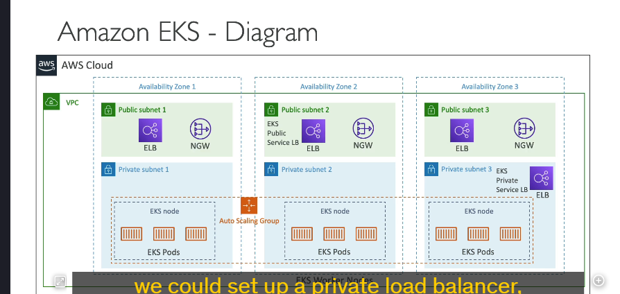
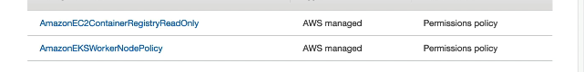

### **Giới thiệu về Amazon EKS**

Amazon EKS là viết tắt của **Elastic Kubernetes Service**, một dịch vụ quản lý giúp bạn triển khai, mở rộng và quản lý các **cụm Kubernetes** trên AWS. Kubernetes là một hệ thống mã nguồn mở để tự động hóa việc triển khai, mở rộng và quản lý các ứng dụng container hóa (thường là Docker).

---

### **Kubernetes là gì?**

- Kubernetes có logo màu xanh dương với biểu tượng bánh lái.
- Là một hệ thống mã nguồn mở để:
  - Tự động hóa việc triển khai ứng dụng.
  - Tự động mở rộng quy mô và quản lý ứng dụng container.
- Kubernetes là **mã nguồn mở**, được nhiều nhà cung cấp đám mây sử dụng, mang lại sự **chuẩn hóa** khi triển khai trên các môi trường khác nhau.

---

### **Sự khác biệt giữa EKS và ECS**

- **ECS**:
  - Được phát triển bởi AWS.
  - Không phải mã nguồn mở.
- **EKS**:
  - Sử dụng Kubernetes, là mã nguồn mở.
  - Hỗ trợ triển khai trên các nền tảng đám mây khác nhau (Azure, Google Cloud).
  - Thích hợp nếu doanh nghiệp của bạn đã sử dụng Kubernetes tại trung tâm dữ liệu (on-premises) hoặc trên các dịch vụ đám mây khác.

---

### **Hai chế độ triển khai của EKS**

1. **Chế độ EC2**:
   - Sử dụng các EC2 instances để làm worker nodes.
2. **Chế độ Fargate**:
   - Chạy container không cần quản lý máy chủ, hoàn toàn serverless.

---

### **Sơ đồ triển khai EKS**

- **Mô hình VPC**:
  - Chia thành **public subnets** và **private subnets**.
  - Các **EKS Worker Nodes** (thường là EC2 instances) nằm trong Auto Scaling Group.
  - Các **Pods** (thành phần tương tự ECS tasks) chạy trên Worker Nodes.
  - Có thể sử dụng Load Balancer để giao tiếp với các dịch vụ bên ngoài.

---

### **Các loại nodes trong Amazon EKS**

1. **Managed Node Groups**:

   - AWS tạo và quản lý EC2 instances cho bạn.
   - Tích hợp Auto Scaling Group.
   - Hỗ trợ cả On-Demand và Spot Instances.

2. **Self-Managed Nodes**:

   - Người dùng tự quản lý và cấu hình các nodes.
   - Cần tự đăng ký các nodes vào EKS Cluster.
   - Có thể sử dụng AMI tối ưu hóa cho EKS hoặc tự tạo AMI riêng.

3. **Fargate Mode**:
   - Không cần quản lý máy chủ (serverless).
   - Chỉ tập trung vào việc chạy container.

---

### **Lưu trữ dữ liệu với EKS**

- **StorageClass manifest**: Cần chỉ định trong cluster EKS để gắn các volumes.
- Hỗ trợ các hệ thống lưu trữ:
  - **Amazon EBS**.
  - **Amazon EFS** (lưu ý: chỉ EFS hỗ trợ Fargate).
  - **Amazon FSx for Lustre**.
  - **Amazon FSx for NetApp ONTAP**.

---

Amazon EKS cung cấp giải pháp linh hoạt để quản lý container khi bạn cần khả năng tương thích với Kubernetes và sự dễ dàng của một dịch vụ quản lý trên AWS.

---

role for eks 
role for worker node , node group 
