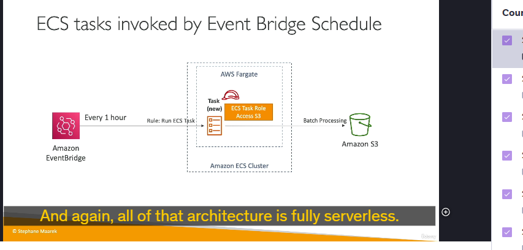
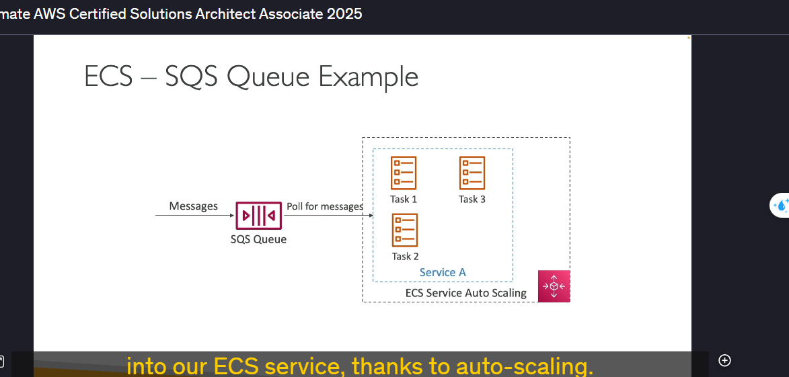

### Kiến Thức Chi Tiết Về Kiến Trúc Giải Pháp Với Amazon ECS

#### 1. **ECS Tasks được kích hoạt bởi EventBridge**

- **Mô tả**:
  - Người dùng tải lên đối tượng vào Amazon S3 bucket.
  - S3 tích hợp với Amazon EventBridge để gửi sự kiện.
  - EventBridge có thể được cấu hình với các quy tắc để chạy các ECS tasks dựa trên sự kiện.
- **Quy trình**:
  1.  S3 bucket nhận đối tượng.
  2.  EventBridge nhận sự kiện tải lên từ S3.
  3.  ECS task (trên Fargate) được khởi chạy.
  4.  ECS task xử lý đối tượng và gửi kết quả vào DynamoDB.
- **Kiến trúc**:
  - Hoàn toàn serverless.
  - Sử dụng ECS task role để cho phép ECS task truy cập S3 và DynamoDB.

#### 2. **ECS Tasks được kích hoạt bởi EventBridge Schedule**

- **Mô tả**:
  - Sử dụng EventBridge để đặt lịch thực thi định kỳ (ví dụ: mỗi giờ).
  - Tạo ECS tasks trên Fargate để xử lý dữ liệu định kỳ.
- **Quy trình**:
  1.  EventBridge kích hoạt mỗi giờ theo lịch.
  2.  ECS task trên Fargate được khởi chạy.
  3.  ECS task thực hiện xử lý batch dữ liệu (ví dụ: xử lý tệp trong S3).
- **Kiến trúc**:
  - Serverless.
  - Dễ dàng mở rộng và tối ưu hóa chi phí nhờ lịch trình chính xác.

#### 3. **ECS và SQS Queue**

- **Mô tả**:
  - Kết hợp ECS với SQS queue để xử lý tin nhắn.
  - ECS service được cấu hình để polling và xử lý tin nhắn từ SQS queue.
- **Quy trình**:
  1.  Tin nhắn được gửi vào SQS queue.
  2.  ECS service với các ECS tasks polling và xử lý tin nhắn.
  3.  ECS Service Auto Scaling mở rộng/dừng các task dựa trên số lượng tin nhắn trong queue.
- **Lợi ích**:
  - Tự động mở rộng để xử lý khối lượng công việc thay đổi.
  - Đảm bảo tin nhắn không bị mất và được xử lý kịp thời.

#### 4. **EventBridge Theo Dõi Trạng Thái ECS Tasks**

- **Mô tả**:
  - Sử dụng EventBridge để theo dõi sự kiện thay đổi trạng thái của ECS tasks.
  - Ví dụ: Khi một task dừng lại hoặc thất bại, EventBridge có thể gửi thông báo.
- **Quy trình**:
  1.  ECS task thay đổi trạng thái (bắt đầu/dừng).
  2.  EventBridge nhận sự kiện (ví dụ: "stopped").
  3.  Gửi thông báo qua SNS hoặc email cho quản trị viên.
- **Lợi ích**:
  - Theo dõi sát sao vòng đời của các container trong ECS cluster.
  - Tăng cường khả năng phản hồi nhanh với sự cố.

---

### Lợi Ích Tổng Thể

- **Serverless Architecture**:
  - Giảm thiểu quản lý cơ sở hạ tầng, tối ưu hóa chi phí.
- **Tính Linh Hoạt**:
  - Dễ dàng tích hợp với các dịch vụ AWS khác như S3, DynamoDB, SNS, SQS.
- **Tự Động Hóa**:
  - Tự động hóa xử lý batch, giám sát và mở rộng.

---

### Ứng Dụng Thực Tiễn

- Xử lý hình ảnh hoặc dữ liệu tải lên từ người dùng (kích hoạt qua S3).
- Xử lý batch định kỳ dữ liệu (kích hoạt theo lịch trình).
- Hệ thống xử lý tin nhắn theo thời gian thực (SQS + ECS).
- Giám sát và phản hồi các thay đổi trong ECS cluster.

---
