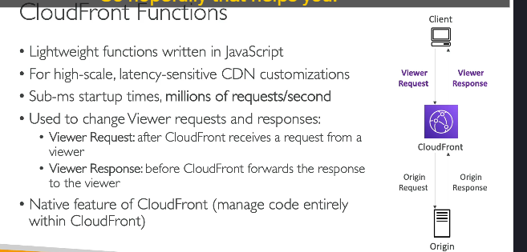
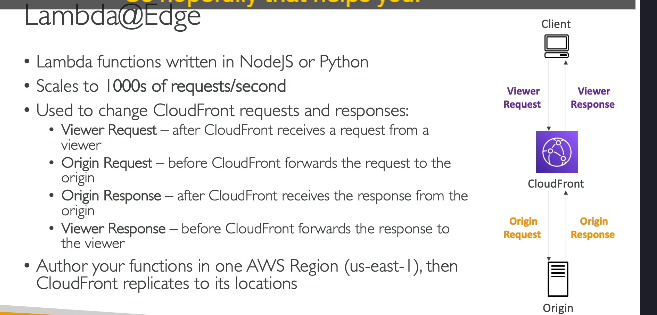
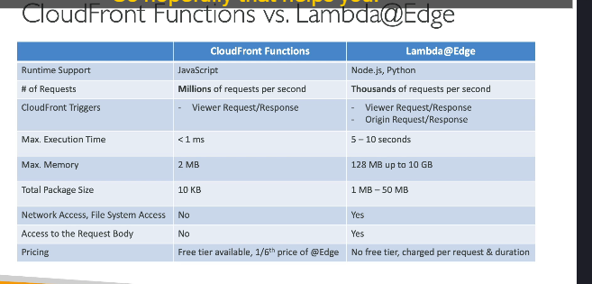

### Chi tiết kiến thức về **Customization At The Edge**

**Customization At The Edge** là khái niệm liên quan đến việc thực hiện các thao tác logic ngay tại **Edge Location** (các điểm phân phối gần với người dùng) trước khi yêu cầu được chuyển đến ứng dụng chính. Điều này giúp **giảm độ trễ** và tối ưu hóa hiệu suất.

---

### 1. **Edge Functions**

Edge Functions là những đoạn mã bạn viết và gắn vào phân phối của **CloudFront**. Các chức năng này giúp thực thi logic ngay tại các Edge Location và hoàn toàn **serverless**. AWS cung cấp hai loại Edge Functions:

- **CloudFront Functions**
- **Lambda@Edge**

---

### 2. **Lợi ích và các trường hợp sử dụng**

Edge Functions có thể được sử dụng cho các trường hợp như:

- **Bảo mật và quyền riêng tư trên website.**
- **Ứng dụng web động tại Edge.**
- **Tối ưu hóa công cụ tìm kiếm (SEO).**
- **Chuyển hướng thông minh giữa các Origin.**
- **Giảm thiểu bot tại Edge.**
- **Chuyển đổi hình ảnh theo thời gian thực tại Edge.**
- **A/B Testing, xác thực và phân quyền người dùng.**
- **Ưu tiên người dùng và phân tích hành vi.**

---

### 3. **CloudFront Functions**

- **Đặc điểm:**
  - Viết bằng JavaScript.
  - **Chỉ áp dụng trên Viewer Request** (yêu cầu từ client đến CloudFront) và **Viewer Response** (phản hồi từ CloudFront về client).
  - **Thời gian thực thi ngắn:** Dưới 1ms.
  - **Quy mô lớn:** Hỗ trợ hàng triệu yêu cầu mỗi giây.
  - Tích hợp và quản lý trực tiếp trên giao diện CloudFront.
- **Các trường hợp sử dụng:**
  - **Cache Key Normalization**: Tối ưu hóa khóa cache.
  - **Header Manipulation**: Thêm, chỉnh sửa hoặc xóa các HTTP header.
  - **URL Rewrite/Redirect**: Thay đổi hoặc chuyển hướng URL.
  - **Authorization Request**: Xác thực và kiểm tra JWT Token.

---

### 4. **Lambda@Edge**

- **Đặc điểm:**

  - Viết bằng **NodeJS** hoặc **Python**.
  - Áp dụng trên tất cả các giai đoạn:
    - **Viewer Request**.
    - **Origin Request** (yêu cầu từ CloudFront đến Origin Server).
    - **Origin Response** (phản hồi từ Origin Server đến CloudFront).
    - **Viewer Response**.
  - **Thời gian thực thi dài hơn:** Lên đến 5–10 giây.
  - **Quy mô thấp hơn:** Hỗ trợ hàng nghìn yêu cầu mỗi giây.
  - Có thể sử dụng **bộ nhớ tùy chỉnh**, CPU có thể điều chỉnh, tích hợp các thư viện của bên thứ ba, và có quyền truy cập vào file system hoặc body của HTTP request.
  - Hỗ trợ truy cập mạng để tích hợp với các dịch vụ bên ngoài.

- **Các trường hợp sử dụng:**
  - Xử lý phức tạp, chẳng hạn như:
    - **Truy cập file system** hoặc **body HTTP request**.
    - **Tích hợp với dịch vụ AWS khác** qua SDK.
    - Phân tích hoặc biến đổi dữ liệu nâng cao.

### 5. **So sánh giữa CloudFront Functions và Lambda@Edge**

| **Tiêu chí** | **CloudFront Functions** | **Lambda@Edge** |
|--------------------------|---------------------------------------------|--------------------------------------------------|
| **Ngôn ngữ hỗ trợ** | JavaScript                                  | NodeJS, Python                                    |
| **Quy mô** | Hàng triệu yêu cầu/giây                     | Hàng nghìn yêu cầu/giây                            |
| **Trigger** | Viewer Request, Viewer Response             | Viewer Request, Origin Request, Origin Response, Viewer Response |
| **Thời gian thực thi** | < 1ms                                       | Lên đến 10 giây                                   |
| **Tính năng bổ sung** | Chỉ xử lý header, cache key, URL đơn giản | Tích hợp phức tạp, sử dụng thư viện bên ngoài, truy cập hệ thống tập tin và dữ liệu body |

### 6. **Khi nào chọn CloudFront Functions và Lambda@Edge?**

- **CloudFront Functions**:

  - Khi cần xử lý **nhẹ, đơn giản** và độ trễ thấp (< 1ms).
  - Ví dụ: [Chỉnh sửa header, cache key, hoặc chuyển hướng URL](./lý-thuyết-bên-lề/case-cloudfrontFunc-lamdaEdge.md).

- **Lambda@Edge**:
  - Khi cần thực hiện **logic phức tạp** và tích hợp với các dịch vụ khác.
  - Ví dụ: [Phân tích dữ liệu, xác thực người dùng, hoặc xử lý file và body của HTTP request(#phân-tích-chi-tiết)](./lý-thuyết-bên-lề/case-cloudfrontFunc-lamdaEdge.md).

---

**Kết luận:** Việc chọn loại Edge Function phụ thuộc vào **mức độ phức tạp** và **hiệu suất** cần thiết của ứng dụng. CloudFront Functions phù hợp cho tác vụ nhẹ, trong khi Lambda@Edge mạnh mẽ hơn cho các thao tác phức tạp.
