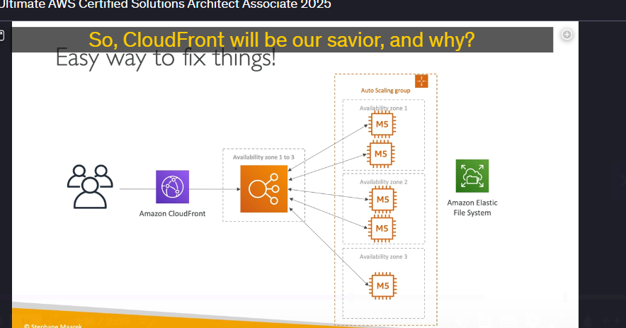

### **Giải pháp Kiến trúc Offloading Cập nhật Phần mềm với AWS CloudFront**

#### **Kịch bản**

- Ứng dụng đang chạy trên **EC2 instances** sau **Classic Elastic Load Balancer (ELB)** và **Auto Scaling Group (ASG)** trong nhiều vùng khả dụng (multi-AZ).
- Các bản cập nhật phần mềm (patches) được lưu trữ trong **Amazon EFS (Elastic File System)**.
- Khi có bản cập nhật mới, nhiều yêu cầu tải xuống sẽ đến từ người dùng, gây tốn kém về chi phí mạng, tài nguyên CPU và chi phí vận hành hệ thống.

---

#### **Yêu cầu**

- **Giảm tải chi phí mạng, CPU và EFS mà không cần thay đổi kiến trúc hiện tại.**
- Giải pháp phải dễ triển khai và hiệu quả.

---

### **Giải pháp: Sử dụng AWS CloudFront**

#### **Vì sao chọn CloudFront?**

- **Không cần thay đổi kiến trúc:** Chỉ cần cấu hình thêm **CloudFront** để phục vụ nội dung tĩnh (các file cập nhật phần mềm).
- **Caching tại Edge Locations:** CloudFront sẽ lưu trữ các file cập nhật phần mềm tại các **edge locations** (điểm phân phối toàn cầu).
  - Khi người dùng yêu cầu tải xuống bản cập nhật, nội dung sẽ được phục vụ từ các edge locations gần nhất thay vì EC2.
- **Tối ưu chi phí:**
  - Giảm số lượng yêu cầu đến EC2, giúp **ASG không cần scale quá mức**.
  - Tiết kiệm chi phí mạng, EFS và EC2 do tải trọng giảm.
- **Khả năng mở rộng:** CloudFront tự động mở rộng quy mô để phục vụ hàng triệu người dùng cùng lúc.
- **Tăng tính sẵn sàng:** Nếu một AZ gặp sự cố, nội dung vẫn có thể được phục vụ từ các edge locations của CloudFront.

---

### **Lợi ích:**

| Tiêu chí         | Trước CloudFront          | Sau CloudFront        |
| ---------------- | ------------------------- | --------------------- |
| Chi phí EC2      | Cao                       | Giảm                  |
| Chi phí mạng     | Cao                       | Giảm                  |
| Tài nguyên CPU   | Tăng nhanh khi có tải lớn | Ổn định hơn           |
| Khả năng mở rộng | Giới hạn bởi ASG          | Tự động mở rộng       |
| Hiệu suất        | Phụ thuộc vào EC2         | Phục vụ nhanh từ edge |

---

### **Kết luận:**

Giải pháp đơn giản nhưng hiệu quả là thêm **CloudFront** để giảm tải hệ thống và tối ưu chi phí cho ứng dụng phân phối nội dung tĩnh. Đây là một ví dụ điển hình cho việc áp dụng AWS để tối ưu kiến trúc hệ thống mà không cần thay đổi nhiều.

---

### **Ví dụ Thực tế về Sử Dụng AWS CloudFront cho Phân Phối Bản Cập Nhật Phần Mềm**

#### **Kịch bản Ví Dụ**

Công ty X phát triển một phần mềm diệt virus và ứng dụng quản lý máy tính cho doanh nghiệp.

- **Mỗi tuần**, họ phát hành các bản cập nhật (patch) để sửa lỗi và nâng cao bảo mật.
- Bản cập nhật được lưu trữ trên **EFS** và tải xuống từ các **EC2 Instances** qua **ELB**.
- Khi phát hành bản cập nhật lớn, hàng ngàn máy tính từ nhiều văn phòng trên toàn thế giới đồng loạt tải xuống, dẫn đến:
  - **Tăng cao chi phí mạng**
  - **Tắc nghẽn tài nguyên EC2**
  - **Tăng hóa đơn dịch vụ AWS**

---

### **Giải Pháp Sử Dụng AWS CloudFront**

1. **Cấu hình CloudFront** để phục vụ các file cập nhật từ EFS thông qua ELB và EC2.
2. Khi có bản cập nhật mới:
   - CloudFront sẽ **cache bản cập nhật tại edge locations** (điểm phân phối gần nhất).
   - Khi máy tính từ các văn phòng khác nhau yêu cầu tải xuống bản cập nhật, nội dung sẽ được lấy từ các edge locations thay vì quay về EC2.

---

### **Lợi Ích Đạt Được:**

| **Tiêu chí**        | **Trước CloudFront** | **Sau CloudFront**          |
| ------------------- | -------------------- | --------------------------- |
| Thời gian tải xuống | Chậm do quay về EC2  | Nhanh hơn từ edge locations |
| Chi phí EC2         | Tăng do tải lớn      | Giảm đáng kể                |
| Chi phí mạng        | Cao                  | Tiết kiệm                   |
| Khả năng mở rộng    | Bị giới hạn bởi ASG  | CloudFront tự mở rộng       |

---

### **Ví dụ So Sánh:**

**Trước CloudFront:**

- Văn phòng tại Việt Nam tải bản cập nhật từ server đặt ở US, mất 5 phút mỗi lần tải.
- Chi phí mạng tăng cao và EC2 phải scale thêm 5 instance mới đáp ứng nổi.

**Sau CloudFront:**

- CloudFront cache bản cập nhật tại edge location ở Singapore.
- Văn phòng Việt Nam tải về trong chưa đầy 30 giây.
- EC2 không cần mở rộng, tiết kiệm chi phí lớn.

---

### **Kết luận:**

Thêm CloudFront là giải pháp dễ dàng, hiệu quả giúp phân phối bản cập nhật nhanh chóng và giảm tải cho hệ thống backend của công ty.
