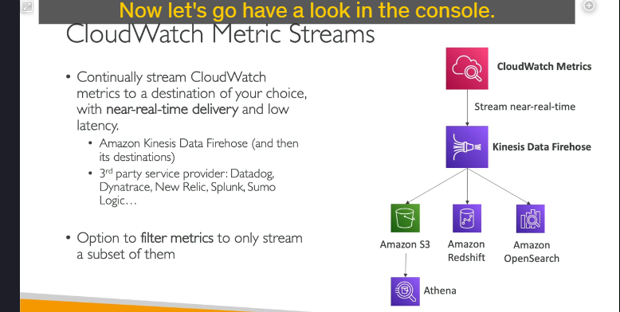

### **Amazon CloudWatch Metrics: Tổng Quan Chi Tiết**

Amazon CloudWatch là một dịch vụ giám sát và quan sát (monitoring and observability) được cung cấp bởi AWS. Nó cho phép bạn thu thập và theo dõi các metric, giám sát tệp nhật ký, thiết lập cảnh báo và tự động phản ứng với các thay đổi trong tài nguyên AWS của bạn. Một trong những tính năng cốt lõi của CloudWatch là **CloudWatch Metrics**, giúp bạn giám sát nhiều khía cạnh khác nhau của tài nguyên và ứng dụng trên AWS.

---

### **1. CloudWatch Metrics là gì?**

- **Metrics** (số liệu) là các biến mà bạn muốn theo dõi theo thời gian. Ví dụ:
  - Đối với một **EC2 instance**, bạn có thể theo dõi các metric như:
    - `CPUUtilization`: Phần trăm sử dụng CPU.
    - `NetworkIn`: Số byte nhận được bởi instance.
    - `NetworkOut`: Số byte gửi đi từ instance.
    - `CPUCreditBalance`: Số CPU credit còn lại cho các instance có hiệu suất burstable.
  - Đối với **Amazon S3**, bạn có thể theo dõi các metric như:
    - `BucketSizeBytes`: Kích thước dữ liệu được lưu trữ trong bucket.
    - `NumberOfObjects`: Số lượng đối tượng trong bucket.
- Các metric là các **điểm dữ liệu được sắp xếp theo thời gian** và được xuất bản lên CloudWatch. Mỗi điểm dữ liệu bao gồm:
  - **Timestamp** (thời gian).
  - **Giá trị** (ví dụ: phần trăm sử dụng CPU).
  - **Dimensions** (các thuộc tính giúp xác định duy nhất metric) - tùy chọn.

---

### **2. Các Khái Niệm Chính trong CloudWatch Metrics**

#### **a. Namespaces (Không gian tên)**

- Các metric được nhóm vào các **namespaces**. Namespace giống như một container chứa các metric.
- Mỗi dịch vụ AWS có một namespace riêng. Ví dụ:
  - `AWS/EC2` cho các metric của EC2.
  - `AWS/S3` cho các metric của S3.
  - `AWS/Lambda` cho các metric của Lambda.
- Namespaces giúp bạn tổ chức và phân tách các metric từ các dịch vụ khác nhau.

#### **b. Dimensions (Chiều dữ liệu)**

- **Dimensions** là các cặp khóa-giá trị giúp xác định duy nhất một metric.
- Ví dụ, đối với một EC2 instance, bạn có thể có các dimensions như:
  - `InstanceId`: ID của instance.
  - `InstanceType`: Loại instance (ví dụ: t2.micro).
  - `Environment`: Môi trường (ví dụ: production, staging).
- Bạn có thể có tối đa **10 dimensions cho mỗi metric**.

#### **c. Timestamps (Thời gian)**

- Các metric đều dựa trên thời gian, nghĩa là mỗi điểm dữ liệu đều có một timestamp.
- Điều này cho phép bạn theo dõi sự thay đổi của các metric theo thời gian.

---

### **3. Các Loại Metric**

#### **a. Standard Metrics (Metric tiêu chuẩn)**

- Đây là các metric được cung cấp sẵn bởi các dịch vụ AWS.
- Ví dụ:
  - EC2 cung cấp các metric như `CPUUtilization`, `DiskReadOps`, và `StatusCheckFailed`.
  - RDS cung cấp các metric như `DatabaseConnections`, `CPUUtilization`, và `FreeStorageSpace`.

#### **b. Custom Metrics (Metric tùy chỉnh)**

- Bạn có thể tạo các **custom metrics** để giám sát dữ liệu cụ thể của ứng dụng.
- Ví dụ:
  - Giám sát mức sử dụng bộ nhớ của một EC2 instance.
  - Theo dõi số lượng người dùng đang hoạt động trong ứng dụng của bạn.
- Custom metrics rất hữu ích khi AWS không cung cấp sẵn metric bạn cần.

---

### **4. Độ Chi Tiết của Giám Sát**

- CloudWatch cung cấp hai mức độ chi tiết giám sát:
  - **Basic Monitoring**: Dữ liệu được thu thập ở khoảng thời gian **5 phút**.
  - **Detailed Monitoring**: Dữ liệu được thu thập ở khoảng thời gian **1 phút**.
- Detailed Monitoring có tính phí bổ sung.

---

### **5. CloudWatch Dashboards (Bảng điều khiển)**

- Bạn có thể tạo **CloudWatch Dashboards** để hiển thị trực quan các metric.
- Dashboards cho phép bạn:
  - Xem nhiều metric cùng một lúc.
  - Tùy chỉnh cách hiển thị (ví dụ: biểu đồ đường, biểu đồ vùng, biểu đồ tròn).
  - Chia sẻ dashboards với người khác.
- Ví dụ: Bạn có thể tạo một dashboard để giám sát mức sử dụng CPU, lưu lượng mạng và dung lượng đĩa của các EC2 instance.

---

### **6. Streaming CloudWatch Metrics**

- Bạn có thể stream các CloudWatch Metrics đến các dịch vụ khác để phân tích hoặc lưu trữ.
- **Amazon Kinesis Data Firehose** là một điểm đến phổ biến để stream metrics.
- Từ Kinesis Data Firehose, bạn có thể gửi metrics đến:
  - **Amazon S3**: Để lưu trữ dài hạn và phân tích bằng các công cụ như Amazon Athena.
  - **Amazon Redshift**: Để lưu trữ dữ liệu và phân tích nâng cao.
  - **Amazon OpenSearch**: Để xây dựng bảng điều khiển và thực hiện phân tích thời gian thực.
  - **Các dịch vụ bên thứ ba**: Như Datadog, Dynatrace, New Relic, Splunk, hoặc Sumo Logic.

---

### **7. Các Trường Hợp Sử Dụng CloudWatch Metrics**

- **Giám sát hiệu suất**: Theo dõi hiệu suất của các EC2 instance, RDS database, hoặc Lambda function.
- **Lập kế hoạch dung lượng**: Giám sát các metric như `BucketSizeBytes` trong S3 để lập kế hoạch lưu trữ.
- **Khắc phục sự cố**: Sử dụng các metric như `StatusCheckFailed` để xác định vấn đề với EC2 instance.
- **Giám sát ứng dụng tùy chỉnh**: Tạo các custom metrics để theo dõi các KPI cụ thể của ứng dụng.

---

### **8. CloudWatch Metrics trong AWS Console**

- Trong AWS Management Console, bạn có thể truy cập CloudWatch Metrics trong phần **Metrics**.
- Các bước để xem metric:
  1. Truy cập **CloudWatch Dashboard**.
  2. Nhấp vào **Metrics** trong menu bên trái.
  3. Chọn một **namespace** (ví dụ: `AWS/EC2`).
  4. Chọn một **metric** (ví dụ: `CPUUtilization`).
  5. Áp dụng các bộ lọc (ví dụ: theo instance ID hoặc khoảng thời gian).
  6. Xem dữ liệu metric trong biểu đồ (ví dụ: biểu đồ đường, biểu đồ vùng).

---

### **9. Các Tính Năng Nâng Cao**

- **Alarms (Cảnh báo)**: Bạn có thể tạo CloudWatch Alarms để thông báo khi một metric vượt ngưỡng (ví dụ: CPU utilization > 80%).
- **Anomaly Detection (Phát hiện bất thường)**: CloudWatch có thể tự động phát hiện các bất thường trong metric bằng machine learning.
- **Metric Math (Toán học metric)**: Thực hiện các phép tính trên metric (ví dụ: tổng, trung bình, phần trăm) để thu được thông tin chi tiết hơn.

---

### **10. Ví Dụ: Giám Sát Một EC2 Instance**

1. Truy cập **CloudWatch Console**.
2. Chọn namespace **AWS/EC2**.
3. Chọn **Per-Instance Metrics**.
4. Lọc theo **InstanceId** và chọn instance của bạn.
5. Xem các metric như `CPUUtilization`, `NetworkIn`, và `NetworkOut`.
6. Tùy chỉnh khoảng thời gian (ví dụ: 1 giờ qua, 7 ngày qua).
7. Thêm metric vào dashboard để giám sát liên tục.

---

### **11. Các Thực Hành Tốt Nhất**

- Bật **Detailed Monitoring** cho các tài nguyên quan trọng.
- Sử dụng **Custom Metrics** để giám sát dữ liệu cụ thể của ứng dụng.
- Tạo **CloudWatch Alarms** để cảnh báo kịp thời khi có sự cố.
- Sử dụng **Dashboards** để tổng hợp và hiển thị các metric một cách trực quan.

---

### **Kết Luận**

CloudWatch Metrics là một công cụ mạnh mẽ để giám sát và phân tích hiệu suất của các tài nguyên và ứng dụng trên AWS. Bằng cách hiểu rõ các khái niệm và tính năng của CloudWatch Metrics, bạn có thể tối ưu hóa việc giám sát và đảm bảo hệ thống của mình hoạt động trơn tru.
