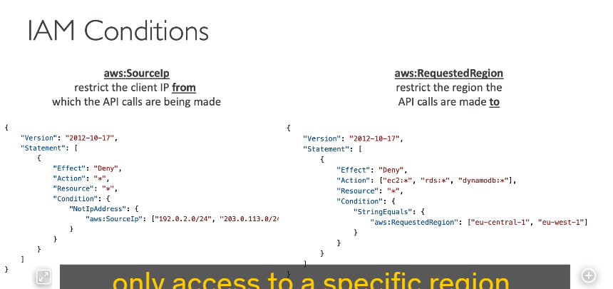
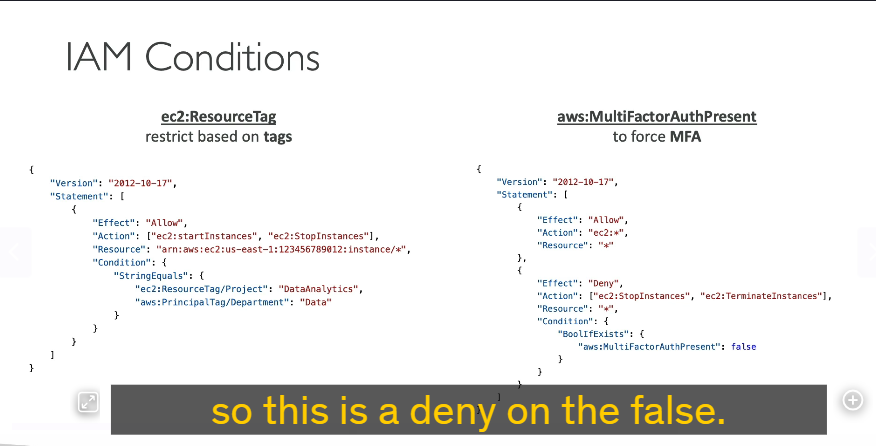
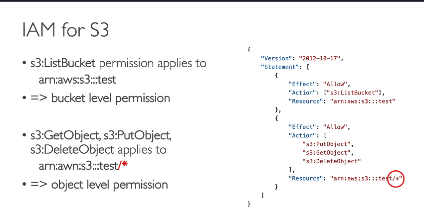
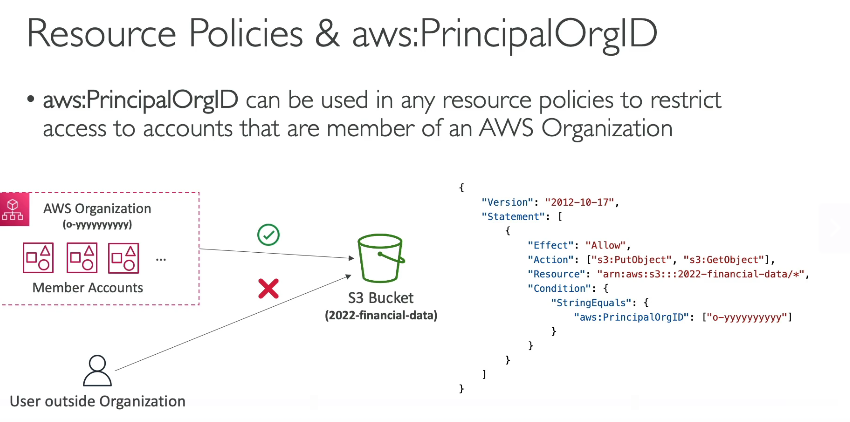

### **Điều Kiện IAM (IAM Conditions) và Tác Động Đến Policies**

Giờ hãy cùng thảo luận về **Điều Kiện IAM** và cách chúng ảnh hưởng đến các policies của bạn.Các điều kiện này áp dụng cho **mọi loại policy trong IAM**, bao gồm:

- Policies cho người dùng.
- Policies tài nguyên (ví dụ: S3 bucket policies).
- Endpoint policies, và nhiều loại khác.

---

### **Các Điều Kiện Phổ Biến**



1. **`aws:SourceIP`**

   - **Mục đích**: Giới hạn địa chỉ IP nguồn thực hiện API calls.
   - **Ví dụ Policy**:

```json
{
  "Version": "2012-10-17",
  "Statement": [
    {
      "Effect": "Deny",
      "Action": "*",
      "Resource": "*",
      "Condition": {
        "NotIpAddress": {
          "aws:SourceIp": ["192.0.2.0/24", "203.0.113.0/24"]
        }
      }
    }
  ]
}
```

     → **Ý nghĩa**: Từ chối mọi hành động nếu API call không đến từ các dải IP `192.0.2.0/24` hoặc `203.0.113.0/24`.
     → **Ứng dụng**: Chỉ cho phép truy cập AWS từ mạng công ty, đảm bảo an toàn.

2. **`aws:RequestedRegion`**

   - **Mục đích**: Giới hạn region mà API call được thực hiện.
   - **Ví dụ Policy**:

```json
{
  "Version": "2012-10-17",
  "Statement": [
    {
      "Effect": "Deny",
      "Action": ["ec2:*", "rds:*", "dynamodb:*"],
      "Resource": "*",
      "Condition": {
        "StringEquals": {
          "aws:RequestedRegion": ["eu-central-1", "eu-west-1"]
        }
      }
    }
  ]
}
```

     → **Ý nghĩa**: Từ chối mọi hành động trên EC2, RDS, DynamoDB tại các region **eu-central-1** và **eu-west-1**.
     → **Ứng dụng**: Áp dụng trong SCP của tổ chức để chỉ cho phép truy cập dịch vụ ở region cụ thể.

3. \*\*`ec2:ResourceTag` và `aws:PrincipalTag

   `\*\*

   

   - **`ec2:ResourceTag`**: Kiểm tra tag trên EC2 instance.
   - **`aws:PrincipalTag`**: Kiểm tra tag trên người dùng (user).
   - **Ví dụ Policy**:

```json
{
  "Version": "2012-10-17",
  "Statement": [
    {
      "Effect": "Allow",
      "Action": ["ec2:StartInstances", "ec2:StopInstances"],
      "Resource": "*",
      "Condition": {
        "StringEquals": {
          "ec2:ResourceTag/Project": "DataAnalytics",
          "aws:PrincipalTag/Department": "Data"
        }
      }
    }
  ]
}
```

    → **Ý nghĩa**:- Chỉ cho phép **start/stop instances** nếu:

    - Instance có tag **Project=DataAnalytics**.
    - User có tag **Department=Data**.

4. **`aws:MultiFactorAuthPresent`**

   - **Mục đích**: Yêu cầu xác thực đa yếu tố (MFA).
   - **Ví dụ Policy**:

```json
{
  "Version": "2012-10-17",
  "Statement": [
    {
      "Effect": "Allow",
      "Action": "ec2:*",
      "Resource": "*"
    },
    {
      "Effect": "Deny",
      "Action": ["ec2:StopInstances", "ec2:TerminateInstances"],
      "Resource": "*",
      "Condition": {
        "BoolIfExists": {
          "aws:MultiFactorAuthPresent": "false"
        }
      }
    }
  ]
}
```

     → **Ý nghĩa**:- Cho phép mọi hành động trên EC2.

     - **Chặn stop/terminate instances** nếu không có MFA.

---

### **Policy Cho S3 Bucket**



- **Phân biệt quyền cấp bucket và object**:

```json
{
  "Version": "2012-10-17",
  "Statement": [
    {
      "Effect": "Allow",
      "Action": "s3:ListBucket",
      "Resource": "arn:aws:s3:::test" // Quyền cấp bucket
    },
    {
      "Effect": "Allow",
      "Action": ["s3:GetObject", "s3:PutObject", "s3:DeleteObject"],
      "Resource": "arn:aws:s3:::test/*" // Quyền cấp object (tất cả objects trong bucket)
    }
  ]
}
```

→ **Lưu ý**:- `s3:ListBucket` yêu cầu ARN bucket (`arn:aws:s3:::test`).

- `s3:GetObject/PutObject/DeleteObject` yêu cầu ARN object (`arn:aws:s3:::test/*`).

---

### **`aws:PrincipalOrgID` trong Resource Policies**



- **Mục đích**: Giới hạn truy cập chỉ cho các account trong tổ chức AWS.
- **Ví dụ Policy S3**:

```json
{
  "Version": "2012-10-17",
  "Statement": [
    {
      "Effect": "Allow",
      "Action": ["s3:PutObject", "s3:GetObject"],
      "Resource": "arn:aws:s3:::example-bucket/*",
      "Condition": {
        "StringEquals": {
          "aws:PrincipalOrgID": "o-1234567890" // ID tổ chức của bạn
        }
      }
    }
  ]
}
```

→ **Ý nghĩa**: Chỉ các account thuộc tổ chức **o-1234567890** mới được phép **PutObject/GetObject** trên bucket này.

---

### **Kết Luận**

Các điều kiện IAM giúp tăng cường **bảo mật** và **kiểm soát truy cập** chi tiết. Bằng cách kết hợp các điều kiện như IP, region, tag, MFA, hoặc OrgID, bạn có thể xây dựng policies linh hoạt, đáp ứng các yêu cầu phức tạp.

Hy vọng bài học hữu ích! Hẹn gặp lại ở phần tiếp theo.

---

**Giải thích thêm:**

- **SCP (Service Control Policies)**: Dùng trong AWS Organizations để áp đặt giới hạn trên nhiều tài khoản.
- **ARN (Amazon Resource Name)**: Định danh duy nhất cho tài nguyên AWS.
- **CIDR**: Định dạng địa chỉ IP và dải mạng (ví dụ: 192.0.2.0/24).
