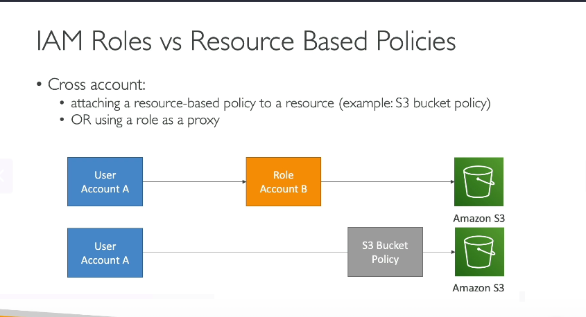
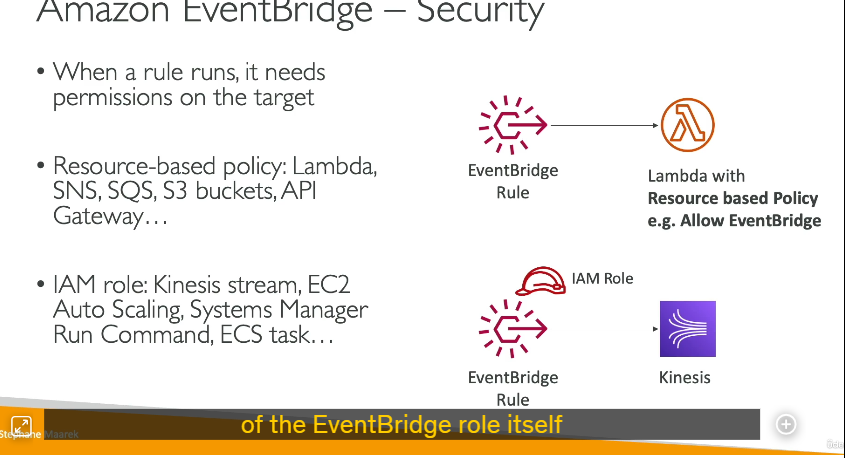

**1. Định nghĩa**

- **IAM Roles**:

  - Là "vai trò" cấp quyền tạm thời cho người dùng/dịch vụ AWS.
  - Người dùng/dịch vụ phải **đảm nhận (assume)** role để sử dụng quyền của role đó.
  - **Hạn chế chính**: Khi assume role, bạn **từ bỏ tất cả quyền ban đầu** và chỉ sử dụng quyền được gán cho role.
- **Resource-Based Policies**:

  - Là chính sách được gắn **trực tiếp vào tài nguyên AWS** (ví dụ: S3 bucket, Lambda function).
  - Xác định ai/quyền nào được phép truy cập vào tài nguyên đó.

---

**2. Truy cập Cross-Account**

- **Cách 1: Sử dụng IAM Role**

  - Ví dụ: Người dùng ở Account A assume role trong Account B để truy cập S3 bucket của Account B.
  - **Nhược điểm**: Người dùng không thể đồng thời sử dụng quyền từ Account A (vì đã từ bỏ quyền gốc khi assume role).
- **Cách 2: Sử dụng Resource-Based Policy**

  - Ví dụ: Bucket policy trên S3 bucket (Account B) cho phép người dùng từ Account A truy cập trực tiếp.
  - **Ưu điểm**: Người dùng **không cần assume role**, giữ nguyên quyền ở Account A và có thêm quyền truy cập tài nguyên ở Account B.

---

**3. Khi nào dùng Resource-Based Policy?**

- Khi cần **kết hợp quyền từ nhiều nguồn** (ví dụ: Người dùng cần scan DynamoDB ở Account A **và** ghi dữ liệu vào S3 bucket ở Account B trong cùng một tác vụ).
- **Dịch vụ hỗ trợ**: S3, SNS, SQS, Lambda, API Gateway...

---

**4. Ví dụ thực tế với AWS EventBridge**

- **EventBridge cần quyền để kích hoạt mục tiêu (target)**:
  - **các Target có hỗ trợ Resource-Based Policy** (ví dụ: Lambda, SNS, S3):
    - EventBridge tự động thêm policy vào target để cho phép kích hoạt.
  - **các Target không hỗ trợ Resource-Based Policy** (ví dụ: Kinesis Data Streams, EC2 Auto Scaling, ECS):
    - EventBridge sử dụng IAM role để cấp quyền.

---

**5. Điểm khác biệt chính**  

| **IAM Role**                   | **Resource-Based Policy**                |
| ------------------------------------ | ---------------------------------------------- |
| Yêu cầu assume role                | Không cần assume role                        |
| Từ bỏ quyền gốc                  | Giữ nguyên quyền gốc                       |
| Phù hợp cho truy cập đơn nhiệm | Phù hợp cho kết hợp quyền đa tài khoản |

---

**6. Lưu ý cho kỳ thi AWS**

- Nhớ các dịch vụ hỗ trợ Resource-Based Policy (S3, Lambda, SQS, SNS).
- EventBridge dùng IAM role cho Kinesis Data Streams, EC2 Auto Scaling... dù Kinesis Data Streams có hỗ trợ resource policy.
